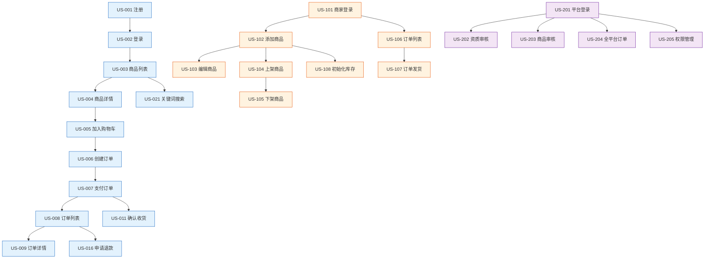

# 用户故事地图

## 文档信息

| 字段 | 内容 |
|------|------|
| 文档名称 | 用户故事地图 |
| 文档版本 | V1.0 |$
| 所属阶段 | 需求阶段 |
| 文档状态 | 已发布 |
| 创建人 | yirancrazy@gmail.com |
| 创建日期 | 2026-07-27 |
| 最后更新 | 2026-07-28 |[\$]

## 文档目的

> 以"角色-旅程阶段-用户故事"三层结构拆解薄荷商城三角色（消费者/商家/平台）需求，将 PRD 转化为可估算、可迭代的交付单元，并按发布版本（MVP/V1.1/V1.2）分组，指导迭代规划与范围确认。

## 适用范围

- **适用对象**：产品经理、研发、测试
- **适用场景**：迭代规划、需求拆分、范围确认、版本排期
- **不适用范围**：纯运营活动（无明确用户角色）、技术实现细节

## 详细内容

### 1. 核心角色与旅程概览

| 角色 | 标识 | 关键旅程 |
|------|------|----------|
| 消费者 | USER | 注册/登录 → 浏览商品 → 加入购物车 → 下单 → 支付 → 等待发货 → 确认收货 → (可选)申请退款 |
| 商家 | MERCHANT | 登录 → 商品管理 → 处理订单 → 库存管理 → 退款审核 → 资金流水/提现 → 站内信 |
| 平台管理员 | PLATFORM | 登录 → 商家资质审核 → 商品审核 → 订单仲裁/强制关单 → 对账/统计 → 公告发布 → 系统监控 |

### 2. 用户故事地图（Mermaid）

#### 2.1 消费者（USER）故事地图

> 图例：🟢 MVP(P0)  🔵 V1.1(P1)  🟣 V1.2(P2)

#### 2.2 商家（MERCHANT）故事地图

#### 2.3 平台管理员（PLATFORM）故事地图

```mermaid
flowchart LR
  subgraph S1["① 认证"]
    P1["US-201 平台登录"]
    P5["US-205 权限管理"]
  end
  subgraph S2["② 商家审核"]
    P2["US-202 资质审核"]
  end
  subgraph S3["③ 商品审核"]
    P3["US-203 商品审核"]
  end
  subgraph S4["④ 订单治理"]
    P4["US-204 全平台订单"]
    P6["US-206 退款仲裁"]
    P7["US-207 强制关单"]
  end
  subgraph S5["⑤ 对账/统计"]
    P8["US-208 交易流水"]
    P10["US-210 提现审核"]
    P11["US-211 资金报表"]
  end
  subgraph S6["⑥ 公告发布"]
    P9["US-209 发布公告"]
  end
  subgraph S7["⑦ 系统监控"]
    P17["US-217 系统监控"]
  end
  subgraph S8["⑧ 库存治理"]
    P12["US-212 库存总览"]
    P13["US-213 库存调拨"]
    P14["US-214 盘点任务"]
    P15["US-215 异常核查"]
    P16["US-216 对账单导出"]
    P18["US-218 滞销预警"]
  end

  S1 --> S2 --> S3 --> S4 --> S5 --> S6 --> S7 --> S8

  classDef mvp fill:#4CAF50,color:#fff,stroke:#2E7D32
  classDef v11 fill:#2196F3,color:#fff,stroke:#1565C0
  classDef v12 fill:#9C27B0,color:#fff,stroke:#6A1B9A

  class P1,P2,P3,P4,P5 mvp
  class P6,P7,P8,P9,P10,P11 v11
  class P12,P13,P14,P15,P16,P17,P18 v12
```

### 3. 用户故事详表

#### 3.1 消费者（USER）用户故事

| ID | 用户故事 | 旅程阶段 | 发布版本 | 优先级 |
|----|----------|----------|----------|--------|
| US-001 | 作为消费者，我想用手机号+验证码注册账号，以便快速开始使用平台 | 认证 | MVP | P0 |
| US-002 | 作为消费者，我想用账号密码登录，以便访问个人数据和购物车 | 认证 | MVP | P0 |
| US-003 | 作为消费者，我想浏览商品列表，以便发现感兴趣的商品 | 浏览商品 | MVP | P0 |
| US-004 | 作为消费者，我想查看商品详情，以便了解商品的完整信息（图片/描述/价格/库存） | 浏览商品 | MVP | P0 |
| US-005 | 作为消费者，我想将商品加入购物车，以便暂存待购商品 | 购物车 | MVP | P0 |
| US-006 | 作为消费者，我想创建订单，以便锁定商品和价格进行购买 | 下单 | MVP | P0 |
| US-007 | 作为消费者，我想支付订单，以便完成购买交易 | 支付 | MVP | P0 |
| US-008 | 作为消费者，我想查看我的订单列表，以便跟踪所有购买记录 | 订单管理 | MVP | P0 |
| US-009 | 作为消费者，我想查看订单详情，以便了解当前订单状态和物流信息 | 订单管理 | MVP | P0 |
| US-010 | 作为消费者，我想取消未支付订单，以便放弃不想购买的商品 | 下单 | MVP | P0 |
| US-011 | 作为消费者，我想确认收货，以便完成订单流程 | 确认收货 | MVP | P0 |
| US-012 | 作为消费者，我想查看物流状态，以便知道包裹的配送进度 | 订单管理 | MVP | P0 |
| US-013 | 作为消费者，我想修改购物车商品数量，以便调整购买数量 | 购物车 | V1.1 | P1 |
| US-014 | 作为消费者，我想勾选/取消勾选购物车商品，以便选择部分商品结算 | 购物车 | V1.1 | P1 |
| US-015 | 作为消费者，我想清空购物车，以便快速移除所有暂存商品 | 购物车 | V1.1 | P1 |
| US-016 | 作为消费者，我想申请退款/售后，以便在商品有问题时获得退款 | 售后 | V1.1 | P1 |
| US-017 | 作为消费者，我想接收订单状态变更通知，以便及时了解订单进展 | 消息/收藏 | V1.1 | P1 |
| US-018 | 作为消费者，我想查看站内信，以便获取平台和商家的通知消息 | 消息/收藏 | V1.1 | P1 |
| US-019 | 作为消费者，我想管理收货地址，以便下单时快速选择配送地址 | 下单 | V1.1 | P1 |
| US-020 | 作为消费者，我想收藏商品，以便快速找到关注的商品 | 消息/收藏 | V1.1 | P1 |
| US-021 | 作为消费者，我想通过关键词搜索商品，以便高效找到所需商品 | 浏览商品 | V1.2 | P2 |
| US-022 | 作为消费者，我想按分类/价格/销量筛选商品，以便精确定位目标商品 | 浏览商品 | V1.2 | P2 |
| US-023 | 作为消费者，我想将购物车商品移入收藏夹，以便灵活管理待购和关注商品 | 购物车 | V1.2 | P2 |
| US-024 | 作为消费者，我想删除单条/批量删除消息，以便保持消息列表整洁 | 消息/收藏 | V1.2 | P2 |

#### 3.2 商家（MERCHANT）用户故事

| ID | 用户故事 | 旅程阶段 | 发布版本 | 优先级 |
|----|----------|----------|----------|--------|
| US-101 | 作为商家，我想用账号密码登录商家后台，以便管理店铺 | 认证 | MVP | P0 |
| US-102 | 作为商家，我想添加商品，以便在平台展示和销售商品 | 商品管理 | MVP | P0 |
| US-103 | 作为商家，我想编辑商品信息，以便更新商品描述和价格 | 商品管理 | MVP | P0 |
| US-104 | 作为商家，我想上架商品，以便将审核通过的商品展示给消费者 | 商品管理 | MVP | P0 |
| US-105 | 作为商家，我想下架商品，以便暂停销售某商品 | 商品管理 | MVP | P0 |
| US-106 | 作为商家，我想查看商家订单列表，以便处理买家订单 | 处理订单 | MVP | P0 |
| US-107 | 作为商家，我想对订单进行发货操作，以便完成订单配送 | 处理订单 | MVP | P0 |
| US-108 | 作为商家，我想初始化商品库存，以便设置可销售数量 | 库存管理 | MVP | P0 |
| US-109 | 作为商家，我想查询当前商品库存，以便了解库存状态 | 库存管理 | MVP | P0 |
| US-110 | 作为商家，我想审核/处理退款申请，以便决定是否同意退款 | 退款审核 | V1.1 | P1 |
| US-111 | 作为商家，我想查看资金流水明细，以便核对每笔收支 | 资金/提现 | V1.1 | P1 |
| US-112 | 作为商家，我想申请余额提现，以便将收入转入银行账户 | 资金/提现 | V1.1 | P1 |
| US-113 | 作为商家，我想调整库存数量，以便补货或修正库存偏差 | 库存管理 | V1.1 | P1 |
| US-114 | 作为商家，我想配置库存预警阈值，以便库存不足时收到提醒 | 库存管理 | V1.1 | P1 |
| US-115 | 作为商家，我想接收新订单提醒通知，以便及时处理订单 | 消息通知 | V1.1 | P1 |
| US-116 | 作为商家，我想接收退款申请提醒，以便及时处理售后 | 消息通知 | V1.1 | P1 |
| US-117 | 作为商家，我想查看站内信，以便接收平台公告和通知 | 消息通知 | V1.1 | P1 |
| US-118 | 作为商家，我想查看交易汇总统计，以便了解经营状况 | 资金/提现 | V1.1 | P1 |
| US-119 | 作为商家，我想导出订单数据，以便进行财务和运营分析 | 处理订单 | V1.2 | P2 |
| US-120 | 作为商家，我想导出库存变动报表，以便核对库存流水 | 库存管理 | V1.2 | P2 |
| US-121 | 作为商家，我想查看库存流水，以便追溯库存变动历史 | 库存管理 | V1.2 | P2 |

#### 3.3 平台管理员（PLATFORM）用户故事

| ID | 用户故事 | 旅程阶段 | 发布版本 | 优先级 |
|----|----------|----------|----------|--------|
| US-201 | 作为平台管理员，我想登录平台管理后台，以便执行平台治理工作 | 认证 | MVP | P0 |
| US-202 | 作为平台管理员，我想审核商家资质，以便控制平台入驻商家的质量 | 商家审核 | MVP | P0 |
| US-203 | 作为平台管理员，我想审核商家提交的商品，以便确保平台商品合规 | 商品审核 | MVP | P0 |
| US-204 | 作为平台管理员，我想查看全平台订单列表，以便掌握交易全局 | 订单治理 | MVP | P0 |
| US-205 | 作为平台管理员，我想管理角色权限，以便控制不同管理员的操作范围 | 认证 | MVP | P0 |
| US-206 | 作为平台管理员，我想进行退款纠纷仲裁，以便公正处理商家与消费者的退款争议 | 订单治理 | V1.1 | P1 |
| US-207 | 作为平台管理员，我想强制关闭/冻结异常订单，以便阻止可疑交易 | 订单治理 | V1.1 | P1 |
| US-208 | 作为平台管理员，我想查看全平台交易流水，以便进行财务对账 | 对账/统计 | V1.1 | P1 |
| US-209 | 作为平台管理员，我想发布系统公告，以便向全平台推送重要通知 | 公告发布 | V1.1 | P1 |
| US-210 | 作为平台管理员，我想审核商家提现申请并打款，以便完成资金结算 | 对账/统计 | V1.1 | P1 |
| US-211 | 作为平台管理员，我想查看平台资金统计报表，以便了解平台经营数据 | 对账/统计 | V1.1 | P1 |
| US-212 | 作为平台管理员，我想查看全平台库存总览，以便掌握商品库存全局 | 库存治理 | V1.2 | P2 |
| US-213 | 作为平台管理员，我想进行跨商家库存调拨，以便优化库存配置 | 库存治理 | V1.2 | P2 |
| US-214 | 作为平台管理员，我想下发库存盘点任务，以便校准库存数据 | 库存治理 | V1.2 | P2 |
| US-215 | 作为平台管理员，我想核查异常库存并纠正，以便保证库存数据一致性 | 库存治理 | V1.2 | P2 |
| US-216 | 作为平台管理员，我想导出平台对账单，以便进行财务审计 | 库存治理 | V1.2 | P2 |
| US-217 | 作为平台管理员，我想查看系统监控大盘，以便及时发现系统异常 | 系统监控 | V1.2 | P2 |
| US-218 | 作为平台管理员，我想设置低周转/滞销商品预警，以便优化库存周转 | 库存治理 | V1.2 | P2 |

### 4. 按发布版本分组总览

#### 4.1 MVP（P0 核心）

> 认证 + 商品浏览 + 下单 + 支付 + 订单管理 + 库存 + 商品审核

| 角色 | 故事数 | 包含故事 |
|------|--------|----------|
| USER | 12 | US-001 ~ US-012 |
| MERCHANT | 9 | US-101 ~ US-109 |
| PLATFORM | 5 | US-201 ~ US-205 |
| **合计** | **26** | |

**MVP 交付目标**：用户可完成"注册→浏览→加购→下单→支付→查看订单→确认收货"完整购物闭环；商家可完成"登录→商品管理→处理订单→库存管理"核心经营闭环；平台可完成"登录→商家审核→商品审核→订单查看→权限管理"核心治理闭环。

#### 4.2 V1.1（P1 增强）

> 购物车完整 + 消息通知 + 退款完整 + 商家对账

| 角色 | 故事数 | 包含故事 |
|------|--------|----------|
| USER | 8 | US-013 ~ US-020 |
| MERCHANT | 9 | US-110 ~ US-118 |
| PLATFORM | 6 | US-206 ~ US-211 |
| **合计** | **23** | |

**V1.1 交付目标**：购物车完整功能（修改数量/勾选/清空）；消息通知全链路（订单/退款/公告）；退款完整流程（用户申请→商家审核→平台仲裁）；商家对账与提现闭环。

#### 4.3 V1.2（P2 锦上添花）

> 平台库存治理 + 高级搜索 + 数据导出

| 角色 | 故事数 | 包含故事 |
|------|--------|----------|
| USER | 4 | US-021 ~ US-024 |
| MERCHANT | 3 | US-119 ~ US-121 |
| PLATFORM | 7 | US-212 ~ US-218 |
| **合计** | **14** | |

**V1.2 交付目标**：高级搜索与筛选；平台库存治理（总览/调拨/盘点/核查/预警）；数据导出（订单/库存/对账单）；系统监控大盘。

### 5. 故事拆分原则（INVEST）

| 字母 | 含义 | 反例 |
|------|------|------|
| I | Independent 独立 | 与 US-001 强耦合 |
| N | Negotiable 可协商 | 描述"完成整个支付" |
| V | Valuable 有价值 | 仅后端实现，无用户感知 |
| E | Estimable 可估算 | 需要跨 3 个团队协作 |
| S | Small 小 | 超过 1 个迭代 |
| T | Testable 可测试 | 无明确验收标准 |

### 6. 优先级评估（HSPL 模型）

- **H** (Hot)：是否阻塞其他故事 / 法规合规 / 数据基础
- **S** (Sprint fit)：是否能在本迭代完成
- **P** (Priority)：业务方明确要求的优先级
- **L** (Low risk)：技术风险与依赖度

综合得分 = H×3 + S×2 + P×2 - L×1，得分越高优先级越高。

### 7. 故事依赖关系

### 8. 版本交付统计

| 发布版本 | USER | MERCHANT | PLATFORM | 合计 | 累计交付 |
|----------|------|----------|----------|------|----------|
| MVP (P0) | 12 | 9 | 5 | 26 | 26 |
| V1.1 (P1) | 8 | 9 | 6 | 23 | 49 |
| V1.2 (P2) | 4 | 3 | 7 | 14 | 63 |
| **总计** | **24** | **21** | **18** | **63** | — |

## 相关文档链接

- 上游：[产品需求文档（PRD）](01-产品需求文档（PRD）.md)
- 横向：[功能清单与优先级](03-功能清单与优先级.md)、[术语表](../6.%20项目管理/03-术语表.md)
- 下游：[需求规格说明书（SRS）](02-需求规格说明书（SRS）.md)、[2. 设计阶段](../2.%20设计阶段/)

## 变更记录

| 日期 | 版本 | 变更人/角色 | 变更说明 |
|------|------|-------------|----------|
| 2026-07-27 | V1.0 | yirancrazy@gmail.com | 初稿创建 |
| 2026-07-27 | V2.0 | yirancrazy@gmail.com | 重构为三角色（USER/MERCHANT/PLATFORM）用户故事地图；按旅程阶段从左到右排列；用户故事统一 US-XXX 编号格式；按发布版本 MVP/V1.1/V1.2 分组；新增 Mermaid 故事地图图与依赖关系图；新增版本交付统计 |
