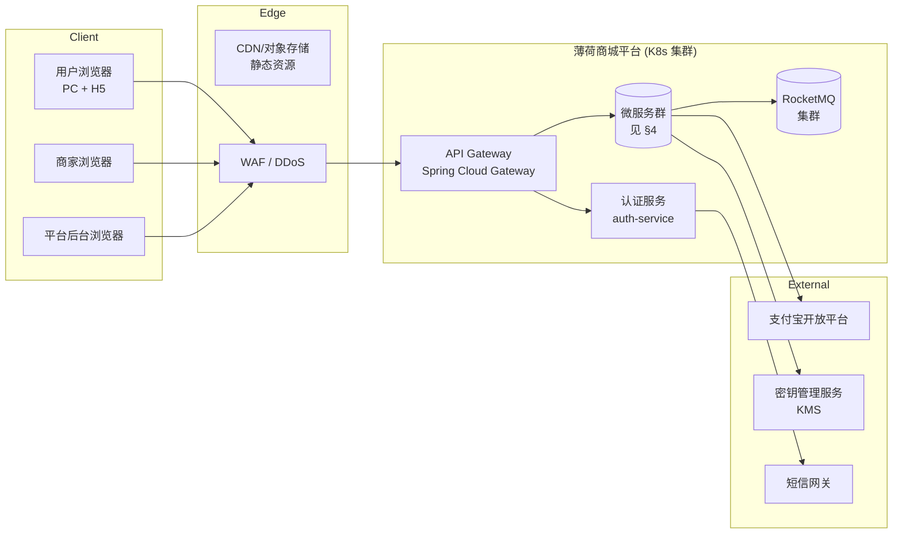
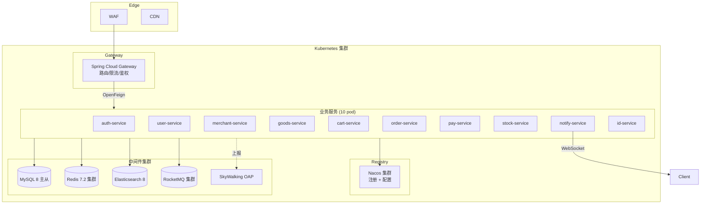
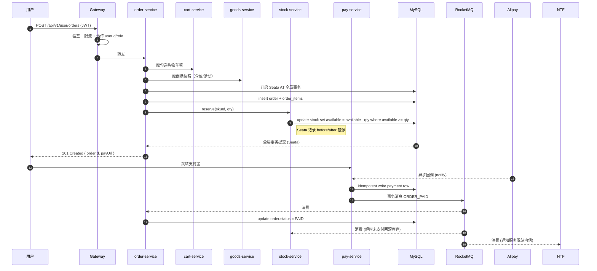
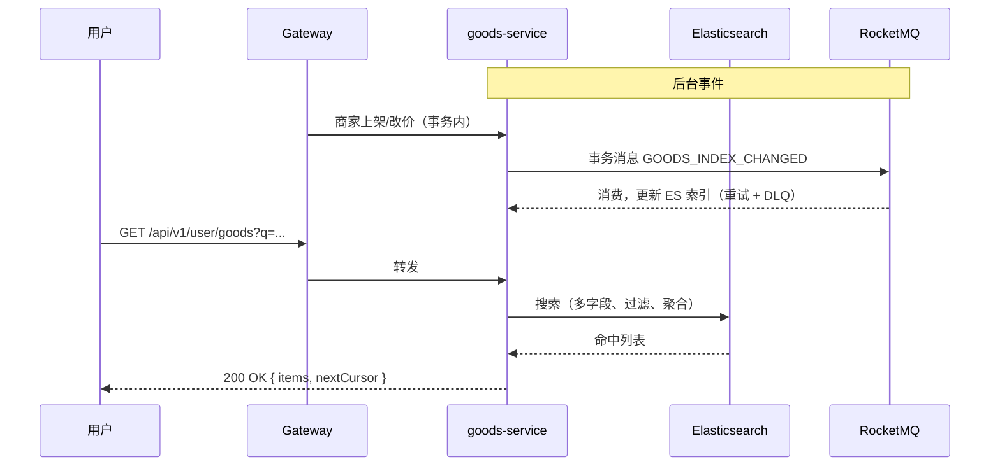
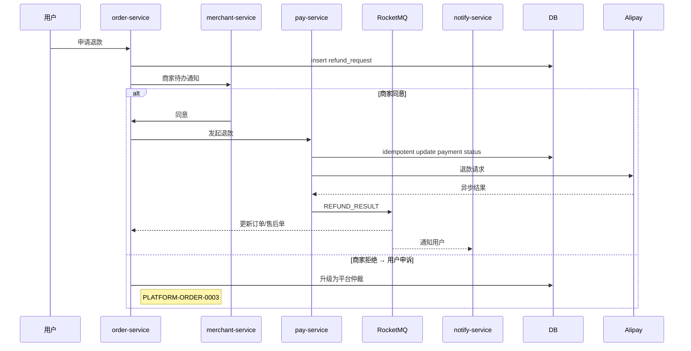
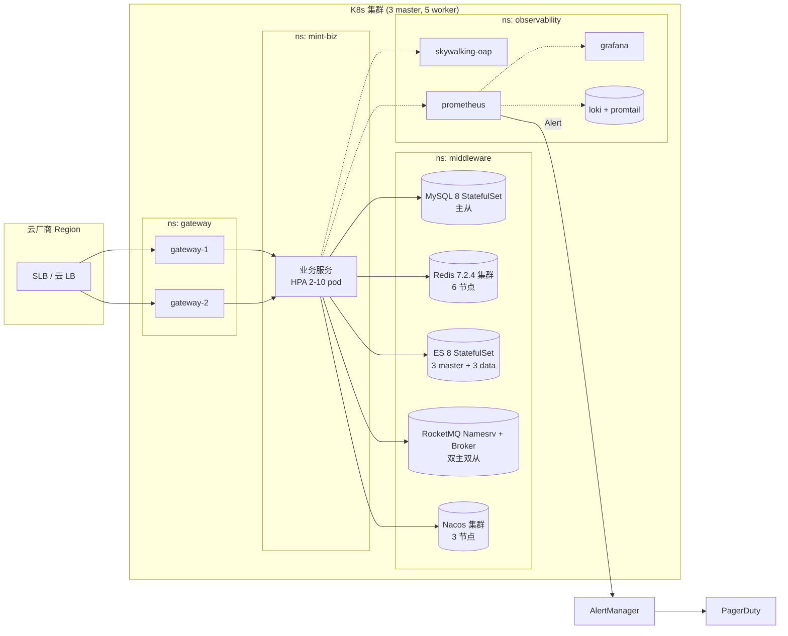

# 系统架构设计文档

## 文档信息

| 字段 | 内容 |
|------|------|
| 文档名称 | 系统架构设计文档 |
| 文档版本 | V1.0 |$
| 所属阶段 | 设计阶段 |
| 文档状态 | 已发布 |
| 创建人 | yirancrazy@gmail.com |
| 创建日期 | 2026-07-27 |
| 最后更新 | 2026-07-28 |[\$]

## 文档目的

> 描述系统的整体架构、技术选型、部署视图与核心模块设计，作为详细设计、编码、部署的顶层蓝图。
> 读者：架构师、研发、运维、SRE。

## 适用范围

- **适用对象**：架构师、研发负责人、运维
- **适用场景**：架构评审、技术选型、详细设计、部署规划
- **适用版本**：V1.0
- **不适用范围**：需求分析（见 [1. 需求阶段](../1.%20需求阶段/)）、详细实现（见 [模块详细设计](07-模块详细设计.md)）

---

## 1. 文档目的与读者

### 1.1 目的

本文档是 `.dev/需求文档.md` 在工程层面的翻译，回答"系统如何被拆出来、用什么技术实现、各服务怎么协作、怎么部署、怎么观测"。它不重复业务规则，只回答结构性问题。需求变更需先改需求文档，再回头修订本文档。

### 1.2 读者

| 角色 | 关心章节 |
|---|---|
| 后端开发 | 3 / 4 / 5 / 6 / 7 |
| 前端开发 | 4（只看接口边界）/ 5（认证、流控）/ 配合 API设计 |
| SRE / 运维 | 8 / 10 / 11 / 12 |
| 测试 / QA | 6 / 7，配合测试策略 |
| 产品 / PM | 1 / 2 / 13 |

---

## 2. 架构原则

下列原则按优先级排序；冲突时高优先级优先。

| 序 | 原则 | 含义 |
|---|---|---|
| P0 | 资金正确性 > 一切 | 订单、支付、退款、库存的对账数据必须逐分不差；可观测可追溯，宁可降级吞吐也要保证一致 |
| P1 | 服务自治 + 数据归属清晰 | 每个微服务拥有自己的数据库，跨服务只能通过 API 或领域事件访问，禁止直连他人 DB |
| P2 | 失败优先 + 幂等先行 | 所有写接口、第三方回调、消息消费必须可重入。幂等键设计见 [02-API设计文档](02-API设计文档.md) §6 |
| P3 | 配置外置 | 任何运行时常量（密钥、阈值、模板、URL）通过 Nacos 注入，禁止硬编码 |
| P4 | 可观测内建 | 关键链路默认开 SkyWalking trace、Prometheus 指标、日志带 traceId；不为可观测再开一轮会 |
| P5 | 演进优于一步到位 | 接口版本化、特性开关、分库分表开关前置预留，具体阈值由压测数据驱动 |
| P6 | 依赖可降级 | DB / Cache / MQ / 第三方支付 均提供主备或降级路径，主路径挂掉不能拖垮整站 |

---

## 3. 总体架构视图

### 3.1 C4-Context



### 3.2 C4-Container



### 3.3 服务交互总览

| 模式 | 用途 | 失败处理 |
|---|---|---|
| Gateway → Service | 用户/商家/平台外部请求统一入口 | 鉴权失败 401；限流 429；超时熔断 |
| Service → Service | 同步业务调用，OpenFeign | Feign 失败默认重试 0 次；超时 3s；连接池隔离 |
| Service → MQ | 异步事件，跨服务状态广播 | 本地事务 + 事务消息保证投递；消费者自重试 + 死信 |
| Service → DB | 各服务独占逻辑库 | 慢查询监控；超时/连接池耗尽熔断 |
| Service → Cache | 热点读 / 分布式锁 / 计数 | miss 走 DB；Redis 不可用时本地缓存兜底 |

---

## 4. 服务划分与服务契约

服务划分遵循 **业务能力边界 + 数据归属**，参考需求文档 §4.1 各角色的功能模块自然切分。

### 4.1 服务清单

| # | 服务 | 端口 | 库名 | 职责 | 对应需求 ID（举例） |
|---|---|---|---|---|---|
| 1 | `gateway` | 8080 | — | 路由、限流、JWT 验签、灰度 | 所有外部入口 |
| 2 | `auth-service` | 8201 | `auth_db` | 登录、注册、找回、token 发放/刷新、RBAC 角色 | USER-AUTH-\* / MERCHANT-AUTH-\* / PLATFORM-AUTH-\* |
| 3 | `user-service` | 8202 | `user_db` | C 端用户档案、地址、收藏 | 配合订单/售后 |
| 4 | `merchant-service` | 8203 | `merchant_db` | B 端商家档案、店铺资质、平台审核 | 配合商品/订单/支付 |
| 5 | `goods-service` | 8204 | `goods_db` | SPU/SKU 增删改查、上下架、平台审核、ES 同步 | GOODS-\* |
| 6 | `cart-service` | 8205 | `cart_db` | 购物车增删改查、勾选、清空 | SHOPPING-CART-\* |
| 7 | `order-service` | 8206 | `order_db` | 订单生命周期（创建/取消/支付/发货/收货/售后）、物流 | ORDER-\* |
| 8 | `pay-service` | 8207 | `pay_db` | 支付宝支付/退款/提现、平台对账、流水 | PAY-\* |
| 9 | `stock-service` | 8208 | `stock_db` | 库存初始化/调整/预警/流水、调拨、盘点 | STOCK-\* |
| 10 | `notify-service` | 8209 | `notify_db` | 站内信、WS 推送、外部短信/邮件、退信补偿 | MSG-\* |
| 11 | `platform-service` | 8210 | `platform_db` | 平台管理员、对账、公告、强制关单；审核通过 OpenFeign 委托业务服务 | PLATFORM-AUTH-0003 / GOODS-0001..0004 等横切 |
| 12 | `id-service` | 8211 | `id_db` | 分布式唯一 ID 生成（雪花算法等）、ID 段分配与回收 | 基础设施，为全站提供唯一标识 |

> 注：`platform-service` 与各业务服务的审核、对账接口存在职责重叠；本期明确审核接口**留在各自业务服务内**——`goods-service` 负责商品审核，`merchant-service` 负责商家资质审核——`platform-service` 仅通过 OpenFeign 调用业务服务获取待审核列表并做运营管理决策（批准/驳回/批量操作），不直接持有审核数据。这与 §4.2 服务间契约一致。平台服务职责聚焦于：管理员账号管理、对账、公告、强制关单等横切运营管理功能。

### 4.2 服务间契约清单

| 调用方 → 被调方 | 关键接口 | 用途 | 备注 |
|---|---|---|---|
| `gateway` → `auth-service` | `POST /internal/auth/verify` | 网关验签后回填角色 | internal 路径不暴露网关外 |
| `cart-service` → `goods-service` | `POST /internal/goods/sku/snapshot` | 结算时取商品快照 | 含 SPU/SKU/价格/库存快照，避免下单后改价 |
| `order-service` → `stock-service` | `POST /internal/stock/reserve` | 锁定库存（Seata AT 全局事务） | |
| `order-service` → `pay-service` | `POST /internal/pay/create` | 创建支付流水 | |
| `pay-service` → Alipay 异步回调 | `notify` | 支付结果 + 退款结果 | 验签 + 幂等消费 |
| `pay-service` → `order-service` | `POST /internal/order/paid/cancel` | 支付成功 / 失败通知 | MQ + RPC 双通道，MQ 为主 |
| `order-service` → `notify-service` | `topic: ORDER_STATUS_CHANGED` | 触发站内信 + WS 推送 | 事务消息 |
| `goods-service` → ES | 同步通道 | 商品变更后索引同步 | 通过 MQ 异步 |

### 4.3 数据库隔离

每个业务服务独立逻辑库 (`auth_db` / `user_db` / `merchant_db` / `goods_db` / `cart_db` / `order_db` / `pay_db` / `stock_db` / `notify_db` / `platform_db`)。物理部署初期使用同一 MySQL 实例不同 schema；隔离部署触发条件见 §11.4。**禁止跨服务直连数据库，所有数据交互走 API 或 MQ。**

---

## 5. 关键技术选型

### 5.1 总览表

| 维度 | 选型 | 版本 | 主要原因 |
|---|---|---|---|
| 语言 | Java | 17 LTS | 团队主流、Alibaba 手册适配、生态成熟 |
| 构建 | Maven | 3.8.6 | 公司统一 |
| 微服务框架 | Spring Cloud Alibaba | 2023.0.1.x | 对应 Spring Boot 3.2.x；Nacos/Sentinel/Seata/RocketMQ 一站 |
| Web 框架 | Spring Web MVC | — | 与现有团队习惯一致；后续按需迁移 WebFlux |
| ORM | MyBatis-Plus | 3.5.x | 国内 SCA 项目标配；Generator 提高 CRUD 效率 |
| API 网关 | Spring Cloud Gateway | 4.x | 响应式、限流/熔断原生支持 |
| 注册/配置中心 | Nacos | 2.3+ | 双角色合一；服务健康检查支持 |
| 消息队列 | RocketMQ | 5.x | 事务消息原生支持；顺序消息支持 |
| 分布式事务 | Seata | 2.x | AT 模式自动补偿，开发快 |
| 数据库 | MySQL | 8.0 LTS | 团队熟悉；原生 JSON / 窗口函数 |
| 缓存 | Redis | 7.2.4（锁定patch） | Cluster 模式；Stream/Function；BSD 许可 |
| 搜索 | Elasticsearch | 8.11.x | 商品搜索 + 复杂筛选 |
| 对象存储 | 阿里云 OSS / MinIO | — | 商品图片、文件 |
| 链路追踪 | Apache SkyWalking | 9.x | 国内 SCA 生态；无侵入探针 |
| 指标 | Prometheus + Grafana | — | 主流，Operator 易接入 |
| 日志 | Loki + Promtail | — | 资源占用低、与 Grafana 一体 |
| 部署 | Kubernetes | 1.29+ | 滚动更新、HPA、自愈 |
| CI/CD | GitLab CI / GitHub Actions（任选） | — | 与代码托管一致 |
| 镜像仓库 | Harbor | — | 国内可达 |
| 第三方支付 | 支付宝开放平台 | — | 需求明确指定 |

### 5.2 不选/排除项说明

| 候选项 | 排除原因 |
|---|---|
| Dubbo + Triple | 与 OpenFeign REST 风格不统一，端到端调试链路分裂 |
| Spring Cloud Sleuth | 已停止维护，迁移到 OpenTelemetry / SkyWalking |
| Eureka | Spring Cloud 已停止积极维护，转 Nacos |
| Spring Cloud OpenFeign 同步阻塞 IO | 初期复杂度友好，后续按需评估 WebClient；异步/高并发场景使用 RocketMQ 或 CompletableFuture+线程池（见 ADR-029.1） |

---

## 6. 请求链路关键场景

### 6.1 用户下单（核心交易链路）



要点：
- Seata AT 全局事务范围：**创建订单 + 锁定库存**。支付链路在 Seata 事务之外，由事务消息保证最终一致。
- 库存采用**乐观更新**（`where available >= qty`）避免乐观锁热点；Seata 同时在 `stock_db` 写入 `undo_log`，事务回滚时自动补回。
- 支付回调分两段写入：`pay_db` 主表 + 一致性哈希消息表，幂等键 = 支付宝 `trade_no` + 商户单号。

### 6.2 商品搜索



要点：搜索 ES 实时一致性 **放弃强一致**（异步索引），搜索结果标注 "刚刚上架的商品可能未立即出现"。`goods-service` 同时维护 MySQL 为权威源，异步任务兜底对账（每日巡检）。

### 6.3 退款 / 售后（高风险链路）



退款链路幂等键 = 退款单号。支付宝单号回写后禁止再发起。

---

## 7. 数据一致性架构

### 7.1 三类一致性边界

| 边界 | 范围 | 方案 | 备注 |
|---|---|---|---|
| **强一致** | 单服务内单事务 | 本地 `@Transactional` | 默认 |
| **最终一致 (秒级)** | 跨服务业务关键事件 | Seata AT + 本地消息表 | 订单创建/库存锁定 |
| **最终一致 (分钟级)** | 跨服务状态广播 | RocketMQ 事务消息 | 订单状态变更通知、ES 索引 |

### 7.2 幂等设计原则

- 所有写接口必须接受 `Idempotency-Key` Header（UUID），服务端 `INSERT IGNORE` 一张 `idempotency` 表，TTL 24h。
- 异步消息消费幂等使用「业务主键 + 唯一索引」天然去重。
- 第三方回调幂等键 = 第三方单号 + 业务单号复合。

### 7.3 分布式锁方案

采用 Redisson 可重入锁（ADR-047）：

| 特性 | 说明 |
|------|------|
| 可重入 | 同一线程多次获取不死锁 |
| 看门狗 | 自动续期，默认 30s |
| 原子性 | Lua 脚本保证加锁/解锁原子性 |

使用示例：
```java
RLock lock = redissonClient.getLock("order:lock:" + orderId);
try {
    if (lock.tryLock(10, TimeUnit.SECONDS)) {
        // 业务逻辑
    }
} finally {
    lock.unlock();
}
```

场景：库存扣减、订单创建、提现审核等互斥资源。

### 7.4 本地缓存

采用 Caffeine（ADR-048）：

| 特性 | 说明 |
|------|------|
| Spring Cache 原生支持 | 无缝集成 |
| 异步刷新 | 避免缓存击穿 |
| W-TinyLFU 算法 | 命中率高 |

配置：
```java
@Configuration
@EnableCaching
public class CacheConfig {
    @Bean
    public CacheManager cacheManager() {
        CaffeineCacheManager manager = new CaffeineCacheManager();
        manager.setCaffeine(Caffeine.newBuilder()
            .expireAfterWrite(5, TimeUnit.MINUTES)
            .maximumSize(1000));
        return manager;
    }
}
```

场景：商品分类、配置项等高频读数据。

### 7.5 缓存一致性

采用 Cache-Aside + 延迟双删（ADR-055）：

1. 先更新 DB
2. 删除缓存
3. 延迟 N 毫秒后再删（防脏数据）

延迟时间需大于：主从同步延迟 + 查询耗时。

### 7.6 限流熔断方案

采用 Sentinel 控制台（ADR-020）：

| 组件 | 功能 |
|------|------|
| Dashboard | 可视化配置 |
| QPS 限流 | 按路由 ID 配置阈值 |
| 熔断降级 | 异常比例 > 50% 熔断 5s |
| Nacos 持久化 | 规则持久化到 Nacos |

Feign 集成：
```yaml
feign:
  sentinel:
    enabled: true
```

### 7.7 数据补偿任务

每个业务服务提供 `compensator` 内部接口 + 对应 `xx-job` 定时任务，扫描超期未推进的本地事务记录，重试或告警。详见各服务的 README。

---

## 8. 可观测性架构

### 8.1 三件套

| 维度 | 工具 | 关键产出 |
|---|---|---|
| **Trace** | SkyWalking 9.x（无侵入探针 + OpenTelemetry SDK 双轨） | 服务调用链、慢 SQL 排名、错误率 |
| **Metrics** | Prometheus + Grafana + AlertManager | QPS / P99 / 错误率 / JVM / DB 连接池 / Sentinel 限流计数 |
| **Logs** | Loki + Promtail + Grafana | 结构化 JSON 日志（traceId / spanId / userId / role 全量带） |

### 8.2 关键告警（必须挂 PagerDuty / 钉钉）

| 名称 | 阈值 | 含义 |
|---|---|---|
| `order_create_error_rate` | > 1% 持续 2 分钟 | 下单失败率飙升（库存/支付/数据库） |
| `pay_callback_lag` | P99 > 10 秒 | 支付宝回调处理积压 |
| `db_conn_pool_active` | > 80% 持续 5 分钟 | DB 连接池接近耗尽 |
| `mq_consumer_lag` | > 10000 / min | 消息消费滞后 |
| `jvm_old_gen_usage` | > 90% 持续 10 分钟 | 即将 FullGC |

### 8.3 Trace 染色规范

- Header 透传：`X-Trace-Id`、`X-User-Id`、`X-Role`、`X-Merchant-Id`、Sentinel `X-Source`。
- MDC 字段：traceId、spanId、userId、role、merchantId、orderId。

---

## 9. 安全架构总览

> 详细策略见 [04-安全设计文档](04-安全设计文档.md)。此处仅列总览。

| 层 | 控制点 |
|---|---|
| 边缘 | WAF + DDoS（云厂商）+ IP 黑名单 |
| 接入 | TLS 1.2+ 强制，HTTPS 全站；HSTS |
| 鉴权 | JWT (HS256) + Gateway 验签 + RBAC 角色 + 对象归属校验 |
| 业务 | 参数化查询、字段级 AES-256、bcrypt、敏感字段脱敏、日志脱敏 |
| 数据 | 字段加密、备份加密、密钥由 KMS 注入 |
| 流程 | 幂等 + 防重放 (timestamp + nonce)、统一审计日志 |
| 限流 | Sentinel 多维度 (IP/用户/接口)、降级开关、热点参数限流 |
| 依赖 | 数据库/缓存/MQ/支付主备 + 降级文档 |
| 合规 | 个人信息采集最小化、跨境流转评估、个保法 + 国标 35273 |

---

## 10. 部署架构

### 10.1 K8s 集群拓扑



### 10.2 命名空间与隔离

| 命名空间 | 用途 | 服务 |
|----------|------|------|
| `minimall-prod` | 生产业务服务 | 全部12服务 |
| `minimall-infra` | 基础设施 | Nacos/MySQL/Redis/RocketMQ/ES/SkyWalking |
| `minimall-monitor` | 监控 | Prometheus/Grafana/Loki |
| `minimall-ingress` | 入口 | Nginx Ingress Controller |

服务间网络策略：default deny-all，仅允许同namespace内通信 + 跨namespace白名单（minimall-prod ↔ minimall-infra, minimall-prod ↔ minimall-monitor）

### 10.3 镜像与发布

- 镜像打包：`mvn -Pprod jib:build` → 推送 Harbor → K8s 滚动更新。
- 配置：Helm values + ConfigMap 非密文 + Secret 密文 (KMS 解封)。
- 灰度：Ingress 按 Header 灰度（如 `X-Beta=1` 5% 流量引入新版本）。
- 回滚：版本 + `kubectl rollout undo`，SLA < 5 分钟。

### 10.4 灾备

| 资源 | 主 | 备 | RPO | RTO |
|---|---|---|---|---|
| MySQL | 主库 | 同城灾备 + binlog 同步 | < 1 分钟 | < 30 分钟 |
| Redis | Cluster 6 节点 | Cluster 跨 AZ | 0（异步复制）| < 5 分钟 |
| RocketMQ | 双主双从 | — | < 1 秒 | < 1 分钟 |
| Elasticsearch | 3 master | — | < 1 分钟 | < 10 分钟 |

---

## 11. 容量与性能规划

> 需求文档 §5 给的是占位值。下列数值为 **首期上线目标**，真实基线以压测为准。

### 11.1 目标值（首期）

| 指标 | 目标 | 备注 |
|---|---|---|
| 登录接口 P99 | < 300ms | 异地容灾场景 < 800ms |
| 下单接口 P99 | < 500ms | 不含支付跳转 |
| 支付回调处理 P99 | < 200ms | 不含 Alipay 调用 |
| 商品列表 QPS | ≥ 1000 | 静态化 + 缓存 |
| 商品搜索 QPS | ≥ 200 | ES |
| 下单写 QPS | ≥ 200 | Seata AT 下调阈值 |
| 移动端首屏 P95 | < 2s | 含 CDN |

> 基线参考：同类B2C电商系统压测数据（单实例8C16G，并发200，MySQL R/W=7:3）。上线后根据实际压测结果调整。

### 11.2 容量估算

- 注册用户：3 年目标 500w；日活峰值 50w。
- SKU 数：100w 量级；日新增 ~5000。
- 日订单峰值：5w，单日大促 50w。
- 日支付交易：与订单一致。
- 日消息总量：订单相关 50w + 营销 200w。

### 11.3 扩容路径

| 阶段 | 触发 | 动作 |
|---|---|---|
| 0 → 1 | 上线 | 业务服务 HPA 2-10，业务库同实例分 schema |
| 1 → 2 | DB 连接池 > 60% 持续 1 周 | 业务库独立 MySQL 实例 |
| 2 → 3 | 单库 > 500GB 或写 QPS > 5k | 引入 Sharding-JDBC，按 `user_id` / `merchant_id` 分库分表 |
| 3 → 4 | 大促备战 | 多 AZ 部署 + 缓存前置 + 流量染色 |

### 11.4 分库分表触发条件（记录但不实现）

- `order_db` 单表 > 1 亿行；
- 写 QPS 单实例 > 5k；
- 备份时长 > 30 分钟。

迁移路径：①ShardingSphere-JDBC 读写分离 → ②按商家ID分库（merchant_id % N）→ ③热点表按时间分表。迁移期间双写校验，确认一致后切读。

### 11.5 性能预算分配（参考）

下单 P99 ≤ 500ms 拆分建议：
- Gateway 验签：≤ 10ms
- 网关→业务网关内网络：≤ 5ms
- 业务服务处理：≤ 200ms
- Seata 协调：≤ 60ms
- DB 写：≤ 100ms
- MQ produce：≤ 30ms
- 余量：95ms

---

## 12. 风险登记与缓解

| ID | 风险 | 影响面 | 概率 | 缓解措施 | 备注 |
|---|---|---|---|---|---|
| R-1 | Seata AT 写放大（每条 SQL 一行 undo_log） | 写 QPS | 高 | 接受首期，监控 undo_log 增长；2 期评估 TCC | 已记录 |
| R-2 | 单 MySQL 实例连接数耗尽 | 全站 | 中 | HPA 服务 + 连接池按需扩容 + 服务间互斥降级 | |
| R-3 | RocketMQ 事务消息回查延迟 | 一致性 | 低 | 设置 1/5/30 分钟回查上限；失败补偿任务扫描 | |
| R-4 | ES 与 MySQL 漂移导致搜索与详情不一致 | 用户感知 | 中 | 商品详情接口以 MySQL 为准；ES 漂移降级搜索接口 | |
| R-5 | 支付宝接口异常 | 支付链路 | 中 | 主备接入 + 超时熔断 + 定时对账 + 商家人工兜底 | |
| R-6 | 商家/平台误操作造成数据破坏 | 数据 | 中 | 所有删除改软删 + 审计日志 + 高危动作二次确认 | |
| R-7 | 内部微服务雪崩 | 全站 | 低 | Sentinel 熔断 + 线程池隔离 + 超时控制 | |
| R-8 | JWT 不能立即失效导致泄露扩散 | 安全 | 中 | 缩短 access_token TTL（15min）+ refresh_token 滚动 | |
| R-9 | 库存超卖 | 资金/履约 | 中 | 乐观更新 + Seata + 支付超时回滚 + 平台巡检 | |
| R-10 | 日志 PII 泄露 | 合规 | 中 | 日志脱敏中间件 + 定期审计 + 最小权限存储 | |

---

## 13. 演进路径

### 13.1 分期路线

| 阶段 | 内容 | 退出标准 |
|---|---|---|
| **M0（当前）** | 文档 + 仓库骨架 + CI | 五份设计文档定稿 |
| **M1（首版）** | auth + user + merchant + platform + goods + cart + order + pay + stock + notify 全服务骨架；登录、商品、购物车、下单、支付、退款、消息 端到端打通 | 5 个真实用户全流程跑通 |
| **M2（加固）** | 可观测性接入；Sentinel 限流上线；灰度发布 | 告警 + 灰度可用 |
| **M3（规模化）** | 分库分表开关、按需启用；ES 搜索完善；性能基线达标 | 压测报告产出 |
| **M4（治理）** | 数据中台化、商家开放 API、客服 IM | — |

### 13.2 不在范围内（明确排除）

- 多语言 / 多币种（仅 CNY）
- 自营/广告/拍卖
- 跨境电商
- 大型商家 ERP 集成（本期仅暴露 REST API）
- 个性化推荐
- 直播电商

### 13.3 决策变更控制

任何对本架构核心决策的变更必须更新本文件并通过评审。变更记录保留在 `docs/adr/` 目录（首篇 AD-0001 即本架构的初版决议）。

---

> 末尾说明：本文档仅描述「整套系统如何运转」。具体接口、字段、错误码、测试方法见配套文档。代码生成器、CI 脚本等第一次落地后再补「基础设施设计文档」。

## 相关文档链接

- 上游：[需求规格说明书（SRS）](../1.%20需求阶段/02-需求规格说明书（SRS）.md)
- 横向：[API 设计文档](02-API设计文档.md)、[接口设计文档](05-接口设计文档.md)、[数据库设计文档](03-数据库设计文档.md)、[安全设计文档](04-安全设计文档.md)、[技术选型与决策记录（ADR）](08-技术选型与决策记录（ADR）.md)
- 下游：[模块概要设计](06-模块概要设计.md)、[3. 开发阶段](../3.%20开发阶段/)、[5. 部署阶段](../5.%20部署阶段/)
- 参考：阿里规约、Spring Cloud 官方文档

## 变更记录

| 日期 | 版本 | 变更人/角色 | 变更说明 |
|------|------|-------------|----------|
| 2026-07-27 | V1.0 | yirancrazy@gmail.com | 初稿创建 |
| 2026-07-28 | V1.1 | yirancrazy@gmail.com | 新增分布式锁、本地缓存、缓存一致性、限流熔断方案 |

---
