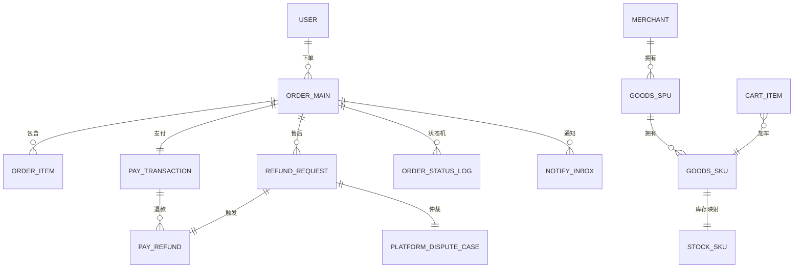

# 数据库设计文档

## 文档信息

| 字段 | 内容 |
|------|------|
| 文档名称 | 数据库设计文档 |
| 文档版本 | V1.0 |$
| 所属阶段 | 设计阶段 |
| 文档状态 | 已发布 |
| 创建人 | yirancrazy@gmail.com |
| 创建日期 | 2026-07-27 |
| 最后更新 | 2026-07-28 |[\$]

## 文档目的

> 定义数据库的表结构、字段、索引、分库分表策略，作为后端开发、SQL 评审、运维变更的统一依据。
> 读者：后端开发、DBA、运维、测试。

## 适用范围

- **适用对象**：后端开发、DBA、运维、测试
- **适用场景**：SQL 编写、索引调优、DDL 变更、数据迁移
- **适用版本**：V1.0
- **不适用范围**：API 契约（见 [API 设计文档](02-API设计文档.md)）、业务需求（见 [1. 需求阶段](../1.%20需求阶段/)）

---

## 目录

1. [设计原则与基线](#1-设计原则与基线)
2. [命名规范](#2-命名规范)
3. [公共约定字段](#3-公共约定字段)
4. [库总览与物理部署](#4-库总览与物理部署)
5. [auth_db — 认证域](#5-auth_db--认证域)
6. [user_db / merchant_db — 主数据域](#6-user_db--merchant_db--主数据域)
7. [platform_db — 平台运营域](#7-platform_db--平台运营域)
8. [goods_db — 商品域](#8-goods_db--商品域)
9. [cart_db — 购物车域](#9-cart_db--购物车域)
10. [order_db — 订单域](#10-order_db--订单域)
11. [pay_db — 支付域](#11-pay_db--支付域)
12. [stock_db — 库存域](#12-stock_db--库存域)
13. [notify_db — 消息域](#13-notify_db--消息域)
14. [辅助/全局表](#14-辅助全局表)
15. [核心 ER 关系](#15-核心-er-关系)
16. [索引设计指南](#16-索引设计指南)
17. [分库分表策略](#17-分库分表策略)
18. [加密与脱敏字段汇总](#18-加密与脱敏字段汇总)
19. [迁移与版本控制](#19-迁移与版本控制)
20. [附录：数据生命周期](#20-附录数据生命周期)

---

## 1. 设计原则与基线

| 序 | 原则 | 含义 |
|---|---|---|
| D0 | 服务独占库 | 一库一服务，禁止跨服务直连 DB |
| D1 | 数据归属 = 服务归属 | 不跨服务 JOIN，跨服务查询走 API 或数据同步到 ES |
| D2 | 字段最小化 | 不存可推导字段，不存敏感明文 |
| D3 | 软删 + 审计 | 所有业务表 `is_deleted` + `created_at`/`updated_at`/`created_by`/`updated_by` |
| D4 | 强一致优先 | Seata AT 要求每张业务表必须存在主键索引，禁止跨库事务 |
| D5 | 可加密标记 | 每个敏感字段用 `_enc` 后缀或不写入列名但写入列注释（避免业务代码读取明文） |
| D6 | 时间统一 | 所有时间字段使用 `DATETIME(3)` UTC，存储 UTC，展示由前端按浏览器时区转换 |
| D7 | 资源标识用 BIGINT | 雪花算法生成 64 位主键（详见 §2.3） |
| D8 | 测试与生产 schema 同构 | 测试库使用 Testcontainers 启动 MySQL，自动 Flyway/Liquibase 迁移 |

---

## 2. 命名规范

### 2.1 通用规则

| 项 | 规则 | 示例 |
|---|---|---|
| 库名 | `<domain>_db`，全小写下划线 | `auth_db`, `order_db` |
| 表名 | `t_<module>_<entity>`，全小写下划线 | `t_order_main`, `t_stock_sku` |
| 字段名 | 全小写下划线，不超过 32 字符 | `order_no`, `paid_at` |
| 主键 | `id` BIGINT UNSIGNED | — |
| 业务流水号 | `<entity>_no` VARCHAR(32) | `order_no`, `payment_no`, `refund_no` |
| 布尔 | `is_<state>`, `has_<state>` | `is_deleted`, `is_paid` |
| 字典 | `dict_<type>` 或独立字典表 | — |
| 索引 | `idx_<table>_<col[_col]>` | `idx_order_user_id` |
| 唯一索引 | `uk_<table>_<col[_col]>` | `uk_order_order_no` |

### 2.2 表前缀 module 缩写

| module | 前缀 | 备注 |
|---|---|---|
| 认证 auth | `auth_` | 登录、token、RBAC |
| 用户 user | `user_` | C 端用户档案 |
| 商家 merchant | `merch_` | B 端商家档案 |
| 平台 platform | `plat_` | 平台运营 |
| 商品 goods | `goods_` | SPU / SKU / 类目 |
| 购物车 cart | `cart_` | — |
| 订单 order | `order_` | — |
| 支付 pay | `pay_` | — |
| 库存 stock | `stock_` | — |
| 消息 notify | `notify_` | — |
| 通用 common | `common_` | 字典、地区、配置 |

### 2.3 主键：雪花 ID

- 全部内部主键使用 `BIGINT UNSIGNED`，默认由 `mybatis-plus` + `cosid` 或自研雪花算法生成；
- 雪花结构：`[1bit 符号][41bit 时间戳][10bit 工作机器][12bit 自增]`，保证趋势递增，便于 InnoDB 聚集索引顺序写入；
- 对外流水号（订单号、支付单号）使用 `VARCHAR(32)` 业务前缀 + 雪花 + 校验位（如 `OD2025121912345678X`）。

### 2.4 MySQL 版本与字符集

- MySQL 8.0 LTS；
- 默认库/表字符集 `utf8mb4` + 排序 `utf8mb4_0900_ai_ci`；
- 所有 VARCHAR 列必须有 CHARACTER SET。

---

## 3. 公共约定字段

下面字段每张业务表强制包含（位置不固定，统一追加）：

| 字段 | 类型 | 默认 | 含义 |
|---|---|---|---|
| `id` | BIGINT UNSIGNED PK | — | 雪花主键 |
| `is_deleted` | TINYINT UNSIGNED NOT NULL | 0 | 软删（0 存在 / 1 删除） |
| `created_at` | DATETIME(3) NOT NULL | — | UTC |
| `updated_at` | DATETIME(3) NOT NULL | — | UTC，行任何 update 触发 |
| `created_by` | BIGINT UNSIGNED NULL | — | 操作者 id，可为系统 |
| `updated_by` | BIGINT UNSIGNED NULL | — | 操作者 id，可为系统 |
| `version` | INT UNSIGNED NOT NULL | 0 | MyBatis-Plus 乐观锁版本号 |

### 3.1 选加字段（按表性质选用）

下面字段**不是每张表都加**，按表性质选用：

| 字段 | 类型 | 适用表类型 | 含义 |
|---|---|---|---|
| `feature_id` | VARCHAR(32) NULL | 审计 / 流水 / 幂等表 | 关联仓库 `CLAUDE.md` 中的 Functional Identifier，如 `USER-ORDER-0001`；用于跨日志 / 文档追溯 |
| `biz_no` | VARCHAR(32) NULL | 单据表 | 业务流水号（如订单号 `OD20251219-A1B2C3D4`），对外展示 |
| `trace_id` | VARCHAR(32) NULL | 审计 / 流水表 | 链路追踪 id，由 SkyWalking 上游注入 |
| `idempotency_key` | VARCHAR(64) NULL | 幂等表 | 唯一键，TTL 24h（见 [02-API设计文档 §6](02-API设计文档.md)） |

加列规则：

- `feature_id` + `biz_no` 二选一，不可重复：一类是审计追溯用，一类是业务展示用
- 审计 / 流水 / 幂等三类表建议三列同时建（feature_id + trace_id + idempotency_key）
- 普通主数据表（用户表 / 商品表 / 商家表）不加 `feature_id`

约定：业务主键 `id` 仅用于表内聚簇索引；对外展示使用业务流水号 `_no`。

---

## 4. 库总览与物理部署

| 库 | 所属服务 | 关键表数 | 物理（首期） | 物理（拆出）触发 |
|---|---|---|---|---|
| `auth_db` | auth-service | 6 | 同实例 schema | 单实例 > 200 连接活跃 > 24h |
| `user_db` | user-service | 4 | 同实例 schema | 同上 |
| `merchant_db` | merchant-service | 6 | 同实例 schema | 同上 |
| `platform_db` | platform-service | 5 | 同实例 schema | 同上 |
| `goods_db` | goods-service | 9 | 同实例 schema | 商品表 > 5000w 行 |
| `cart_db` | cart-service | 3 | 同实例 schema | 与 user_db 同实例可合并 |
| `order_db` | order-service | 8 | 同实例 schema | 订单主表 > 1 亿行 |
| `pay_db` | pay-service | 7 | 独立实例 | 上线即分离 |
| `stock_db` | stock-service | 6 | 独立实例 | 上线即分离 |
| `notify_db` | notify-service | 6 | 同实例 schema | — |

首期所有 schema 部署在一台 MySQL（主从）上；通过 Schema/User 隔离 + 网络策略约束访问。`pay_db` 与 `stock_db` 上线即分离实例，触发条件见 §17。

> **D0 "服务独占库"与物理部署说明**：首期采用**物理共实例+逻辑隔离**策略：所有 schema 部署在同一 MySQL 实例上以节省资源，但每个服务拥有独立 schema，禁止跨服务直连其他服务的表。扩容时按服务独立迁移到单独实例。此策略与 D0 原则不矛盾——D0 强调的是逻辑归属与访问隔离（一库一服务、禁止跨服务直连 DB），而非物理实例独占。

---

## 5. auth_db — 认证域

### 5.1 t_auth_user（认证用户）

| 字段 | 类型 | 备注 |
|---|---|---|
| `id` | BIGINT UNSIGNED PK | 雪花 |
| `account` | VARCHAR(64) | 登录账号（手机号 / 邮箱）— 字段不加密；输入唯一；用作登录名 |
| `phone_enc` | VARBINARY(256) | AES-256，手机号密文 |
| `email_enc` | VARBINARY(256) | AES-256 |
| `password_hash` | VARCHAR(80) | bcrypt cost=12 |
| `salt` | VARCHAR(32) | bcrypt 内置，无需独立 salt |
| `account_type` | TINYINT | 1=USER, 2=MERCHANT, 3=PLATFORM |
| `role_id` | BIGINT UNSIGNED | 关联 `t_auth_role.id` |
| `status` | TINYINT | 0=未激活 1=正常 2=冻结 3=注销 |
| `last_login_at` | DATETIME(3) | — |
| 公共字段 | | 见 §3 |

索引：`uk_auth_user_account(account)`，`idx_auth_user_phone_hash(phone_hash)`, `idx_auth_user_type_status(account_type, status)`。

> 拆分考量：账户账号列只存散列前缀 + 加密密文，避免明文泄露后被字典攻击。

### 5.2 t_auth_user_audit（认证尝试审计）

| 字段 | 类型 | 备注 |
|---|---|---|
| `id` | BIGINT UNSIGNED PK | — |
| `user_id` | BIGINT UNSIGNED | FK，可空（账号不存在时） |
| `account_input_hash` | CHAR(64) | 输入账号 SHA-256 |
| `client_ip` | VARCHAR(45) | IPv6 friendly |
| `user_agent` | VARCHAR(255) | — |
| `result` | TINYINT | 1=成功 2=密码错 3=锁定 4=异常 |
| `created_at` | DATETIME(3) | UTC |
| 公共字段 | | 见 §3 |

索引：`idx_auth_audit_user(user_id, created_at)`, `idx_auth_audit_ip(client_ip, created_at)`。保留 180 天。

### 5.3 t_auth_role / t_auth_permission / t_auth_role_permission

- `t_auth_role`：角色主表，记录三种角色及子角色（运营/客服/审核）。
- `t_auth_permission`：权限码（`USER-ORDER-0001` 等）。
- `t_auth_role_permission`：多对多，含通配符规则（`ORDER:*`）。

### 5.4 t_auth_token_blacklist（JWT 主动失效）

字段：`jti CHAR(32) PK, user_id, expires_at, revoked_at, reason`。定期清理已过期记录。

### 5.5 undo_log（Seata AT 强制）

Seata 默认表结构由框架自动建表；本文档不重复描述。

---

## 6. user_db / merchant_db — 主数据域

### 6.1 user_db

`t_user_profile`：用户档案（昵称、头像、性别、生日）。

| 字段 | 类型 | 备注 |
|---|---|---|
| `user_id` | BIGINT UNSIGNED PK | 与 `auth_db.t_auth_user.id` 同号 |
| `nickname` | VARCHAR(32) | — |
| `avatar_url` | VARCHAR(255) | — |
| `gender` | TINYINT | 0=未填 1=男 2=女 |
| `birthday` | DATE | — |
| `level` | TINYINT | 用户等级（会员体系，预留） |
| 公共字段 | | 见 §3 |

`t_user_address`：收货地址。

| 字段 | 类型 | 备注 |
|---|---|---|
| `id` | BIGINT UNSIGNED PK | — |
| `user_id` | BIGINT UNSIGNED | — |
| `receiver_name_enc` | VARBINARY(256) | 收货人 AES-256 |
| `receiver_phone_enc` | VARBINARY(256) | AES-256 |
| `region_code` | VARCHAR(12) | 行政区划编码 |
| `detail_enc` | VARBINARY(512) | 详细地址 AES-256 |
| `is_default` | TINYINT | — |
| 公共字段 | | 见 §3 |

索引：`uk_user_address_default(user_id, is_default)`, `idx_user_address_user(user_id)`。

字段级加密说明：
- `receiver_phone_enc`: AES-256-CBC 加密存储，密钥由KMS托管，查询时Service层解密
- `receiver_name_enc`: 字段名后缀 `_enc` 标识已加密
- 详细地址暂不加密（非敏感PII）

`t_user_favorite`：收藏夹（从购物车移入）。

`t_user_behavior_log`：行为埋点（搜索、浏览、点击）异步写入 ClickHouse，本期 MySQL 仅保留 7 天冷数据。

### 6.2 merchant_db

`t_merch_merchant`：商家主体。

| 字段 | 类型 | 备注 |
|---|---|---|
| `id` | BIGINT UNSIGNED PK | — |
| `user_id` | BIGINT UNSIGNED | 关联 `auth_db` |
| `merchant_name` | VARCHAR(64) | 店铺名 |
| `legal_person_enc` | VARBINARY(256) | 法人姓名 AES-256 |
| `legal_phone_enc` | VARBINARY(256) | 法人手机 AES-256 |
| `id_card_no_enc` | VARBINARY(512) | 身份证 AES-256 |
| `business_license_no_enc` | VARBINARY(512) | 营业执照 AES-256 |
| `bank_account_enc` | VARBINARY(512) | 提现银行卡 AES-256 |
| `settlement_account_type` | TINYINT | 1=对公 2=法人 |
| `audit_status` | TINYINT | 0=待审 1=通过 2=驳回 |
| `audit_reason` | VARCHAR(255) | — |
| `audit_at` | DATETIME(3) | — |
| 公共字段 | | 见 §3 |

索引：`uk_merch_merchant_user(user_id)`, `idx_merch_status(audit_status)`。

`t_merch_withdraw_account`：商家提现账户明细（同上 AES-256 加密字段）。

`t_merch_qualification`：经营资质（多对一）。

`t_merch_balance`：商家余额账。

| 字段 | 类型 | 备注 |
|---|---|---|
| `merchant_id` | BIGINT UNSIGNED PK | FK `t_merch_merchant.id` |
| `available_amount` | DECIMAL(18,2) | 可提现 |
| `frozen_amount` | DECIMAL(18,2) | 提现中 |
| `currency` | CHAR(3) | CNY |
| 公共字段 | | 见 §3 |

`t_merch_balance_journal`：余额账流水，每笔金额变动的复式记账记录。

`t_merch_audit_log`：商家资质审核日志。每行 `feature_id = PLATFORM-AUTH-0004`（跨文档追溯用，见 [02-API设计文档 §13.1](02-API设计文档.md) 与 [CLAUDE.md Functional Identifier Convention](../../CLAUDE.md)）。

---

## 7. platform_db — 平台运营域

### 7.1 t_plat_admin

平台管理员表，结构同 `t_auth_user` 但 `account_type=3`；本期直接在 `auth_db` 中即可，不必分库。**保留此表是为未来与 `t_auth_user` 解耦预留扩展点。**

### 7.2 t_plat_announcement

| 字段 | 类型 | 备注 |
|---|---|---|
| `id` | BIGINT UNSIGNED PK | — |
| `title` | VARCHAR(128) | — |
| `content_md` | MEDIUMTEXT | — |
| `target` | TINYINT | 0=全部 1=USER 2=MERCHANT 3=USER+MERCHANT |
| `publish_at` | DATETIME(3) | — |
| `expire_at` | DATETIME(3) | — |
| 公共字段 | | 见 §3 |

### 7.3 t_plat_dispute_case

退款纠纷仲裁工单，对应 `PLATFORM-ORDER-0003`。

| 字段 | 类型 | 备注 |
|---|---|---|
| `id` | BIGINT UNSIGNED PK | — |
| `case_no` | VARCHAR(32) UK | — |
| `order_id` | BIGINT UNSIGNED | 跨服务，不建 FK |
| `refund_request_id` | BIGINT UNSIGNED | 跨服务 |
| `status` | TINYINT | 0=待处理 1=处理中 2=已结案 |
| `resolution` | VARCHAR(512) | 仲裁结果 |
| `handler_id` | BIGINT UNSIGNED | 平台管理员 |
| `handled_at` | DATETIME(3) | — |
| 公共字段 | | 见 §3 |

### 7.4 t_plat_reconciliation_batch

对账批次。

| 字段 | 类型 | 备注 |
|---|---|---|
| `id` | BIGINT UNSIGNED PK | — |
| `batch_no` | VARCHAR(32) UK | — |
| `biz_date` | DATE | — |
| `status` | TINYINT | 0=生成中 1=对账中 2=有差异 3=一致 |
| `diff_count` | INT | — |
| `created_at` | DATETIME(3) | — |
| 公共字段 | | 见 §3 |

### 7.5 t_plat_reconciliation_diff

对账差异明细（订单/支付/库存三方对账）。

---

## 8. goods_db — 商品域

### 8.1 ER 关系

```mermaid
erDiagram
    CATEGORY ||--o{ SPU : 1:N
    SPU ||--o{ SKU : 1:N
    SPU }o--|| MERCHANT : N:1
    SKU }o--o| STOCK_SKU : 1:1
    SKU ||--o{ SKU_ATTR_VALUE : 1:N
    ATTR_DEF ||--o{ ATTR_VALUE : 1:N
    SPU }o--o{ ATTR_DEF : M:N
    GOODS_AUDIT }o--|| SPU : N:1
    GOODS_AUDIT }o--o| ADMIN : N:1
```

### 8.2 t_goods_category

商品类目，3 级树。

| 字段 | 类型 | 备注 |
|---|---|---|
| `id` | BIGINT UNSIGNED PK | — |
| `parent_id` | BIGINT UNSIGNED | 0 = 一级 |
| `name` | VARCHAR(64) | — |
| `level` | TINYINT | 1/2/3 |
| `path` | VARCHAR(255) | `/1/12/124/` 类目路径 |
| `sort_order` | INT | — |
| `status` | TINYINT | 0=禁用 1=启用 |
| 公共字段 | | 见 §3 |

索引：`idx_goods_category_parent(parent_id, sort_order)`, `uk_goods_category_path(path)`。

### 8.3 t_goods_attr_def / t_goods_attr_value

商品属性定义与可选值（如"颜色"、"尺码"→["红","蓝"]）。

### 8.4 t_goods_spu

| 字段 | 类型 | 备注 |
|---|---|---|
| `id` | BIGINT UNSIGNED PK | — |
| `spu_no` | VARCHAR(32) UK | — |
| `merchant_id` | BIGINT UNSIGNED | — |
| `category_id` | BIGINT UNSIGNED | 末级类目 |
| `title` | VARCHAR(128) | — |
| `subtitle` | VARCHAR(255) | — |
| `brand_id` | BIGINT UNSIGNED NULL | — |
| `main_image_url` | VARCHAR(255) | — |
| `video_url` | VARCHAR(255) | — |
| `detail_md` | MEDIUMTEXT | 富文本 |
| `status` | TINYINT | 0=草稿 1=待审 2=在售 3=下架 4=审核驳回 |
| `audit_id` | BIGINT UNSIGNED NULL | 关联审核记录 |
| `publish_at` | DATETIME(3) | 上架时间 |
| 公共字段 | | 见 §3 |

索引：`uk_goods_spu_spu_no(spu_no)`, `idx_goods_spu_merchant_status(merchant_id, status, updated_at)`, `idx_goods_spu_category_status(category_id, status)`。

### 8.5 t_goods_sku

| 字段 | 类型 | 备注 |
|---|---|---|
| `id` | BIGINT UNSIGNED PK | — |
| `sku_no` | VARCHAR(32) UK | — |
| `spu_id` | BIGINT UNSIGNED | — |
| `merchant_id` | BIGINT UNSIGNED | — |
| `sku_spec_json` | JSON | `{"颜色":"红","尺码":"XL"}` |
| `price` | DECIMAL(12,2) | 当前售价 |
| `market_price` | DECIMAL(12,2) | — |
| `cost_price` | DECIMAL(12,2) | 商家成本（仅商家可见） |
| `weight_g` | INT | — |
| `barcode` | VARCHAR(32) | — |
| `image_url` | VARCHAR(255) | — |
| `status` | TINYINT | 0=禁用 1=启用 |
| 公共字段 | | 见 §3 |

索引：`uk_goods_sku_sku_no(sku_no)`, `idx_goods_sku_spu(spu_id)`, `idx_goods_sku_merchant(merchant_id)`。

### 8.6 t_goods_spu_image / t_goods_spu_attr / t_goods_sku_attr

SPU/SKU 关联属性 + 图片。

### 8.7 t_goods_audit_record

| 字段 | 类型 | 备注 |
|---|---|---|
| `id` | BIGINT UNSIGNED PK | — |
| `spu_id` | BIGINT UNSIGNED | — |
| `auditor_id` | BIGINT UNSIGNED | 平台管理员 |
| `decision` | TINYINT | 1=通过 2=驳回 |
| `reason` | VARCHAR(512) | — |
| `audit_at` | DATETIME(3) | — |
| 公共字段 | | 见 §3 |

### 8.8 t_goods_search_sync

ES 同步任务表（异步消息消费失败或对账扫描用），保留 30 天。

| 字段 | 类型 | 备注 |
|---|---|---|
| `id` | BIGINT UNSIGNED PK | — |
| `spu_id` | BIGINT UNSIGNED | — |
| `op` | TINYINT | 1=upsert 2=delete |
| `status` | TINYINT | 0=待同步 1=已同步 2=失败 |
| `retry_count` | INT | — |
| `last_error` | VARCHAR(512) | — |
| `synced_at` | DATETIME(3) | — |

---

## 9. cart_db — 购物车域

### 9.1 t_cart_item

| 字段 | 类型 | 备注 |
|---|---|---|
| `id` | BIGINT UNSIGNED PK | — |
| `user_id` | BIGINT UNSIGNED | — |
| `merchant_id` | BIGINT UNSIGNED | 购物车按商家分组 |
| `sku_id` | BIGINT UNSIGNED | — |
| `spu_id` | BIGINT UNSIGNED | 冗余便于展示 |
| `quantity` | INT | — |
| `is_selected` | TINYINT | 勾选状态 |
| `price_snapshot` | DECIMAL(12,2) | 加入购物车时的价格 |
| `activity_id` | BIGINT UNSIGNED NULL | 活动 id（预留） |
| `added_at` | DATETIME(3) | — |
| 公共字段 | | 见 §3 |

索引：`uk_cart_user_sku(user_id, sku_id)`（一用户一 SKU 一行，更新数量即可）, `idx_cart_user_merchant(user_id, merchant_id)`。

### 9.2 t_cart_log

加车/删车/勾选/清空行为日志，保留 90 天。

### 9.3 t_cart_abandoned_record

弃单挽回任务专用，每用户每 SKU 一条，30 天过期删除。

---

## 10. order_db — 订单域

### 10.1 ER 关系

```mermaid
erDiagram
    ORDER_MAIN ||--o{ ORDER_ITEM : 1:N
    ORDER_MAIN ||--o{ ORDER_STATUS_LOG : 1:N
    ORDER_MAIN ||--o{ REFUND_REQUEST : 0:N
    REFUND_REQUEST ||--o{ REFUND_LOG : 1:N
    ORDER_MAIN }o--o| ORDER_PAYMENT_SNAPSHOT : 1:1
```

### 10.2 t_order_main

| 字段 | 类型 | 备注 |
|---|---|---|
| `id` | BIGINT UNSIGNED PK | — |
| `order_no` | VARCHAR(32) UK | — |
| `user_id` | BIGINT UNSIGNED | — |
| `merchant_id` | BIGINT UNSIGNED | 跨商家拆单时为多记录 |
| `order_type` | TINYINT | 1=普通 2=拼团 3=秒杀（预留） |
| `status` | TINYINT | 1=待支付 2=已支付 3=已发货 4=已收货 5=已取消 6=退款中 7=已关闭 |
| `total_amount` | DECIMAL(12,2) | 应付总额 |
| `pay_amount` | DECIMAL(12,2) | 实付 |
| `freight_amount` | DECIMAL(12,2) | 运费 |
| `discount_amount` | DECIMAL(12,2) | 优惠金额 |
| `receiver_snapshot_json` | JSON | 下单时收货信息快照 |
| `pay_expire_at` | DATETIME(3) | 支付超时时间 |
| `paid_at` | DATETIME(3) | 支付完成时间 |
| `shipped_at` | DATETIME(3) | 发货时间 |
| `received_at` | DATETIME(3) | 收货时间 |
| `closed_at` | DATETIME(3) | 关闭时间 |
| `close_reason` | VARCHAR(128) | — |
| `client_ip` | VARCHAR(45) | — |
| `idempotency_key` | CHAR(36) | 唯一幂等键 |
| 公共字段 | | 见 §3 |

索引：
- `uk_order_main_no(order_no)`；
- `idx_order_main_user_status(user_id, status, created_at)`；
- `idx_order_main_merchant_status(merchant_id, status, created_at)`；
- `idx_order_main_pay_expire(status, pay_expire_at)`；
- `uk_order_main_idem(idempotency_key)`。

### 10.3 t_order_item

| 字段 | 类型 | 备注 |
|---|---|---|
| `id` | BIGINT UNSIGNED PK | — |
| `order_id` | BIGINT UNSIGNED | — |
| `merchant_id` | BIGINT UNSIGNED | 冗余 |
| `spu_id` | BIGINT UNSIGNED | — |
| `spu_snapshot_json` | JSON | 下单时 SPU 信息快照 |
| `sku_id` | BIGINT UNSIGNED | — |
| `sku_snapshot_json` | JSON | 下单时 SKU 信息快照 |
| `sku_image_url` | VARCHAR(255) | — |
| `sku_title` | VARCHAR(255) | — |
| `unit_price` | DECIMAL(12,2) | — |
| `quantity` | INT | — |
| `subtotal_amount` | DECIMAL(12,2) | — |
| `discount_amount` | DECIMAL(12,2) | — |
| `pay_amount` | DECIMAL(12,2) | — |
| `refund_status` | TINYINT | 0=无 1=部分退款 2=全额退款 |
| 公共字段 | | 见 §3 |

索引：`uk_order_item_order_sku(order_id, sku_id)`, `idx_order_item_merchant(merchant_id)`。

### 10.4 t_order_status_log

订单状态机日志（事件溯源）。

| 字段 | 类型 | 备注 |
|---|---|---|
| `id` | BIGINT UNSIGNED PK | — |
| `order_id` | BIGINT UNSIGNED | — |
| `from_status` | TINYINT | — |
| `to_status` | TINYINT | — |
| `trigger` | VARCHAR(32) | USER_PAY, MERCHANT_SHIP, SYSTEM_TIMEOUT ... |
| `operator_id` | BIGINT UNSIGNED NULL | — |
| `note` | VARCHAR(255) | — |
| `created_at` | DATETIME(3) | — |

索引：`idx_order_status_log_order(order_id, created_at)`。

### 10.5 t_refund_request / t_refund_log

`PLATFORM-ORDER-0003` 与 `MERCHANT-ORDER-0005` 数据载体。

`refund_request` 字段：`id`, `refund_no`, `order_id`, `order_item_id`, `user_id`, `merchant_id`, `refund_type` (1=仅退款 2=退货退款), `refund_amount`, `reason`, `evidence_json`, `status` (0=待商家审 1=商家同意 2=商家拒绝 3=平台仲裁 4=已退款 5=已关闭), `merchant_decision_at`, `platform_decision_at`, `completed_at`, ... + 公共字段。

### 10.6 t_order_payment_snapshot

支付快照，`order_id` 唯一：记录 `pay_amount`、`pay_method`、`expire_at`，便于支付服务校验一致性。

### 10.7 t_order_logistics

物流主表（运单号 + 物流公司），与 `t_order_logistics_event` 一对多。

### 10.8 t_idempotency

全局幂等键表，TTL 24h，由 cleanup 任务清理。

---

## 11. pay_db — 支付域

### 11.1 t_pay_channel

支付渠道字典：1=支付宝，2=微信（预留），3=余额（预留）。

### 11.2 t_pay_transaction

| 字段 | 类型 | 备注 |
|---|---|---|
| `id` | BIGINT UNSIGNED PK | — |
| `payment_no` | VARCHAR(32) UK | 商户单号 |
| `trade_no` | VARCHAR(64) | 支付宝/微信单号 |
| `order_no` | VARCHAR(32) | 关联订单号 |
| `user_id` | BIGINT UNSIGNED | — |
| `merchant_id` | BIGINT UNSIGNED | — |
| `amount` | DECIMAL(12,2) | — |
| `currency` | CHAR(3) | CNY |
| `status` | TINYINT | 1=待支付 2=成功 3=失败 4=关闭 5=退款中 6=已退款 |
| `channel` | TINYINT | — |
| `channel_response` | JSON | 异步回调原始报文，存证 |
| `paid_at` | DATETIME(3) | — |
| `idempotency_key` | CHAR(36) | — |
| 公共字段 | | 见 §3 |

索引：`uk_pay_trade_no(trade_no)`, `idx_pay_order_no(order_no)`, `idx_pay_user_status(user_id, status, created_at)`, `uk_pay_idem(idempotency_key)`。

### 11.3 t_pay_refund

退款单。

| 字段 | 类型 | 备注 |
|---|---|---|
| `id` | BIGINT UNSIGNED PK | — |
| `refund_no` | VARCHAR(32) UK | — |
| `payment_no` | VARCHAR(32) | — |
| `refund_trade_no` | VARCHAR(64) | 支付宝退款单号 |
| `amount` | DECIMAL(12,2) | — |
| `reason` | VARCHAR(255) | — |
| `status` | TINYINT | 0=待发起 1=成功 2=失败 3=关闭 |
| `notified_at` | DATETIME(3) | — |
| `idempotency_key` | CHAR(36) | — |
| 公共字段 | | 见 §3 |

### 11.4 t_pay_withdraw

提现申请（对应 `MERCHANT-PAY-0003` / `PLATFORM-PAY-0004`）。

### 11.5 t_pay_journal

复式记账流水（每笔金额变动：debit/credit/balance_after）。

### 11.6 t_pay_reconciliation_file

对账文件元数据（每日下载、解析、对账状态）。

### 11.7 t_pay_idempotency

支付幂等键表。

---

## 12. stock_db — 库存域

### 12.1 ER 关系

```mermaid
erDiagram
    STOCK_SKU ||--o{ STOCK_RESERVE : 1:N
    STOCK_SKU ||--o{ STOCK_JOURNAL : 1:N
    STOCK_THRESHOLD ||--|| STOCK_SKU : 1:1
```

### 12.2 t_stock_sku（库存单元）

| 字段 | 类型 | 备注 |
|---|---|---|
| `id` | BIGINT UNSIGNED PK | — |
| `sku_id` | BIGINT UNSIGNED | 跨服务 |
| `merchant_id` | BIGINT UNSIGNED | — |
| `available_qty` | INT NOT NULL | 可售库存 |
| `reserved_qty` | INT NOT NULL | 已锁库存（待支付） |
| `sold_qty` | INT NOT NULL | 已售出 |
| `total_qty` | INT NOT NULL GENERATED ALWAYS AS (available + reserved + sold) | 生成列 |
| `version` | INT NOT NULL | 乐观锁 |
| 公共字段 | | 见 §3 |

索引：`uk_stock_sku_sku(sku_id)`, `idx_stock_sku_merchant(merchant_id)`。

更新 SQL 模版（乐观更新，避免超卖）：

```sql
UPDATE t_stock_sku
   SET available_qty = available_qty - #{qty},
       reserved_qty  = reserved_qty + #{qty},
       version = version + 1
 WHERE sku_id = #{skuId}
   AND available_qty >= #{qty}
   AND version = #{version};
```

### 12.3 t_stock_reserve（锁定明细）

| 字段 | 类型 | 备注 |
|---|---|---|
| `id` | BIGINT UNSIGNED PK | — |
| `reserve_no` | VARCHAR(32) UK | — |
| `sku_id` | BIGINT UNSIGNED | — |
| `order_no` | VARCHAR(32) | — |
| `user_id` | BIGINT UNSIGNED | — |
| `qty` | INT | — |
| `expire_at` | DATETIME(3) | 锁定到期时间 |
| `status` | TINYINT | 1=锁定中 2=已扣减 3=已释放 4=已过期 |
| 公共字段 | | 见 §3 |

索引：`idx_stock_reserve_order(order_no)`, `idx_stock_reserve_expire(status, expire_at)`。

### 12.4 t_stock_journal

出入库流水（`MERCHANT-STOCK-0005`），含原因：INIT / ADJUST / RESERVE / RELEASE / CONFIRM / TRANSFER / TAKE。

### 12.5 t_stock_threshold

预警阈值配置（`MERCHANT-STOCK-0003`）：SKU 级 + 商家级双层。

### 12.6 t_stock_transfer

平台调拨单（`PLATFORM-STOCK-0002`）。

---

## 13. notify_db — 消息域

### 13.1 t_notify_template

| 字段 | 类型 | 备注 |
|---|---|---|
| `id` | BIGINT UNSIGNED PK | — |
| `code` | VARCHAR(64) UK | 模板编号：`ORDER_PAID_USER` |
| `channel` | TINYINT | 1=站内信 2=短信 3=邮件 4=推送 |
| `subject` | VARCHAR(128) | — |
| `content_md` | TEXT | — |
| `vars_json` | JSON | 占位符清单，供前端/审核做完整性校验 |
| `status` | TINYINT | 0=草稿 1=启用 2=禁用 |
| 公共字段 | | 见 §3 |

### 13.2 t_notify_inbox（用户/商家站内信）

| 字段 | 类型 | 备注 |
|---|---|---|
| `id` | BIGINT UNSIGNED PK | — |
| `receiver_role` | TINYINT | 1=USER 2=MERCHANT 3=PLATFORM |
| `receiver_id` | BIGINT UNSIGNED | — |
| `template_code` | VARCHAR(64) | — |
| `category` | TINYINT | 1=订单 2=商品 3=退款 4=营销 5=系统 |
| `title` | VARCHAR(128) | — |
| `content_md` | TEXT | 渲染后的内容 |
| `biz_ref_type` | VARCHAR(32) | `ORDER` / `REFUND` / `GOODS` / ... |
| `biz_ref_id` | VARCHAR(32) | 业务单号 |
| `is_read` | TINYINT | 0=未读 1=已读 |
| `read_at` | DATETIME(3) | — |
| `expire_at` | DATETIME(3) | — |
| 公共字段 | | 见 §3 |

索引：`uk_notify_inbox_receiver_unread(receiver_role, receiver_id, is_read, created_at)`, `idx_notify_inbox_biz(biz_ref_type, biz_ref_id)`。

### 13.3 t_notify_push_task

WebSocket / 短信 / 邮件 推送任务表，状态机：待发→已发→失败→重试中→死信。

### 13.4 t_notify_subscribe / t_notify_subscribe_topic

订阅主题（运营可定义广播主题）。

### 13.5 t_notify_dead_letter

死信表（消费失败 N 次后归档）。

---

## 14. 辅助/全局表

### 14.1 通用字典

`t_common_dict`、`t_common_region`（省/市/区/街道四级行政区划，可使用民政部公开数据导入）。

### 14.2 分布式锁看门狗

不存表，用 Redis（`Redisson`）。

### 14.3 分布式 Id 表

`t_common_seq` 仅在雪花降级时使用。

### 14.4 通用幂等

`t_idempotency`（在 `order_db` 内），也可按服务建独立表。

---

## 15. 核心 ER 关系

下方是「平台端→订单→支付→库存→消息」端到端的核心实体关系（跨服务不建 FK，仅以业务单号关联）：



---

## 16. 索引设计指南

### 16.0 索引设计原则（ADR-030）

| 规则 | 说明 |
|------|------|
| 主键/外键/唯一约束 | 自动建索引 |
| 高频查询字段 | 建单列索引（如 `user_id`、`order_no`） |
| 多条件查询 | 建联合索引，遵循最左前缀原则 |
| 索引数量 | 单表 < 10 个索引 |
| 索引命名 | `idx_表名_字段1_字段2` |

反模式：
- ❌ 全字段索引：写入慢，存储大
- ❌ 无规划按需添加：风险高

### 16.1 通用规则

- 单表索引不超过 6 个；`write` QPS 高的表尤甚。
- 复合索引列顺序：等值 → 范围；命中率高列靠前。
- 所有 `WHERE` 列必须命中索引，覆盖索引优先（`SELECT` 列全部出现在 `INDEX` 中）。
- 唯一约束与业务主键一一对应，业务流水号必须 `UNIQUE`，系统不另行创建额外唯一键。
- 不创建 `FUNCTION()` / 表达式索引（维护成本高），改为冗余列。
- 模糊查询用全文索引（`FULLTEXT (ngram)`）或转 ES。

### 16.2 必须建立的索引清单

| 表 | 索引名 | 列 | 用途 |
|---|---|---|---|
| `t_order_main` | `idx_order_main_user_status` | (user_id, status, created_at DESC) | 用户订单列表 |
| `t_order_main` | `idx_order_main_merchant_status` | (merchant_id, status, created_at DESC) | 商家订单列表 |
| `t_order_main` | `idx_order_main_pay_expire` | (status, pay_expire_at) | 超时扫描 |
| `t_pay_transaction` | `idx_pay_order_no` | (order_no) | 订单查询 |
| `t_stock_sku` | `uk_stock_sku_sku` | (sku_id) UK | 锁定/释放的乐观更新 |
| `t_notify_inbox` | `uk_notify_inbox_receiver_unread` | (receiver_role, receiver_id, is_read, created_at DESC) | 红点 + 列表 |
| `t_goods_spu` | `idx_goods_spu_merchant_status` | (merchant_id, status, updated_at DESC) | 商家列表 |
| `t_goods_sku` | `uk_goods_sku_sku_no` | (sku_no) UK | 业务单查 |

### 16.3 不能建的索引

- 低区分度字段（性别、状态）不独立建索引，必须组合。
- 不建 `WHERE LEFT(x, n)` / `DATE(created_at)` 类表达式索引。

---

## 17. 分库分表策略

### 17.1 边界

首期按服务独立 schema，**所有表都不分库分表**。下表为远期触发条件下的预规划。

### 17.2 分库分表预留（ADR-054）

首期不分库分表，但预留分片键：
- 订单表 `order_id` 作为潜在分片键，索引设计兼容
- 单库单表先行，数据量超500万行再评估ShardingSphere
- 避免过早优化

### 17.3 分片键选择

| 表 | 分片键 | 类型 | 路由 | 备注 |
|---|---|---|---|---|
| `t_order_main` | `user_id` | HASH 64 | mod | 用户维度查 |
| `t_order_main`（高优写） | `id`（按时间） | RANGE | 月表 | 归档方便 |
| `t_pay_transaction` | `user_id` | HASH 32 | mod | — |
| `t_goods_spu` | `merchant_id` | HASH 32 | mod | 商家隔离 |
| `t_notify_inbox` | `receiver_id` | HASH 16 | mod | — |
| `t_stock_journal` | `sku_id` | HASH 64 | mod | — |

### 17.4 工具

- Sharding-JDBC（轻量，应用层路由）；
- 不引入 Sharding-Proxy（运维复杂）。

### 17.5 跨分片禁忌

- 跨分片禁止事务，改用 Seata 全局事务或消息最终一致。
- 跨分片排序/分页下推到 ES。

---

## 18. 加密与脱敏字段汇总

| 服务 | 表 | 字段 | 加密方式 | 解密权限 |
|---|---|---|---|---|
| auth | t_auth_user | password_hash | bcrypt | 永不还原 |
| auth | t_auth_user | phone_enc | AES-256-GCM | auth + 商家客服 |
| auth | t_auth_user | email_enc | AES-256-GCM | auth |
| user | t_user_address | receiver_name_enc | AES-256-GCM | user + 商家 |
| user | t_user_address | receiver_phone_enc | AES-256-GCM | user + 商家 |
| user | t_user_address | detail_enc | AES-256-GCM | user + 商家 |
| merchant | t_merch_merchant | legal_person_enc | AES-256-GCM | 商家本人 + 平台审核 |
| merchant | t_merch_merchant | id_card_no_enc | AES-256-GCM | 商家本人 + 平台 |
| merchant | t_merch_merchant | bank_account_enc | AES-256-GCM | 商家本人 + 平台支付审核 |
| pay | t_pay_channel_response | channel_response | AES-256-GCM | 平台支付审核 |

密钥：KMS 注入，运行时从 Nacos Config / 启动 secret 拉取；每 90 天轮换一次；秘文保留为可解密的两份（hot/warm）。

---

## 19. 迁移与版本控制

### 19.1 工具

- 迁移工具：Flyway；SQL 文件位于 `each-service/src/main/resources/db/migration/`，命名 `V<YYYYMMDD>__<desc>.sql`。
- 每张表首次创建同 PR 提交，禁止事后补脚本。

### 19.2 黄金流程

1. PR 评审：所有 DDL 必须经过 DBA + 架构师评审。
2. 灰度：DBA 先在测试 → 预发 → 生产。
3. 回滚：DDL 原则上一条语句必须可逆（新列允许为空、回填、置 NOT NULL 在另一 PR 完成）。
4. 历史：所有 DDL 提交 hash 永久存档。

---

## 20. 附录：数据生命周期

| 类型 | 保留 | 清理策略 |
|---|---|---|
| 订单主表 | 永久 | 物理备份 |
| 订单日志/流水 | 5 年 | 5 年后归档冷库 |
| 消息 inbox | 90 天（已读）/ 180 天（未读） | 过期删除 |
| 行为日志 | 7 天（热）/ 90 天（冷） | 7 天后归档 ClickHouse |
| 幂等键 | 24 小时 | 定时清理 |
| Token 黑名单 | JWT 过期后 + 7 天 | 定时清理 |
| 库存流水 | 5 年 | 同订单 |
| 支付流水 | 10 年（金融合规） | 备份不删除 |
| 审计日志 | 5 年 | 备份不删除 |
| ES 同步任务 | 30 天 | 定时清理 |

> 任何超过保留期限的数据清理必须有 retention 任务跑批记录，并由 ops 抽查。

> 末尾说明：本数据库模型是初版骨架，每个服务有独立 README 持续扩充。表结构调整必须先在 ADR 中论述，再改本文件并迁移。

---

## 相关文档链接

- 上游：[系统架构设计文档](01-系统架构设计文档.md)、[需求规格说明书（SRS）](../1.%20需求阶段/02-需求规格说明书（SRS）.md)
- 横向：[API 设计文档](02-API设计文档.md)、[安全设计文档](04-安全设计文档.md)
- 下游：[MyBatis-Plus 规范](../3.%20开发阶段/03-MyBatis-Plus规范.md)、[3. 开发阶段](../3.%20开发阶段/)
- 参考：阿里规约、MySQL 8.0 LTS 官方文档

## 变更记录

| 日期 | 版本 | 变更人/角色 | 变更说明 |
|------|------|-------------|----------|
| 2026-07-28 | V1.1 | yirancrazy@gmail.com | 新增索引设计原则（ADR-030）和分库分表预留策略（ADR-054） |
| 2026-07-27 | V1.0 | yirancrazy@gmail.com | 初稿创建，合并旧数据库设计文档至模板 |
