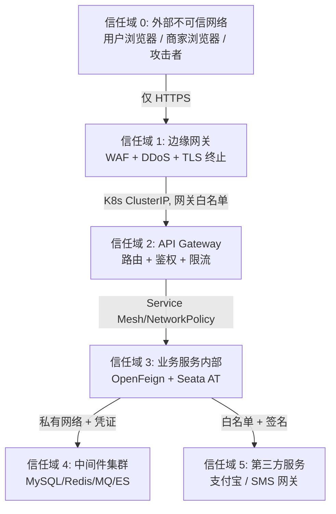

# 安全设计文档

## 文档信息

| 字段 | 内容 |
|------|------|
| 文档名称 | 安全设计文档 |
| 文档版本 | V1.0 |$
| 所属阶段 | 设计阶段 |
| 文档状态 | 已冻结 |
| 项目名称 | 薄荷商城后台系统 |
| 创建人 | yirancrazy@gmail.com |
| 审核人 | yirancrazy@gmail.com |
| 创建日期 | 2026-07-27 |
| 最后更新 | 2026-08-05 |[\$]

## 文档目的

> 明确系统的认证、授权、数据加密、攻击防护等安全设计，作为开发、测试、运维的安全基线。
> 读者：架构师、研发、测试、运维、安全工程师。

## 适用范围

- **适用对象**：架构师、研发、测试、运维、安全工程师
- **适用场景**：安全评审、代码审计、渗透测试、应急响应
- **适用版本**：V1.0
- **不适用范围**：API 契约（见 [API 设计文档](02-API设计文档.md)）、系统架构（见 [系统架构设计文档](01-系统架构设计文档.md)）

---

## 目录

1. [安全原则](#1-安全原则)
2. [信任边界模型](#2-信任边界模型)
3. [认证与授权](#3-认证与授权)
4. [会话与 Token 管理](#4-会话与-token-管理)
5. [越权防御（垂直 + 水平）](#5-越权防御垂直--水平)
6. [输入校验与 Web 攻击防御](#6-输入校验与-web-攻击防御)
7. [数据加密（传输 + 存储）](#7-数据加密传输--存储)
8. [敏感数据脱敏](#8-敏感数据脱敏)
9. [防重放与幂等](#9-防重放与幂等)
10. [限流与防刷](#10-限流与防刷)
11. [审计日志](#11-审计日志)
12. [第三方集成安全（支付宝）](#12-第三方集成安全支付宝)
13. [密钥与凭据管理](#13-密钥与凭据管理)
14. [依赖与镜像安全](#14-依赖与镜像安全)
15. [备份与灾备安全](#15-备份与灾备安全)
16. [合规与隐私](#16-合规与隐私)
17. [应急响应](#17-应急响应)
18. [安全测试与演练](#18-安全测试与演练)
19. [安全检查清单](#19-安全检查清单)

---

## 1. 安全原则

按优先级排序：

| 序 | 原则 | 含义 |
|---|---|---|
| S0 | 最小特权 | 每个服务、每个用户只获得完成本职工作必需的权限 |
| S1 | 零信任客户端 | 客户端只用于展示，所有权限边界由服务端强制 |
| S2 | 默认拒绝 | 鉴权失败、规则缺失默认拒绝通过 |
| S3 | 显式审计 | 资金流、权限流、配置变更全部可追溯 |
| S4 | 不依赖隐藏 | 算法/密钥/凭证泄漏不影响整体安全；安全应当靠分层防御而不是模糊 |
| S5 | 失败安全 | 任何中间件（DB/Redis/MQ/Alipay）故障时降级而不是裸奔 |

---

## 2. 信任边界模型



每跨越一层都必须重新校验；不允许"内网就放行"的隐式信任。

### 2.1 网关层安全（Gateway AuthFilter + Sentinel）

API Gateway（信任域 2）作为统一入口，承担以下安全职责：

| 组件 | 功能 | 说明 |
|------|------|------|
| 全局 AuthFilter | JWT 校验 + 黑名单检查 | 验签后比对 `jti` 是否在 Redis SET 黑名单中，命中则返回 401 |
| Sentinel 限流 | 按路由 ID 配置 QPS 阈值 | 超限返回 `429 Too Many Requests` + `Retry-After` 头 |
| Sentinel 熔断 | 下游服务异常比例 > 50% 时熔断 5s | 避免故障级联，熔断后返回降级响应 |
| 白名单 | 免鉴权路径 | `/api/v1/auth/login`、`/api/v1/auth/register`、`/api/v1/auth/sms-code`、`/api/v1/auth/refresh-token`、`/api/v1/auth/captcha`、`/actuator/health`、`/druid/*`（仅内网） |

注册防刷：同 IP 1 分钟内最多 5 次注册请求，超限返回 `429 Too Many Requests`。

---

## 3. 认证与授权

### 3.1 角色与权限模型

| 元素 | 内容 |
|---|---|
| 主体 (Subject) | `auth_user.id`（与业务 `user_id` / `merchant_id` 一致） |
| 角色 (Role) | `USER`, `MERCHANT`, `PLATFORM` + 平台内部子角色（运营/客服/审核） |
| 权限码 (Permission) | `<ROLE>-<MODULE>-<NNNN>`，例如 `USER-ORDER-0006` |
| 通配符 | `MODULE:*`（如 `ORDER:*` 表示订单所有权限） |
| 资源 (Resource) | 具体业务单据，校验对象归属 |

### 3.2 RBAC 矩阵示例

| 资源 | USER | MERCHANT | PLATFORM |
|---|---|---|---|
| 自己的订单 | R | R（仅自家） | R |
| 他人订单 | ✗ | ✗ | R |
| 自己的商品 | ✗ | R/U/D | R（审核） |
| 提现申请 | ✗ | C/R（自家） | R/U（审核） |
| 系统公告 | R | R | C/R/U/D |

### 3.3 完整权限矩阵

> 必须明确标注权限矩阵，覆盖所有角色与资源域的组合，作为接口鉴权与代码评审的基线。

| 角色 | 资源域 | 权限 |
|------|--------|------|
| USER | 商品/购物车/订单/支付/消息 | 读+写(自己) |
| MERCHANT | 商品(自己的)/订单(自己的)/库存(自己的)/资金(自己的)/消息 | 读+写 |
| MERCHANT | 商品审核(自己的) | 读 |
| PLATFORM_ADMIN | 全部资源域 | 读 |
| PLATFORM_ADMIN | 商家审核/商品审核/对账/公告/强制关单 | 读+写 |
| PLATFORM_SUPER | 角色管理/权限分配 | 读+写 |

### 3.4 双层校验

每个业务接口必须通过：

1. **角色垂直校验**：当前用户角色能访问此类资源？
2. **对象水平校验**：当前用户是该资源的所有者吗？

垂直校验在网关（`@PreAuthorize("hasAuthority('USER-ORDER-*')")`）完成；水平校验在 service 层调用前置 `guard.assertOwn(...)` 完成。

```java
@PreAuthorize("hasAuthority('USER-ORDER-0001')")
public OrderCreateResponse createOrder(OrderCreateRequest req) { ... }

orderService.createOrder(order, userId) {
    order.guardOwnedBy(userId);
    ...
}
```

### 3.5 内部服务调用授权

内部服务通过 Feign Header `X-Internal-Token` (一次性短期 JWT) 携带来源服务身份，下游服务对内部调用另开 RBAC（角色映射为 `INTERNAL_<SRC>`），禁止内部服务冒充用户身份。**禁止内部调用沿用用户 JWT**。

---

## 4. 会话与 Token 管理

### 4.1 Token 体系

| Token | 用途 | TTL | 存哪 |
|---|---|---|---|
| `access_token` | 鉴权头携带 | 15 分钟 | 仅客户端 |
| `refresh_token` | 刷新 access | 7 天 | Redis（可主动吊销） |
| `id_token` | OIDC 兼容字段 | 同 access | 客户端可读 |

### 4.2 JWT 结构（HS256）

| 字段 | 说明 |
|---|---|
| `iss` | `mint-mall` |
| `sub` | `auth_user.id` |
| `aud` | `gateway` |
| `exp` / `iat` / `nbf` | 时间 |
| `jti` | UUID 随机 |
| `role` | `USER` / `MERCHANT` / `PLATFORM` |
| `scope` | `["USER-ORDER-0001","USER-CART-0004"]` |
| `merch_id` | 商家专属，多角色场景 |

`scope` 由 `auth-service` 在登录时按角色权限码生成；签名密钥从 KMS 注入到网关内存（不落盘）。

### 4.3 主动失效

- `jti` 进 `t_auth_token_blacklist`（仅注销或重置密码时写入），TTL = token 剩余有效期 + 7 天；
- 网关验签后比对 `jti` 已在黑名单 → 401；
- 短 TTL + 滚动 refresh 自动缓解泄露扩散。

### 4.4 刷新机制

- refresh 端点必须验证 `client_id` + `client_secret`（Web 端 cookie 单源）；
- 一次刷新同时换发新 refresh_token，旧 refresh 立即加入黑名单（防重放）；
- 异地登录提醒：检测 `client_ip` 或 `device_fp` 变更触发「非常用设备登录」短信。

### 4.5 注销

- 注销时将 refresh 与当前 access 的 `jti` 加入黑名单，并清空客户端存储；
- 注销不可逆（按合规要求）；同账号再登录视为全新账号体系。

---

## 5. 越权防御（垂直 + 水平）

### 5.1 垂直越权

- 角色权限矩阵在 `auth-service` 维护，下发到网关；
- 所有接口必须显式声明所需权限码（无声明 = 默认拒绝 = 0 权限）；
- 网关拦截 90% 越权请求，service 层 `@PreAuthorize` 兜底，纵深防御。

### 5.2 水平越权

所有根据 `id`/`order_no` 访问的资源，必须由 service 层校验当前用户对该资源的归属：

```java
public Order loadOwnedOrder(Long orderId, Long currentUserId) {
    Order o = orderMapper.selectById(orderId);
    if (o == null || !o.getUserId().equals(currentUserId)) {
        throw new ForbiddenException("not your order"); // 也防 ID 枚举
    }
    return o;
}
```

禁止通过「前端传入 merchant_id 来过滤数据」实现水平校验；merchant_id 永远从 token 取，绝不信任前端传入。

**实现示例**：

```java
// OrderService — 水平越权校验
public OrderVO getOrderDetail(Long orderId, Long currentUserId) {
    Order order = orderManager.getById(orderId);
    // 守卫：当前用户只能查看自己的订单
    if (!order.getUserId().equals(currentUserId)) {
        throw new BizException("ORDER_ACCESS_DENIED", "无权访问该订单");
    }
    return OrderConverter.toVO(order);
}
```

### 5.3 ID 不可枚举

- 雪花 ID 不连续，对手难以枚举；但仍需水平校验兜底；
- 业务单号（`order_no` 等）不应被允许在 URL 中"猜"出归属，必须携带鉴权；
- 全局唯一资源（订单详情）必须 401/404 模糊响应相同的「无权限或不存在」。

---

## 6. 输入校验与 Web 攻击防御

### 6.1 输入校验

| 攻击 | 防御 |
|---|---|
| SQL 注入 | MyBatis 全部使用 `#{}` 参数；禁止 `${}`；复杂查询走 ES |
| XSS | 富文本走 Markdown + 服务端白名单 sanitize；纯文本入库前 strip HTML；展示 CSP |
| CSRF | 浏览器表单禁 SameSite=None；浏览器端强制 `X-Requested-With: XMLHttpRequest`；API 不接受纯 form |
| SSRF | 任何用户输入作为 URL 时强制白名单（图片代理仅允许 OSS 域名）；禁止跟随 HTTP 302 |
| 反序列化 | Jackson 禁用 `enableDefaultTyping`；禁止使用 `ObjectInputStream`；JDK 升级 ≥ 21 修复原生反序列化 |
| 文件上传 | MIME + 魔数 + 后缀三重校验；OSS 直传 + 服务端回调校验；图片自动压缩后转 webp |
| JSON 大对象 | 限制 1MB；Jackson `@Size` 校验；Spring `spring.servlet.multipart.max-file-size=10MB` |

### 6.2 响应头安全

强制响应头（API 网关层注入）：

```
Content-Security-Policy: default-src 'self'; img-src 'self' data: https://oss.example.com;
Strict-Transport-Security: max-age=63072000; includeSubDomains; preload
X-Content-Type-Options: nosniff
X-Frame-Options: DENY
Referrer-Policy: strict-origin-when-cross-origin
Permissions-Policy: geolocation=(), microphone=()
```

CORS：
- 仅允许 `https://mall.example.com`、`https://merchant.example.com`、`https://admin.example.com`；
- `Access-Control-Allow-Credentials: true`，不允许 `*`；
- 预检缓存 `Access-Control-Max-Age: 600`。

### 6.3 路由保护

- 任何不存在的 URL 返回 404（防 dir-traversal 路径扫描信息泄露）；
- Actuator 端点（如 `/actuator/health`）仅内网可访问，`/actuator/env` 完全关闭；
- Swagger UI 仅暴露在预发环境与 `*.example.local`，不在生产开放。

### 6.4 业务接口通用请求头部校验

| Header | 必填 | 备注 |
|---|---|---|
| `Authorization: Bearer <access_token>` | 公开接口外必填 | 网关验签 |
| `X-Trace-Id` | 可选 | 网关生成或沿用 |
| `X-Idempotency-Key` | 写接口必填 | UUID |
| `X-Client-Ts` | 可选 | 客户端时间戳 |
| `X-Client-Nonce` | 写敏感接口 | 6~16 位随机串 |
| `User-Agent` | 必填 | 网关拦截明显 UA |

---

## 7. 数据加密（传输 + 存储）

### 7.1 传输加密

| 链路 | 加密 |
|---|---|
| 用户 ↔ 边缘 | TLS 1.2+ 强制，HSTS；2025 年后强制 TLS 1.3 |
| 边缘 ↔ 网关 | 云内 SLB 终结 TLS，内部 mTLS（Istio 或自管证书） |
| 服务 ↔ 服务 | mTLS，证书每 90 天轮换 |
| 服务 ↔ 中间件 | TLS（MySQL `require_secure_transport=ON`，Redis `tls-port`，RocketMQ `tls`） |
| 服务 ↔ 支付宝 | 证书 + 签名验签（见 §12） |

### 7.2 存储加密

| 对象 | 算法 | 模式 | 密钥 |
|---|---|---|---|
| 手机号 / 邮箱 / 收货人 / 身份证 / 银行卡 / 详细地址 | AES-256 | GCM（含完整性校验） | KMS 注入 |
| 密码 | bcrypt cost=12 | — | 仅哈希 |
| 商户密钥、回调验签密钥 | RSA-2048 / SM2 | — | KMS |

### 7.3 敏感数据字段级加密

采用 AES-256-GCM 字段级加密（ADR-056），密钥托管于 HashiCorp Vault。

| 字段类型 | 加密方式 | 说明 |
|----------|----------|------|
| 手机号 | AES-256-GCM，保留前3后4 | 支持模糊查询 |
| 身份证 | AES-256-GCM，保留前3后4 | 支持模糊查询 |
| 密码 | BCrypt 单向哈希 | 不可逆 |
| 银行卡号 | SHA-256 哈希 | 不可逆 |

实现要点：
- 敏感字段入库前通过Vault获取密钥加密
- 查询时先解密再返回
- 手机号/身份证保留前3后4位支持模糊查询（如 `138****8001`）
- Vault需高可用部署，密钥支持版本管理

### 7.4 密钥生命周期

1. **生成**：密钥由 KMS 生成，业务服务**不可见明文**；
2. **下发**：启动时通过 Nacos 加密配置 + 服务身份认证拉取；
3. **轮换**：每 90 天自动轮换，旧密钥保留 7 天解密期（hot/warm 双版本）；
4. **作废**：密钥泄漏事件触发全链路密钥重生成+回灌；
5. **审计**：密钥拉取/解密 API 调用全日志，异常频率告警。

### 7.5 备份加密

- MySQL `mysqldump` / xtrabackup 加密落 OSS，加密密钥由 KMS 管理；
- 备份不可被恢复账号单独下载，必须经双人复核 + 申请单。

---

## 8. 敏感数据脱敏

### 8.1 日志脱敏

| 字段 | 脱敏规则 |
|---|---|
| 手机号 | `138****1234` |
| 身份证 | `110***********1234` |
| 银行卡 | `**** **** **** 5678` |
| 邮箱 | `a****@example.com` |
| 密码 / 密钥 | `[REDACTED]` |
| access_token | 仅保留前 4 位 + 后 4 位 |

脱敏日志中间件强制处理，禁止业务代码直接 `log.info("phone={}", phone)`。

### 8.2 接口脱敏

| 角色可读字段 | 普通角色 | 客服/平台审核 |
|---|---|---|
| 手机号 | 完整 | 完整 + 审计 |
| 身份证 / 银行卡 | 脱敏 (`****`) | 完整可读，但记录审计 |

### 8.3 数据库脱敏

非生产环境（staging/dev）所有加密字段重写为合成数据，由 `maskor` 脚本按规则生成。

---

## 9. 防重放与幂等

### 9.1 请求级防重放

- 所有写接口必须携带 `Idempotency-Key`（UUID），网关/服务基于此去重，TTL 24h；
- 敏感写接口额外要求 `X-Client-Ts` (距网关时间 ± 5 分钟合法) 与 `X-Client-Nonce` (10 分钟内一次性)；
- 网关拦截 `ts` 偏差过大、`nonce` 已用 → 400。

### 9.2 支付回调防重放

- 支付宝回调使用 `notify_id` 作为幂等键，落地 `t_pay_transaction.idempotency_key`；
- 全局锁 + 业务状态机保证「同 notify 多次回调」仅生效一次；
- 主动调用 `Alipay.Query` 反查兜底，防止单边丢消息。

### 9.3 Token 防重放

- refresh_token 一次性使用（详 §4.4）。

### 9.4 MQ 消费防重放

- 业务主键 + 唯一索引天然去重；
- 失败后重试消费不做业务影响，多次成功的请求通过补偿幂等表去重。

---

## 10. 限流与防刷

### 10.1 Sentinel 限流分层

| 维度 | 阈值（首版占位） | 触发动作 |
|---|---|---|
| 单 IP 总入 | 200 QPS | 拦截 429 |
| 单用户登录 | 5 次/分钟 | 滑块验证码 |
| 单用户下单 | 30 笔/小时 | 拦截 + 短信 |
| 单用户支付 | 60 笔/小时 | 拦截 + 短信 |
| 商品详情单 SKU | 500 QPS | 拦截 429 |
| 短信发送 | 同号 1 次/分钟，5 次/小时 | 拒绝 |
| 营销消息推送 | 100w / 批 / 5 分钟 | 流控 |

### 10.2 限流实现

- 网关层 Sentinel 集群限流（`cluster-mode`）共享 Redis 计数；
- 热点参数（商品 ID、活动 ID）走 Sentinel 热点规则；
- 限流命中返回 `429 Too Many Requests` + `Retry-After` 头 + 统一 `Result<T>` 错误响应。

### 10.3 验证码

- 登录、改密、绑定手机号：图形滑块 + 必要时短信下行二次验证；
- 商家新设备登录：短信下行确认；
- 风控分数异常时强制二次验证。

### 10.4 黑名单

- 自动黑名单：登录失败 ≥ 5 次 / 15min → 30 分钟拉黑；
- 人工黑名单：客服可手动封禁账号/IP；
- Redis Set 存储 + 定时回库。

---

## 11. 审计日志

### 11.1 必须审计的事件

| 事件 | 包含字段 |
|---|---|
| 登录/登出/注册 | user_id, ip, ua, result, mfa_used |
| 密码修改 | user_id, operator_id, result |
| 权限变更 | role_id, operator_id, before, after |
| 金额变动（支付/退款/提现/对账调整） | biz_no, amount, before_balance, after_balance, operator |
| 商家资质审核 | merchant_id, decision, reason, operator |
| 商品审核 | spu_id, decision, reason, operator |
| 平台强制关单 | order_no, reason, operator |
| 退款仲裁 | refund_no, decision, operator |
| 密钥拉取 / 解密 | service_name, key_id, reason |
| 公告发布 | announcement_id, target, operator |

### 11.2 审计日志实现

- 异步写入 `t_audit_log`（每服务独立表，按月分区）；
- 异步管道（`Disruptor` / `Logback AsyncAppender`）落盘，避免影响业务；
- 监管专用只读账号（`audit-readonly`）定期出报表；
- 保留 5 年，受个保法金融领域约束。

### 11.3 行为审计查询

- 提供 `audit-service` 查询接口（仅 PLATFORM）；
- 任何导出含敏感字段需要走二次审批。

---

## 12. 第三方集成安全（支付宝）

### 12.1 关键控制

| 项 | 控制 |
|---|---|
| 商户私钥 | KMS 托管，禁止落代码库、配置中心明文 |
| 回调验签 | 服务端 `AlipaySignature.rsaCheckV1` 二次校验 |
| 回调幂等 | `notify_id` 全局去重（同 §9.2） |
| 回调时间 | 服务端校验 `notify_time` 不超过当前 + 5 分钟，防历史重放 |
| 商户单号 | 不可预测、`payment_no` 自生成，禁止可信第三方控制 |
| 退款 | 必须原路退；金额 ≤ 原始订单未退金额 |
| 提现 | 限商家本人银行卡；金额超阈值走平台二次审核 |
| 文档/SDK | 仅用官方 PHP/Java SDK；每季度升级；离线依赖扫描 |

### 12.2 Alipay 网关白名单

- 网关出口仅允许 `*.alipay.com` 与 `*.alipay.cn`（IP 段通过云厂商安全组控制）；
- 商家通过 `alipay.openapi` 域名访问，无外部入站。

### 12.3 风险监控

- 单商户单日退款比例异常告警；
- 同 IP 多账户提现聚集告警；
- 支付成功率异常下降（同环比 -50%）告警。

---

## 13. 密钥与凭据管理

### 13.1 凭据列表与所有人

| 凭据 | 所有人 | 存储 | 备注 |
|---|---|---|---|
| Alipay app_id | 平台运营 | KMS | 平台拥有 |
| Alipay 商户私钥 | KMS | KMS | 自动换签 |
| JWT 签名密钥 | 网关 | Nacos 加密配置 + KMS | 网关独占 |
| 数据库账号 | SRE | Vault / KMS 临时下发 | 每服务独立账号，最小权限 |
| Redis 账号 | SRE | Vault | 同上 |
| ES / Nacos / RocketMQ | SRE | Vault | 同上 |
| 短信网关 | 平台 | KMS | 通过 sub-account 限定 IP |

### 13.2 凭据使用原则

- 凭据从不出现在日志、环境变量、URL、命令行参数；
- 凭据永不提交到代码库（pre-commit hook 检测）；
- 服务间通信 mTLS 双向认证；
- 凭据轮换：DB/Redis/MQ 90 天，业务密钥 90 天，紧急泄漏即轮换。

### 13.3 拒绝「长寿命密钥」

- 不允许任何 .properties / .yaml 文件含明文凭据；
- `.gitignore` 已包含 `application-*.yaml` 模式（参见 `gitignore`）；
- pre-commit + CI 双重检测：gitleaks/trufflehog 扫描。

---

## 14. 依赖与镜像安全

| 维度 | 控制 |
|---|---|
| SCA 扫描 | CI 阶段运行 `snyk` / `dependency-check`，高危漏洞阻塞合并 |
| License 检查 | 禁止 GPL 在商业服务中传播；Apache-2.0 / MIT 优先 |
| 容器镜像 | 基础镜像统一 `eclipse-temurin:17-jre-alpine`；Trivy 扫描；漏洞基线记录 |
| 第三方对接 | 官方 SDK / Whitelist CDN，禁止第三方"开源打包" |
| CI 凭据 | 短期 OIDC，避免长期 PAT |

---

## 15. 备份与灾备安全

| 数据 | 备份策略 | 加密 | 保留 |
|---|---|---|---|
| MySQL | xtrabackup 日备 + binlog 实时 | AES-256 | 30 天 / 180 天 |
| Redis | RDB + AOF | — | 7 天 |
| ES | 快照 OSS | AES-256 | 30 天 |
| 审计日志 | 冷归档 OSS | AES-256 | 5 年 |
| 阿里云配置 | 异地备份 | 阿里云托管 | 永久 |

恢复演练每季度一次；RTO = 30min（数据库主从切换+服务重启），RPO = 0（MySQL半同步复制 + 异步binlog备份）。详见 [架构设计](01-系统架构设计文档.md) §10.4。

---

## 16. 合规与隐私

### 16.1 法规基线

| 文件 | 适用要点 |
|---|---|
| 《个人信息保护法》 | 知情同意、最小必要、可撤回、可携 |
| GB/T 35273-2020 《个人信息安全规范》 | 敏感信息加密、权限分离 |
| 《网络安全法》 | 等级保护测评（本期目标等保 2.0 三级） |
| 《数据安全法》 | 重要数据识别、跨境流转评估 |
| 《消费者权益保护法》 | 个人信息保护、价格明示 |
| 《电子商务法》 | 工商资质、交易记录保存 ≥ 3 年 |

### 16.2 用户协议与隐私政策

- 注册时强制勾选《用户协议》《隐私政策》；
- 隐私政策必须经法务审核 + 版本管理；
- 协议更新后用户可"撤回"全部授权并请求数据清除。

### 16.3 跨境

- 默认不出境；任何跨境（云厂商境外 Region、海外支付）需走安全+法务联合评审；
- 个人信息跨境需通过安全评估 / 标准合同 / 认证之一。

### 16.4 数据主体权利

支持：查询、更正、删除、撤回授权、可携权（CSV/JSON 导出我的全部订单、评价、消息）。

---

## 17. 应急响应

### 17.1 响应级别

| 级别 | 触发 | 响应 |
|---|---|---|
| P0 | 全站宕机 / 大规模资金异常 / 数据大规模泄露 | 立即响应，5 分钟内启动战时指挥群 |
| P1 | 重大功能不可用 / 重大漏洞确认 | 30 分钟内召集 |
| P2 | 中等影响 | 4 小时内处置 |
| P3 | 低影响 | 一个工作日内响应 |

### 17.2 应急流程

```
发现 → 分类 → 抑制（止损） → 根因分析 → 恢复 → 复盘 → 预案更新
```

### 17.3 预案

| 预案 | 内容 |
|---|---|
| `IR-001` 密钥泄漏 | 立即禁用旧密钥 + 全链路回灌 + 报警 |
| `IR-002` 凭据泄漏 | 同上 + 全员凭据轮换 |
| `IR-003` 数据库被拖库 | 通知安全+监管，立刻强制全员改密，强制 MFA |
| `IR-004` 支付宝商户私钥泄漏 | 立刻联系支付宝客服挂失，重发新证书 |
| `IR-005` 支付异常聚集 | 紧急熔断 → 关闭入口 → 风控复核 |
| `IR-006` 商品违规 | 一键下架 + 商家警告 + 案件链 |

### 17.4 战时通讯

- 钉钉战时指挥群：固定模板（事件简述、影响面、当前动作、负责人、下次汇报时间）；
- 所有动作留痕到 `t_audit_log`。

---

## 18. 安全测试与演练

| 类型 | 工具 / 方式 | 频率 |
|---|---|---|
| 漏洞扫描 | OWASP ZAP（DAST）、CodeQL（SAST） | 每次 PR |
| 依赖扫描 | Snyk / OWASP Dependency-Check | 每日 |
| 镜像扫描 | Trivy | 每次构建 |
| 渗透测试 | 第三方 | 每年 1 次 + 上线前 |
| 红蓝对抗 | 内部红队 | 每半年 |
| 密钥扫描 | Gitleaks / TruffleHog | pre-commit + CI |
| 配置扫描 | kube-bench / kube-hunter | 上线前 + 月度 |
| 攻防演练 | 钓鱼演练 / 社工 | 每年 |

---

## 19. 安全检查清单

### 19.1 设计评审阶段

- [ ] 是否识别所有信任域并定义边界？
- [ ] 数据流图是否明确标注敏感数据？
- [ ] 权限矩阵是否覆盖所有角色？
- [ ] 是否存在越权风险路径？
- [ ] 是否有未加密的敏感字段落库？
- [ ] 第三方集成是否使用最小权限？

### 19.2 编码 PR 阶段

- [ ] 所有 MyBatis 使用 `#{}`？
- [ ] 控制器层入参有 `@Valid` 校验？
- [ ] 富文本输入有 sanitize？
- [ ] 日志中间件强制脱敏？
- [ ] 异常信息不直接抛栈给前端？
- [ ] Token、密钥无任何日志输出？

### 19.3 上线阶段

- [ ] HTTPS 证书有效且 HSTS 注入？
- [ ] WAF 规则集已下发？
- [ ] Actuator 端口已关？
- [ ] 默认密码 / 初始凭据已修改？
- [ ] 应急联系人已更新？

---

> 末尾说明：本安全设计是首版框架，每个具体控制点由各服务的 README 与代码片段细化。任何控制点变更必须先在 ADR 评审，再修订本文档。

---

## 相关文档链接

- 上游：[系统架构设计文档](01-系统架构设计文档.md)、[需求规格说明书（SRS）](../1.%20需求阶段/02-需求规格说明书（SRS）.md)
- 横向：[API 设计文档](02-API设计文档.md)、[数据库设计文档](03-数据库设计文档.md)
- 下游：[Java 编码规范](../3.%20开发阶段/01-Java编码规范.md)、[测试策略与计划](../4.%20测试阶段/01-测试策略文档.md)
- 参考：阿里规约、OWASP Top 10、等保 2.0

## 变更记录

| 日期 | 版本 | 变更人/角色 | 变更说明 |
|------|------|-------------|----------|
| 2026-07-27 | V1.0 | yirancrazy@gmail.com | 初稿创建，合并旧安全设计文档内容至模板 |
| 2026-07-28 | V1.1 | yirancrazy@gmail.com | 更新token存储策略，新增敏感数据字段级加密方案 |
