# 模块概要设计

## 文档信息

| 字段 | 内容 |
|------|------|
| 文档名称 | 模块概要设计 |
| 文档版本 | V1.0 |$
| 所属阶段 | 设计阶段 |
| 文档状态 | 已发布 |
| 创建人 | yirancrazy@gmail.com |
| 创建日期 | 2026-07-27 |
| 最后更新 | 2026-07-28 |[\$]

## 文档目的

> 从系统架构下沉到模块粒度，明确各模块的职责、边界、对外接口与依赖关系，为详细设计和开发提供蓝图。

## 适用范围

- **适用对象**：架构师、模块负责人、研发
- **适用场景**：模块拆分、任务分配、依赖审查
- **不适用范围**：单文件/单方法实现（见 [模块详细设计](07-模块详细设计.md)）

## 详细内容

### 1. 模块划分原则

| 原则 | 说明 |
|------|------|
| 高内聚 | 模块内功能强相关，职责单一（单一职责原则） |
| 低耦合 | 模块间通过稳定接口通信，避免内部细节泄漏 |
| 业务边界 | 按业务域划分（用户域、订单域、支付域） |
| 数据归属 | 每个服务独占逻辑库，禁止跨服务直连数据库 |
| 演进性 | 模块粒度可随业务复杂度调整，避免过早拆分 |

### 2. 模块总览

| # | 编号 | 模块名称 | 端口 | 数据库 | 职责概述 |
|---|------|----------|------|--------|----------|
| 1 | M-001 | gateway | 8080 | — | 路由、限流、JWT 验签、灰度 |
| 2 | M-002 | auth-service | 8201 | `auth_db` | 登录、注册、找回、token 发放/刷新、RBAC |
| 3 | M-003 | user-service | 8202 | `user_db` | C 端用户档案、地址、收藏 |
| 4 | M-004 | merchant-service | 8203 | `merchant_db` | B 端商家档案、店铺资质、平台审核 |
| 5 | M-005 | goods-service | 8204 | `goods_db` | SPU/SKU 增删改查、上下架、平台审核、ES 同步 |
| 6 | M-006 | cart-service | 8205 | `cart_db` | 购物车增删改查、勾选、清空 |
| 7 | M-007 | order-service | 8206 | `order_db` | 订单生命周期（创建/取消/支付/发货/收货/售后）、物流 |
| 8 | M-008 | pay-service | 8207 | `pay_db` | 支付宝支付/退款/提现、平台对账、流水 |
| 9 | M-009 | stock-service | 8208 | `stock_db` | 库存初始化/调整/预警/流水、调拨、盘点 |
| 10 | M-010 | notify-service | 8209 | `notify_db` | 站内信、WS 推送、外部短信/邮件 |
| 11 | M-011 | platform-service | 8210 | `platform_db` | 平台管理员、商家/商品审核、对账、公告、强制关单 |

### 3. 服务依赖关系图

```mermaid
flowchart TD
    GW[gateway<br/>:8080]
    AUTH[auth-service<br/>:8201]
    USER[user-service<br/>:8202]
    MER[merchant-service<br/>:8203]
    GOODS[goods-service<br/>:8204]
    CART[cart-service<br/>:8205]
    ORDER[order-service<br/>:8206]
    PAY[pay-service<br/>:8207]
    STOCK[stock-service<br/>:8208]
    NOTIFY[notify-service<br/>:8209]
    PLAT[platform-service<br/>:8210]
    ES[(Elasticsearch)]

    GW -->|sync: /internal/auth/verify| AUTH

    CART -->|sync: /internal/goods/sku/snapshot| GOODS

    ORDER -->|sync: /internal/stock/reserve| STOCK
    ORDER -->|sync: /internal/pay/create| PAY
    ORDER -->|sync: /internal/notify/send| NOTIFY

    PAY -->|sync+MQ: /internal/order/paid /cancel| ORDER

    ORDER -.->|MQ: ORDER_STATUS_CHANGED| NOTIFY
    ORDER -.->|MQ: ORDER_STATUS_CHANGED| MER
    ORDER -.->|MQ: REFUND_REQUESTED| MER
    ORDER -.->|MQ: REFUND_REQUESTED| NOTIFY

    PAY -.->|MQ: PAY_CALLBACK| ORDER
    PAY -.->|MQ: REFUND_RESULT| ORDER
    PAY -.->|MQ: REFUND_RESULT| NOTIFY

    GOODS -.->|MQ: GOODS_CHANGED| ES

    STOCK -.->|MQ: STOCK_WARNING| MER
    STOCK -.->|MQ: STOCK_WARNING| NOTIFY

    style GW fill:#4a90d9,color:#fff
    style AUTH fill:#7b68ee,color:#fff
    style USER fill:#7b68ee,color:#fff
    style MER fill:#7b68ee,color:#fff
    style GOODS fill:#e67e22,color:#fff
    style CART fill:#e67e22,color:#fff
    style ORDER fill:#e74c3c,color:#fff
    style PAY fill:#e74c3c,color:#fff
    style STOCK fill:#e74c3c,color:#fff
    style NOTIFY fill:#27ae60,color:#fff
    style PLAT fill:#7b68ee,color:#fff
    style ES fill:#95a5a6,color:#fff
```

> **图例**：实线箭头 = 同步 OpenFeign 调用；虚线箭头 = 异步 MQ 事件；颜色分组 = 用户认证域（紫）/ 商品交易域（橙）/ 订单支付域（红）/ 通知域（绿）

### 4. 各模块详细说明

#### 4.1 M-001 gateway

| 属性 | 内容 |
|------|------|
| 编号 | M-001 |
| 名称 | gateway |
| 端口 | 8080 |
| 数据库 | — |
| 职责 | 全站统一入口：路由转发、限流熔断、JWT 验签、灰度发布 |

**核心功能列表**：
1. 路由分发（按路径/Host 规则转发到下游业务服务）
2. JWT 验签 + 角色回填（调用 auth-service 校验）
3. Sentinel 限流（IP / 用户 / 接口维度）
4. 灰度路由（按 Header `X-Beta` 百分比分流）
5. 请求日志 + traceId 注入
6. CORS / WAF 前置策略

**对外接口引用**：所有外部 API 的统一入口；内部接口见 [接口设计文档](05-接口设计文档.md) §3 `gateway → auth-service`

**依赖模块（向下游）**：
- `auth-service`（同步：`POST /internal/auth/verify`）

**被依赖模块（向上游）**：
- 无（gateway 为全站入口，不被业务服务依赖）

**关键数据表**：
- 无（无状态服务，路由/限流规则由 Nacos 配置中心管理）

**性能/安全要求**：
- 验签延迟 P99 ≤ 10ms
- 全链路限流 429 响应 < 5ms
- JWT 密钥由 KMS 注入，禁止硬编码
- 禁止 `/internal/` 路径暴露到外网

---

#### 4.2 M-002 auth-service

| 属性 | 内容 |
|------|------|
| 编号 | M-002 |
| 名称 | auth-service |
| 端口 | 8201 |
| 数据库 | `auth_db` |
| 职责 | 登录、注册、找回、token 发放/刷新、RBAC 角色权限 |

**核心功能列表**：
1. 手机号 + 密码注册 / 登录
2. 短信验证码登录
3. 密码找回（短信验证码重置）
4. access_token 发放 + refresh_token 刷新
5. RBAC 角色权限管理（用户-角色-权限三级）
6. token 吊销 / 黑名单

**对外接口引用**：[API 设计文档](02-API设计文档.md) § 用户认证相关；内部接口见 [接口设计文档](05-接口设计文档.md) §3 `gateway → auth-service`

**依赖模块（向下游）**：
- 无（auth-service 为基础服务，不依赖其他业务服务；外部依赖短信网关）

**被依赖模块（向上游）**：
- `gateway`（同步验签调用）

**关键数据表**：
- `t_auth_user`（账号认证信息）
- `t_auth_role`（角色定义）
- `t_auth_permission`（权限定义）
- `t_auth_role_permission`（角色-权限关联）
- `t_token_blacklist`（token 黑名单）

**性能/安全要求**：
- 登录接口 P99 < 300ms
- access_token TTL = 15min，refresh_token 滚动刷新
- 密码 bcrypt 存储，禁止明文
- 登录失败 5 次锁定 15 分钟
- 敏感信息脱敏（手机号 `138****8001`）

---

#### 4.3 M-003 user-service

| 属性 | 内容 |
|------|------|
| 编号 | M-003 |
| 名称 | user-service |
| 端口 | 8202 |
| 数据库 | `user_db` |
| 职责 | C 端用户档案、地址、收藏 |

**核心功能列表**：
1. 用户档案查询 / 修改（昵称、头像、手机号）
2. 收货地址 CRUD（设默认地址）
3. 商品收藏 / 取消收藏 / 收藏列表
4. 用户状态管理（冻结 / 解冻）

**对外接口引用**：[API 设计文档](02-API设计文档.md) § 用户相关

**依赖模块（向下游）**：
- 无

**被依赖模块（向上游）**：
- `order-service`（订单关联用户信息）
- `notify-service`（消息推送关联用户）

**关键数据表**：
- `t_user_profile`（用户档案）
- `t_user_address`（收货地址）
- `t_user_favorite`（商品收藏）

**性能/安全要求**：
- 用户信息查询 P99 < 200ms
- 手机号等 PII 字段加密存储 + 脱敏输出
- 地址信息字段级 AES-256 加密

---

#### 4.4 M-004 merchant-service

| 属性 | 内容 |
|------|------|
| 编号 | M-004 |
| 名称 | merchant-service |
| 端口 | 8203 |
| 数据库 | `merchant_db` |
| 职责 | B 端商家档案、店铺资质、平台审核 |

**核心功能列表**：
1. 商家入驻申请 / 审核
2. 店铺信息管理（名称、Logo、描述）
3. 商家资质管理（营业执照、法人信息）
4. 商家状态管理（正常 / 冻结 / 关停）
5. 商家对账单查询

**对外接口引用**：[API 设计文档](02-API设计文档.md) § 商家相关

**依赖模块（向下游）**：
- 无（通过 MQ 异步接收事件）

**被依赖模块（向上游）**：
- `order-service`（MQ: `ORDER_STATUS_CHANGED`、`REFUND_REQUESTED`）
- `stock-service`（MQ: `STOCK_WARNING`）
- `goods-service`（商品关联商家）
- `platform-service`（审核流程）

**关键数据表**：
- `t_merchant`（商家主表）
- `t_shop`（店铺信息）
- `t_merchant_qualification`（商家资质）
- `t_merchant_audit_log`（商家审核记录）

**性能/安全要求**：
- 商家信息查询 P99 < 200ms
- 资质文件（营业执照等）存储于 OSS，禁止入库
- 法人身份证号加密存储 + 脱敏输出
- 商家冻结后所有写操作拒绝

---

#### 4.5 M-005 goods-service

| 属性 | 内容 |
|------|------|
| 编号 | M-005 |
| 名称 | goods-service |
| 端口 | 8204 |
| 数据库 | `goods_db` |
| 职责 | SPU/SKU 增删改查、上下架、平台审核、ES 同步 |

**核心功能列表**：
1. SPU / SKU 增删改查
2. 商品上下架
3. 平台商品审核
4. 分类 / 品牌管理
5. 商品搜索（ES 同步，MQ 异步）
6. 商品快照（供结算时取价格快照）

**对外接口引用**：[API 设计文档](02-API设计文档.md) § 商品相关；内部接口见 [接口设计文档](05-接口设计文档.md) §3 `cart-service → goods-service`

**依赖模块（向下游）**：
- Elasticsearch（MQ 异步：`GOODS_CHANGED` 事件驱动索引同步）

**被依赖模块（向上游）**：
- `cart-service`（同步：`POST /internal/goods/sku/snapshot`）
- `order-service`（订单创建时取商品快照）
- `platform-service`（商品审核流程）

**关键数据表**：
- `t_spu`（SPU 主表）
- `t_sku`（SKU 主表）
- `t_category`（分类）
- `t_brand`（品牌）
- `t_spu_attribute`（SPU 属性）
- `t_goods_audit_record`（商品审核记录）

**性能/安全要求**：
- 商品列表 QPS ≥ 1000（缓存 + CDN）
- 商品搜索 QPS ≥ 200（ES）
- ES 与 MySQL 漂移由每日巡检兜底对账
- 商品详情以 MySQL 为权威源，ES 为搜索加速
- 上下架操作需平台审核通过方可生效

---

#### 4.6 M-006 cart-service

| 属性 | 内容 |
|------|------|
| 编号 | M-006 |
| 名称 | cart-service |
| 端口 | 8205 |
| 数据库 | `cart_db` |
| 职责 | 购物车增删改查、勾选、清空 |

**核心功能列表**：
1. 加入购物车 / 修改数量 / 删除
2. 勾选 / 取消勾选
3. 清空购物车
4. 购物车列表查询（含商品实时价格快照）

**对外接口引用**：[API 设计文档](02-API设计文档.md) § 购物车相关

**依赖模块（向下游）**：
- `goods-service`（同步：`POST /internal/goods/sku/snapshot`，结算时取商品快照）

**被依赖模块（向上游）**：
- `order-service`（下单时读取勾选购物车项）

**关键数据表**：
- `t_cart_item`（购物车条目）

**性能/安全要求**：
- 购物车操作 P99 < 150ms
- 热点用户购物车可缓存至 Redis，miss 走 DB
- 下单后自动清除已勾选的购物车项

---

#### 4.7 M-007 order-service

| 属性 | 内容 |
|------|------|
| 编号 | M-007 |
| 名称 | order-service |
| 端口 | 8206 |
| 数据库 | `order_db` |
| 职责 | 订单生命周期（创建/取消/支付/发货/收货/售后）、物流 |

**核心功能列表**：
1. 创建订单（Seata AT 全局事务：创建订单 + 锁定库存）
2. 订单状态机（CREATED → PAID → SHIPPED → RECEIVED → COMPLETED / CANCELLED / REFUNDING）
3. 取消订单（超时未支付自动取消，回滚库存）
4. 退款 / 售后申请
5. 物流信息查询
6. 订单列表 / 详情查询

**对外接口引用**：[API 设计文档](02-API设计文档.md) § 订单相关；内部接口见 [接口设计文档](05-接口设计文档.md) §3 `order-service → stock-service`、`order-service → pay-service`、`order-service → notify-service`，以及被 `pay-service` 调用的 `/internal/order/paid`、`/internal/order/cancel`

**依赖模块（向下游）**：
- `stock-service`（同步：`POST /internal/stock/reserve`，Seata AT 全局事务内锁定库存）
- `pay-service`（同步：`POST /internal/pay/create`，创建支付流水）
- `notify-service`（同步：`POST /internal/notify/send`，触发站内信 + WS 推送）

**被依赖模块（向上游）**：
- `pay-service`（同步 + MQ：`/internal/order/paid`、`/internal/order/cancel`；MQ: `PAY_CALLBACK`、`REFUND_RESULT`）
- `merchant-service`（MQ: `ORDER_STATUS_CHANGED`、`REFUND_REQUESTED`）

**关键数据表**：
- `t_trade_order`（订单主表）
- `t_order_item`（订单明细）
- `t_order_status_log`（订单状态流转日志）
- `t_refund_request`（退款/售后申请）
- `undo_log`（Seata AT undo 日志）

**性能/安全要求**：
- 下单接口 P99 < 500ms（不含支付跳转）
- Seata 协调 ≤ 60ms
- 订单创建 + 库存锁定强一致（Seata AT）
- 订单状态变更通过事务消息广播（最终一致，秒级）
- 幂等键 = `Idempotency-Key` Header + `t_idempotency` 表，TTL 24h
- 下单失败率 `order_create_error_rate` > 1% 持续 2 分钟触发告警

---

#### 4.8 M-008 pay-service

| 属性 | 内容 |
|------|------|
| 编号 | M-008 |
| 名称 | pay-service |
| 端口 | 8207 |
| 数据库 | `pay_db` |
| 职责 | 支付宝支付/退款/提现、平台对账、流水 |

**核心功能列表**：
1. 支付下单（创建支付宝交易）
2. 支付宝异步回调处理（验签 + 幂等）
3. 退款申请 / 退款回调
4. 商家提现
5. 平台对账（与支付宝对账文件核对）
6. 支付流水查询

**对外接口引用**：[API 设计文档](02-API设计文档.md) § 支付相关；内部接口见 [接口设计文档](05-接口设计文档.md) §3 `pay-service → order-service`

**依赖模块（向下游）**：
- `order-service`（同步 + MQ：`POST /internal/order/paid`、`/internal/order/cancel`；MQ: `PAY_CALLBACK`、`REFUND_RESULT`）

**被依赖模块（向上游）**：
- `order-service`（同步：`POST /internal/pay/create`）
- `platform-service`（对账流程）

**关键数据表**：
- `t_payment`（支付流水）
- `t_payment_callback_log`（回调日志）
- `t_pay_refund`（退款记录）
- `t_settlement`（结算/提现记录）
- `t_idempotency`（幂等去重表）

**性能/安全要求**：
- 支付回调处理 P99 < 200ms（不含 Alipay 调用）
- 回调延迟 `pay_callback_lag` P99 > 10s 触发告警
- 所有回调必须验签，幂等键 = 支付宝 `trade_no` + 商户单号
- 退款幂等键 = 退款单号，支付宝单号回写后禁止再发起
- 支付密钥由 KMS 注入，禁止硬编码
- 资金正确性 > 一切：逐分不差，可观测可追溯

---

#### 4.9 M-009 stock-service

| 属性 | 内容 |
|------|------|
| 编号 | M-009 |
| 名称 | stock-service |
| 端口 | 8208 |
| 数据库 | `stock_db` |
| 职责 | 库存初始化/调整/预警/流水、调拨、盘点 |

**核心功能列表**：
1. 库存初始化（SKU 粒度设置可用库存）
2. 库存预留 / 释放（Seata AT 全局事务内）
3. 库存扣减确认（支付成功后）
4. 库存调整 / 调拨 / 盘点
5. 库存预警（低于阈值触发 MQ 通知）
6. 库存流水查询

**对外接口引用**：[API 设计文档](02-API设计文档.md) § 库存相关；内部接口见 [接口设计文档](05-接口设计文档.md) §3 `order-service → stock-service`，以及接口示例 §7.1

**依赖模块（向下游）**：
- 无（通过 MQ 异步发送预警事件）

**被依赖模块（向上游）**：
- `order-service`（同步：`POST /internal/stock/reserve`，Seata AT 全局事务内锁定库存）
- `merchant-service`（MQ: `STOCK_WARNING`）
- `notify-service`（MQ: `STOCK_WARNING`）

**关键数据表**：
- `t_stock`（库存主表，含 available / reserved 字段）
- `t_stock_reserve`（库存预留记录）
- `t_stock_journal`（库存变动流水）
- `t_stock_threshold`（库存预警阈值配置）
- `undo_log`（Seata AT undo 日志）

**性能/安全要求**：
- 库存预留 P99 < 200ms
- 乐观更新 `where available >= qty` 避免 SuperLock 热点
- Seata 同时在 `stock_db` 写入 `undo_log`，事务回滚时自动补回
- 支付超时未支付自动回滚库存（MQ 延迟消息驱动）
- 禁止超卖：乐观更新 + Seata + 支付超时回滚 + 平台巡检三重保障

---

#### 4.10 M-010 notify-service

| 属性 | 内容 |
|------|------|
| 编号 | M-010 |
| 名称 | notify-service |
| 端口 | 8209 |
| 数据库 | `notify_db` |
| 职责 | 站内信、WS 推送、外部短信/邮件 |

**核心功能列表**：
1. 站内信发送 / 已读 / 列表
2. WebSocket 实时推送
3. 外部短信发送（注册验证码、订单通知）
4. 外部邮件发送
5. 退信补偿（发送失败重试 + 死信记录）

**对外接口引用**：[API 设计文档](02-API设计文档.md) § 消息相关；内部接口见 [接口设计文档](05-接口设计文档.md) §3 `order-service → notify-service`

**依赖模块（向下游）**：
- 无（调用外部短信/邮件网关）

**被依赖模块（向上游）**：
- `order-service`（同步：`POST /internal/notify/send`；MQ: `ORDER_STATUS_CHANGED`、`REFUND_REQUESTED`）
- `pay-service`（MQ: `REFUND_RESULT`）
- `stock-service`（MQ: `STOCK_WARNING`）

**关键数据表**：
- `t_message`（站内信）
- `t_message_read_log`（已读记录）
- `t_push_record`（推送记录，含 WS/短信/邮件）

**性能/安全要求**：
- 站内信投递延迟 < 1s
- WS 推送在线用户实时送达，离线用户走站内信兜底
- 短信/邮件发送失败自重试 3 次（间隔 1s/5s/30s），仍失败入死信
- 短信模板由 Nacos 配置注入，禁止硬编码
- 日消息总量预估：订单相关 50w + 营销 200w

---

#### 4.11 M-011 platform-service

| 属性 | 内容 |
|------|------|
| 编号 | M-011 |
| 名称 | platform-service |
| 端口 | 8210 |
| 数据库 | `platform_db` |
| 职责 | 平台管理员、商家/商品审核、对账、公告、强制关单 |

**核心功能列表**：
1. 平台管理员账号管理
2. 商家入驻审核
3. 商品上架审核
4. 平台对账（与 pay-service 对账数据核对）
5. 公告发布 / 撤回
6. 强制关单（紧急情况人工介入）

**对外接口引用**：[API 设计文档](02-API设计文档.md) § 平台管理相关

**依赖模块（向下游）**：
- 无（审核/对账等操作通过调用各业务服务暴露的 P 端接口完成）

**被依赖模块（向上游）**：
- `auth-service`（平台管理员认证）
- `merchant-service`（商家审核流程）
- `goods-service`（商品审核流程）
- `pay-service`（对账流程）
- `order-service`（强制关单）

**关键数据表**：
- `t_admin`（平台管理员）
- `t_announcement`（公告）
- `t_audit_record`（审核记录，商家/商品审核统一）
- `t_reconciliation`（对账记录）

**性能/安全要求**：
- 审核操作需二次确认（防误操作）
- 所有删除操作为软删除（`is_deleted` 标记）
- 审计日志全量记录（操作人、时间、内容）
- 强制关单为高危操作，需记录原因 + 操作人
- 平台管理员权限最小化，RBAC 控制

### 5. 依赖关系矩阵

| ↓ 调用方 / 被调方 → | gateway | auth | user | merchant | goods | cart | order | pay | stock | notify | platform |
|---------------------|---------|------|------|----------|-------|------|-------|-----|-------|--------|----------|
| **gateway** | | 同步 | | | | | | | | | |
| **auth-service** | | | | | | | | | | | |
| **user-service** | | | | | | | | | | | |
| **merchant-service** | | | | | | | | | | | |
| **goods-service** | | | | | | | | | | | ES(MQ) |
| **cart-service** | | | | | 同步 | | | | | | |
| **order-service** | | | | 异步 | | | | 同步 | 同步 | 同步 | |
| **pay-service** | | | | | | | 同步+MQ | | | 异步 | |
| **stock-service** | | | | 异步 | | | | | | 异步 | |
| **notify-service** | | | | | | | | | | | |
| **platform-service** | | | | | | | | | | | |

> **图例**：同步 = OpenFeign 同步调用；异步 = RocketMQ 事务消息；ES(MQ) = 通过 MQ 异步同步 ES 索引

### 6. 模块评审清单

- [ ] 职责是否单一？有无混杂多个业务域？
- [ ] 对外接口是否最小化、版本化？
- [ ] 依赖是否单向？有无循环？
- [ ] 关键流程是否标注一致性、性能、安全要求？
- [ ] 失败/降级策略是否明确？
- [ ] 数据库是否独立？有无跨服务直连？
- [ ] 幂等设计是否覆盖所有写接口？
- [ ] Seata AT 事务范围是否最小化（仅覆盖必要的强一致场景）？
- [ ] MQ 消费者是否有重试 + 死信策略？
- [ ] 敏感数据是否加密存储 + 脱敏输出？

## 相关文档链接

- 上游：[系统架构设计文档](01-系统架构设计文档.md)
- 横向：[API 设计文档](02-API设计文档.md)、[接口设计文档](05-接口设计文档.md)、[数据库设计文档](03-数据库设计文档.md)
- 下游：[模块详细设计](07-模块详细设计.md)、[3. 开发阶段](../3.%20开发阶段/)

## 变更记录

| 日期 | 版本 | 变更人/角色 | 变更说明 |
|------|------|-------------|----------|
| 2026-07-27 | V1.0 | yirancrazy@gmail.com | 初稿创建，补全 11 个服务模块、服务依赖图、依赖矩阵 |
