# 模块详细设计

## 文档信息

| 字段 | 内容 |
|------|------|
| 文档名称 | 模块详细设计 |
| 文档版本 | V1.0 |$
| 所属阶段 | 设计阶段 |
| 文档状态 | 已发布 |
| 创建人 | yirancrazy@gmail.com |
| 创建日期 | 2026-07-27 |
| 最后更新 | 2026-07-28 |[\$]

## 文档目的

> 深入到类/方法级别描述核心模块的实现思路，包括类图、时序、状态机、关键算法、数据结构，作为复杂模块开发、评审、重构的权威参考。
> 读者：模块负责人、开发、Code Review。

## 适用范围

- **适用对象**：模块负责人、开发、Code Review
- **适用场景**：复杂模块开发、关键流程评审、跨模块改动、新成员接手
- **适用版本**：V1.0
- **不适用范围**：简单 CRUD 业务（概要设计 + 代码注释即可）、纯配置项

---

## 目录

1. [何时需要详细设计](#1-何时需要详细设计)
2. [order-service — 订单模块详细设计](#2-order-service--订单模块详细设计)
3. [pay-service — 支付模块详细设计](#3-pay-service--支付模块详细设计)
4. [stock-service — 库存模块详细设计](#4-stock-service--库存模块详细设计)
5. [相关文档链接](#5-相关文档链接)

---

## 1. 何时需要详细设计

- [x] 模块涉及分布式事务、状态机、复杂算法
- [x] 跨 3 个以上模块的关键流程
- [x] 涉及性能/一致性/安全敏感逻辑
- [x] 新成员接手复杂模块前的预热文档
- [ ] 重构前对原设计的澄清（按需）

不满足以上条件，简单模块可在概要设计 + 代码注释中说明，不必单独详细设计。

---

## 2. order-service — 订单模块详细设计

### 2.1 模块概述

order-service 负责订单全生命周期管理，是交易核心链路的编排中枢。核心职责包括：订单创建（Seata AT 全局事务编排 order+stock）、支付回调处理（MQ+RPC 双通道）、发货/收货流转、退款/售后申请、超时自动取消。端口 8206，独占 `order_db`。

**关键约束**：
- 下单链路使用 Seata AT 保证订单创建 + 库存预留的原子性
- 支付成功通知走 RocketMQ 事务消息为主通道，OpenFeign RPC 为兜底通道
- 订单状态变更必须经过状态机校验，禁止直接 update status
- 金额计算全链路 `BigDecimal`，`scale=2`，`RoundingMode.HALF_EVEN`

### 2.2 关键流程时序图

#### 2.2.1 下单流程（Seata AT 全局事务）

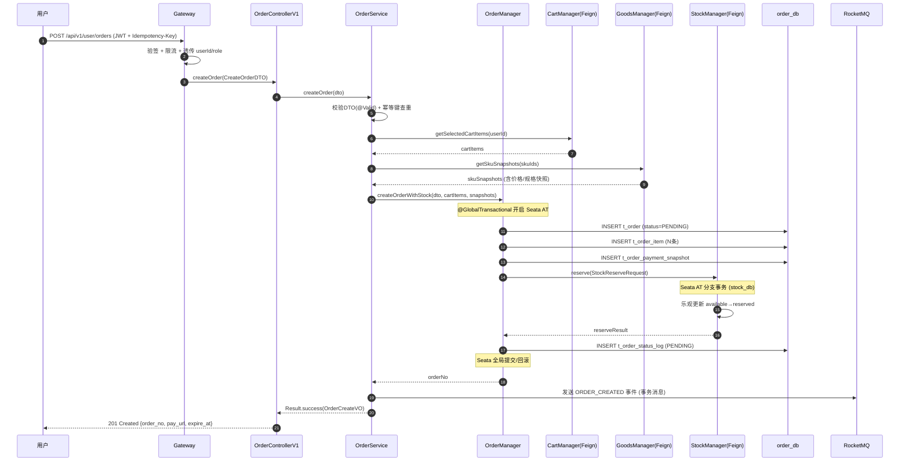
```mermaid
sequenceDiagram
    autonumber
    participant U as 用户
    participant GW as Gateway
    participant OC as OrderControllerV1
    participant OS as OrderService
    participant OM as OrderManager
    participant CM as CartManager(Feign)
    participant GM as GoodsManager(Feign)
    participant SM as StockManager(Feign)
    participant DB as order_db
    participant MQ as RocketMQ

    U->>GW: POST /api/v1/user/orders (JWT + Idempotency-Key)
    GW->>GW: 验签 + 限流 + 透传 userId/role
    GW->>OC: createOrder(CreateOrderDTO)
    OC->>OS: createOrder(dto)
    OS->>OS: 校验DTO(@Valid) + 幂等键查重
    OS->>CM: getSelectedCartItems(userId)
    CM-->>OS: cartItems
    OS->>GM: getSkuSnapshots(skuIds)
    GM-->>OS: skuSnapshots (含价格/规格快照)
    OS->>OM: createOrderWithStock(dto, cartItems, snapshots)
    Note over OM: @GlobalTransactional 开启 Seata AT
    OM->>DB: INSERT t_order (status=PENDING)
    OM->>DB: INSERT t_order_item (N条)
    OM->>DB: INSERT t_order_payment_snapshot
    OM->>SM: reserve(StockReserveRequest)
    Note over SM: Seata AT 分支事务 (stock_db)
    SM->>SM: 乐观更新 available→reserved
    SM-->>OM: reserveResult
    OM->>DB: INSERT t_order_status_log (PENDING)
    Note over OM: Seata 全局提交/回滚
    OM-->>OS: orderNo
    OS->>MQ: 发送 ORDER_CREATED 事件 (事务消息)
    OS-->>OC: Result.success(OrderCreateVO)
    OC-->>U: 201 Created {order_no, pay_url, expire_at}
```

**要点**：
- Seata AT 全局事务范围 = 创建订单 + 锁定库存。支付链路在事务之外。
- 幂等键 `idempotency_key` 写入 `t_order` 唯一索引，相同 key 重复请求直接返回首次结果。
- 商品快照在事务内固化，避免下单后改价风险。

#### 2.2.2 支付回调处理（MQ+RPC 双通道）

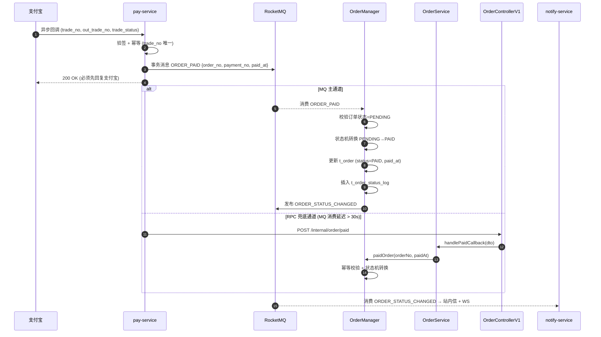
```mermaid
sequenceDiagram
    autonumber
    participant Ali as 支付宝
    participant PAY as pay-service
    participant MQ as RocketMQ
    participant OM as OrderManager
    participant OS as OrderService
    participant OC as OrderControllerV1
    participant NTF as notify-service

    Ali->>PAY: 异步回调 (trade_no, out_trade_no, trade_status)
    PAY->>PAY: 验签 + 幂等 (trade_no 唯一)
    PAY->>MQ: 事务消息 ORDER_PAID {order_no, payment_no, paid_at}
    PAY-->>Ali: 200 OK (必须先回复支付宝)

    alt MQ 主通道
        MQ-->>OM: 消费 ORDER_PAID
        OM->>OM: 校验订单状态=PENDING
        OM->>OM: 状态机转换 PENDING→PAID
        OM->>OM: 更新 t_order (status=PAID, paid_at)
        OM->>OM: 插入 t_order_status_log
        OM->>MQ: 发布 ORDER_STATUS_CHANGED
    else RPC 兜底通道 (MQ 消费延迟 > 30s)
        PAY->>OC: POST /internal/order/paid
        OC->>OS: handlePaidCallback(dto)
        OS->>OM: paidOrder(orderNo, paidAt)
        OM->>OM: 幂等校验 + 状态机转换
    end

    MQ-->>NTF: 消费 ORDER_STATUS_CHANGED → 站内信 + WS
```

**要点**：
- MQ 消费幂等 = `order_no` + 状态校验（仅 PENDING→PAID 可执行）。
- RPC 兜底在 MQ 消费超 30s 未推进时触发，逻辑同 MQ 消费端，幂等保护。**本期未实现延迟检测，当前 RPC 兜底由 pay-service 同步 Feign 触发，待延迟监控模块上线后补齐 30s 阈值检测**
- 支付回调必须先 200 回复支付宝，再做业务处理。

#### 2.2.3 退款流程（MQ 异步）

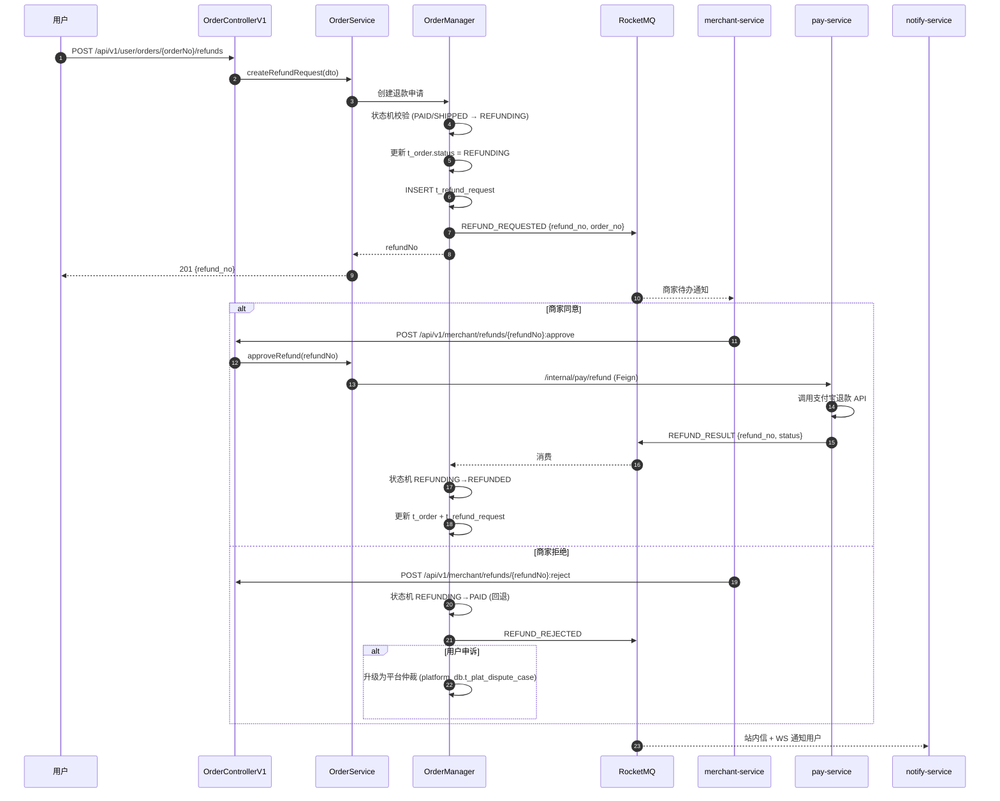
```mermaid
sequenceDiagram
    autonumber
    participant U as 用户
    participant OC as OrderControllerV1
    participant OS as OrderService
    participant OM as OrderManager
    participant MQ as RocketMQ
    participant MER as merchant-service
    participant PAY as pay-service
    participant NTF as notify-service

    U->>OC: POST /api/v1/user/orders/{orderNo}/refunds
    OC->>OS: createRefundRequest(dto)
    OS->>OM: 创建退款申请
    OM->>OM: 状态机校验 (PAID/SHIPPED → REFUNDING)
    OM->>OM: 更新 t_order.status = REFUNDING
    OM->>OM: INSERT t_refund_request
    OM->>MQ: REFUND_REQUESTED {refund_no, order_no}
    OM-->>OS: refundNo
    OS-->>U: 201 {refund_no}

    MQ-->>MER: 商家待办通知

    alt 商家同意
        MER->>OC: POST /api/v1/merchant/refunds/{refundNo}:approve
        OC->>OS: approveRefund(refundNo)
        OS->>PAY: /internal/pay/refund (Feign)
        PAY->>PAY: 调用支付宝退款 API
        PAY->>MQ: REFUND_RESULT {refund_no, status}
        MQ-->>OM: 消费
        OM->>OM: 状态机 REFUNDING→REFUNDED
        OM->>OM: 更新 t_order + t_refund_request
    else 商家拒绝
        MER->>OC: POST /api/v1/merchant/refunds/{refundNo}:reject
        OM->>OM: 状态机 REFUNDING→PAID (回退)
        OM->>MQ: REFUND_REJECTED
        alt 用户申诉
            OM->>OM: 升级为平台仲裁 (platform_db.t_plat_dispute_case)
        end
    end

    MQ-->>NTF: 站内信 + WS 通知用户
```

#### 2.2.4 超时自动取消

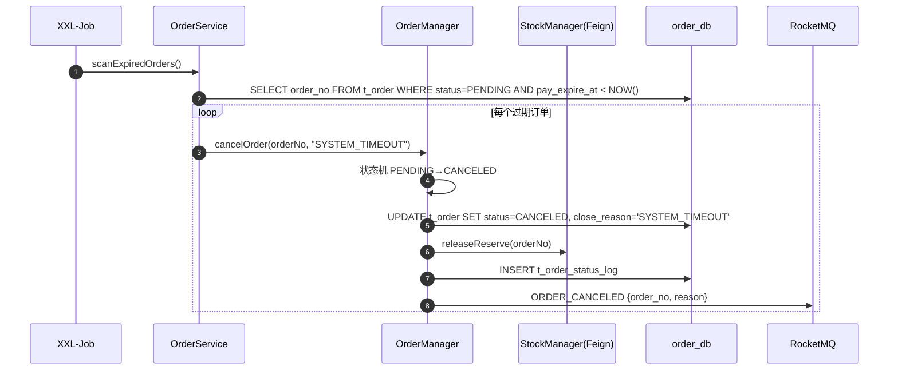
```mermaid
sequenceDiagram
    autonumber
    participant JOB as XXL-Job
    participant OS as OrderService
    participant OM as OrderManager
    participant SM as StockManager(Feign)
    participant DB as order_db
    participant MQ as RocketMQ

    JOB->>OS: scanExpiredOrders()
    OS->>DB: SELECT order_no FROM t_order WHERE status=PENDING AND pay_expire_at < NOW()
    loop 每个过期订单
        OS->>OM: cancelOrder(orderNo, "SYSTEM_TIMEOUT")
        OM->>OM: 状态机 PENDING→CANCELED
        OM->>DB: UPDATE t_order SET status=CANCELED, close_reason='SYSTEM_TIMEOUT'
        OM->>SM: releaseReserve(orderNo)
        OM->>DB: INSERT t_order_status_log
        OM->>MQ: ORDER_CANCELED {order_no, reason}
    end
```

### 2.3 核心类与职责

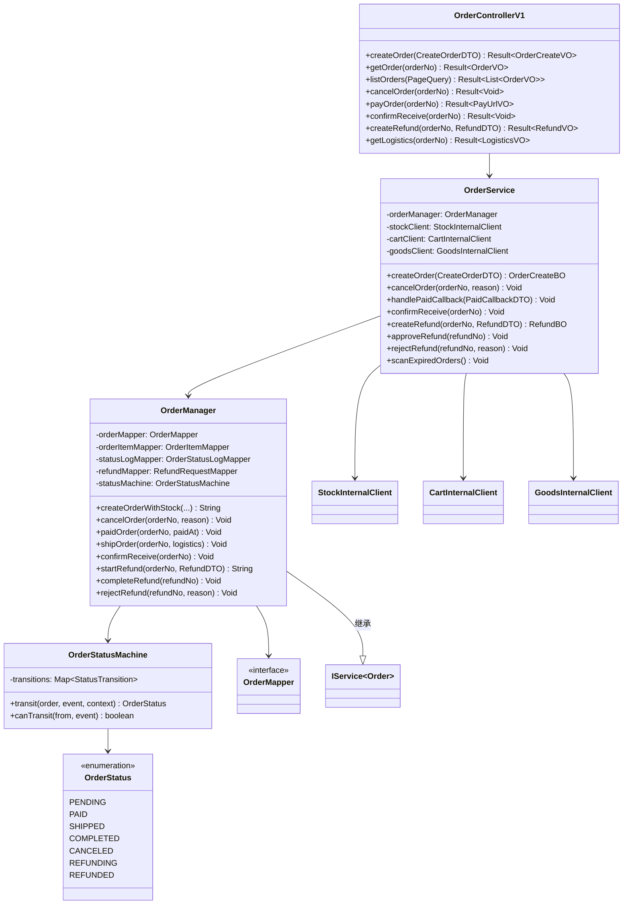
```mermaid
classDiagram
    class OrderControllerV1 {
        +createOrder(CreateOrderDTO) Result~OrderCreateVO~
        +getOrder(orderNo) Result~OrderVO~
        +listOrders(PageQuery) Result~List~OrderVO~~
        +cancelOrder(orderNo) Result~Void~
        +payOrder(orderNo) Result~PayUrlVO~
        +confirmReceive(orderNo) Result~Void~
        +createRefund(orderNo, RefundDTO) Result~RefundVO~
        +getLogistics(orderNo) Result~LogisticsVO~
    }

    class OrderService {
        -orderManager: OrderManager
        -stockClient: StockInternalClient
        -cartClient: CartInternalClient
        -goodsClient: GoodsInternalClient
        +createOrder(CreateOrderDTO) OrderCreateBO
        +cancelOrder(orderNo, reason) Void
        +handlePaidCallback(PaidCallbackDTO) Void
        +confirmReceive(orderNo) Void
        +createRefund(orderNo, RefundDTO) RefundBO
        +approveRefund(refundNo) Void
        +rejectRefund(refundNo, reason) Void
        +scanExpiredOrders() Void
    }

    class OrderManager {
        -orderMapper: OrderMapper
        -orderItemMapper: OrderItemMapper
        -statusLogMapper: OrderStatusLogMapper
        -refundMapper: RefundRequestMapper
        -statusMachine: OrderStatusMachine
        +createOrderWithStock(...) String
        +cancelOrder(orderNo, reason) Void
        +paidOrder(orderNo, paidAt) Void
        +shipOrder(orderNo, logistics) Void
        +confirmReceive(orderNo) Void
        +startRefund(orderNo, RefundDTO) String
        +completeRefund(refundNo) Void
        +rejectRefund(refundNo, reason) Void
    }

    class OrderStatusMachine {
        -transitions: Map~StatusTransition~
        +transit(order, event, context) OrderStatus
        +canTransit(from, event) boolean
    }

    class OrderStatus {
        <<enumeration>>
        PENDING
        PAID
        SHIPPED
        COMPLETED
        CANCELED
        REFUNDING
        REFUNDED
    }

    class OrderMapper {
        <<interface>>
    }

    OrderControllerV1 --> OrderService
    OrderService --> OrderManager
    OrderService --> StockInternalClient
    OrderService --> CartInternalClient
    OrderService --> GoodsInternalClient
    OrderManager --> OrderMapper
    OrderManager --> OrderStatusMachine
    OrderStatusMachine --> OrderStatus
    OrderManager --|> IService~Order~ : 继承
```

**分层契约**：
- `OrderControllerV1`：接收 HTTP 请求，参数校验（`@Valid`），调用 Service，返回 `Result<T>`。
- `OrderService`：薄业务层，**禁止**继承 `IService<T>`。负责参数组装、跨服务调用编排、MQ 发送。不含 CRUD 逻辑。
- `OrderManager`：**必须**继承 `IService<Order>` + `ServiceImpl<OrderMapper, Order>`，复用 MyBatis-Plus 通用 CRUD。负责事务内数据操作、状态机驱动、幂等校验。
- `OrderStatusMachine`：无状态单例，管理状态转换规则表，提供 `transit()` 与 `canTransit()` 方法。

### 2.4 状态机

#### 2.4.1 状态机图

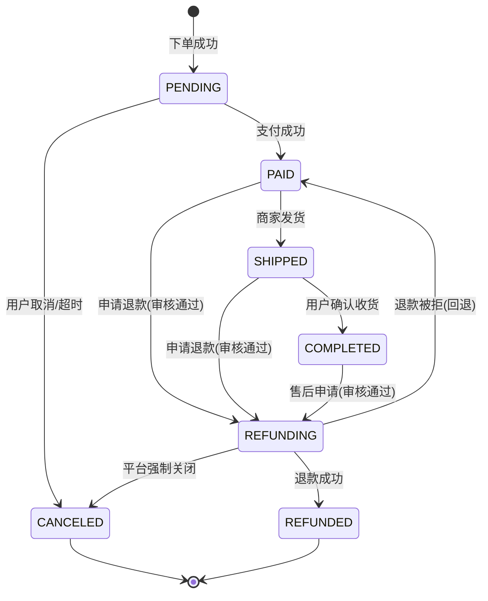
```mermaid
stateDiagram-v2
    [*] --> PENDING : 下单成功
    PENDING --> PAID : 支付成功
    PENDING --> CANCELED : 用户取消/超时
    PAID --> SHIPPED : 商家发货
    PAID --> REFUNDING : 申请退款(审核通过)
    SHIPPED --> COMPLETED : 用户确认收货
    SHIPPED --> REFUNDING : 申请退款(审核通过)
    REFUNDING --> REFUNDED : 退款成功
    REFUNDING --> PAID : 退款被拒(回退)
    REFUNDING --> CANCELED : 平台强制关闭
    COMPLETED --> REFUNDING : 售后申请(审核通过)
    CANCELED --> [*]
    REFUNDED --> [*]
```

#### 2.4.2 状态转换规则表

| # | 当前状态 | 事件 | 目标状态 | 守卫条件 | 动作 |
|---|----------|------|----------|----------|------|
| T1 | PENDING | USER_PAY_SUCCESS | PAID | 支付回调验签通过 + payment_no 匹配 | 更新 `paid_at`、插入 `status_log`、发布 `ORDER_STATUS_CHANGED` |
| T2 | PENDING | USER_CANCEL | CANCELED | 当前时间 < `pay_expire_at` 且无支付流水 | 释放库存预留、发布 `ORDER_CANCELED` |
| T3 | PENDING | SYSTEM_TIMEOUT | CANCELED | `pay_expire_at` < NOW() 且 status=PENDING | 释放库存预留、记录 `close_reason=SYSTEM_TIMEOUT`、发布 `ORDER_CANCELED` |
| T4 | PAID | MERCHANT_SHIP | SHIPPED | 运单号 + 物流公司非空 | 更新 `shipped_at`、创建物流记录、发布 `ORDER_STATUS_CHANGED` |
| T5 | PAID | REFUND_APPROVED | REFUNDING | 退款单状态=商家同意 | 更新退款单状态、调用 pay-service 发起退款、发布 `REFUND_STARTED` |
| T6 | SHIPPED | USER_CONFIRM | COMPLETED | 物流签收或用户手动确认 | 更新 `received_at`、发布 `ORDER_STATUS_CHANGED`、触发结算 |
| T7 | SHIPPED | REFUND_APPROVED | REFUNDING | 退款单状态=商家同意 | 同 T5 |
| T8 | REFUNDING | REFUND_SUCCESS | REFUNDED | pay-service 退款回调成功 | 更新退款单状态=已退款、记录 `closed_at`、发布 `ORDER_STATUS_CHANGED` |
| T9 | REFUNDING | REFUND_REJECTED | PAID | 退款单状态=商家拒绝 + 非仲裁升级 | 回退订单状态、发布 `REFUND_REJECTED` |
| T10 | REFUNDING | PLATFORM_FORCE_CLOSE | CANCELED | 平台仲裁决定关闭 | 强制关闭、释放库存、退款（如已支付）、记录仲裁结果。**本期未实现，待平台仲裁模块上线后补齐** |
| T11 | COMPLETED | REFUND_APPROVED | REFUNDING | 售后期内（收货后15天内）+ 退款单审核通过 | 同 T5 |

**非法转换**：任何不在上表中的 (当前状态, 事件) 组合，抛出 `BizException("ORDER_STATUS_INVALID", "订单状态不允许此操作")`，返回 409。

### 2.5 关键算法/业务规则

| 规则 | 说明 | 实现位置 |
|------|------|----------|
| 金额计算 | 全链路 `BigDecimal`，`scale=2`，`RoundingMode.HALF_EVEN`；`total_amount = Σ(item.subtotal_amount) + freight_amount - discount_amount` | `OrderService.calcAmount()` |
| 幂等键校验 | `idempotency_key` 写入 `t_order.uk_order_idem`，重复请求查回原结果 | `OrderService.createOrder()` |
| 商品快照固化 | 下单时将 SKU/SPU 信息写入 `t_order_item.sku_snapshot_json` + `spu_snapshot_json`，后续价格变动不影响已下订单 | `OrderManager.createOrderWithStock()` |
| 收货信息快照 | 下单时将地址信息写入 `t_order.receiver_snapshot_json`，防止地址变更影响发货 | `OrderManager.createOrderWithStock()` |
| 支付超时 | 默认 30 分钟，`pay_expire_at = create_time + 30min`，由 XXL-Job 每 1 分钟扫描。**本期未实现，待 XXL-Job 调度模块上线后补齐** | `OrderService.scanExpiredOrders()` |
| 自动确认收货 | 发货后 15 天未操作自动确认，由 XXL-Job 扫描 `shipped_at + 15d < NOW()`。**本期未实现，待 XXL-Job 调度模块上线后补齐** | `OrderService.scanAutoConfirm()` |
| 跨商家拆单 | 一个用户订单按 `merchant_id` 拆分为多个 `t_order`（共享同一用户订单组），每个子订单独立状态机。**本期未实现，当前仅支持单商家订单，待多商家场景落地后补齐** | `OrderService.createOrder()` |

### 2.6 数据结构与索引

核心表：

| 表 | 关键字段 | 说明 |
|---|---|---|
| `t_order` | `order_no`, `user_id`, `merchant_id`, `status`, `total_amount`, `pay_amount`, `idempotency_key`, `pay_expire_at` | 订单主表 |
| `t_order_item` | `order_id`, `sku_id`, `unit_price`, `quantity`, `pay_amount`, `refund_status` | 订单项 |
| `t_order_status_log` | `order_id`, `from_status`, `to_status`, `trigger`, `operator_id` | 状态机日志 |
| `t_refund_request` | `refund_no`, `order_id`, `refund_type`, `refund_amount`, `status` | 退款/售后申请 |
| `t_order_payment_snapshot` | `order_id`, `pay_amount`, `pay_method`, `expire_at` | 支付快照 |
| `t_order_logistics` | `order_id`, `tracking_no`, `carrier` | 物流信息 |
| `t_idempotency` | `idempotency_key`, `response_cache`, `expire_at` | 幂等键表 |

关键索引（源自数据库设计文档 §10）：

| 索引名 | 列 | 用途 |
|--------|-----|------|
| `uk_order_no` | (order_no) | 业务单号唯一 |
| `idx_order_user_status` | (user_id, status, create_time) | 用户订单列表 |
| `idx_order_merchant_status` | (merchant_id, status, create_time) | 商家订单列表 |
| `idx_order_pay_expire` | (status, pay_expire_at) | 超时扫描 |
| `uk_order_idem` | (idempotency_key) | 幂等查重 |

### 2.7 异常处理与降级

| 异常场景 | 触发条件 | 处理方式 | 降级策略 |
|----------|----------|----------|----------|
| 库存锁定失败 | `available_qty < qty` | 返回 `BIZ_1001_OUT_OF_STOCK` (422) | 前端提示库存不足，建议调整数量 |
| Seata 全局事务回滚 | stock-service 分支异常 | 自动回滚 order_db + stock_db 写入 | 返回 500，前端重试 |
| 支付回调延迟 | MQ 消费延迟 > 30s | pay-service 发起 RPC 兜底调用 | 双通道保证最终一致 |
| 重复支付回调 | 同一 trade_no 多次回调 | 幂等表 `uk_pay_trade_no` 去重 | 直接返回首次结果 |
| 商品服务不可用 | Feign 调用超时/熔断 | Sentinel 熔断，返回降级提示 | 提示"商品信息暂时不可用，请稍后重试" |
| 购物车服务不可用 | Feign 调用超时 | 下单流程阻断，返回 503 | 不降级（购物车数据是下单必需） |
| 数据库死锁 | 高并发更新同一行 | Seata 自动重试 + 超时回滚 | 返回 409，前端重试 |
| 退款回调丢失 | 支付宝退款回调未到 | XXL-Job 补偿任务扫描超时退款单 | 主动查询支付宝退款状态 |

### 2.8 性能与并发

| 场景 | 指标 | 方案 |
|------|------|------|
| 下单 P99 | ≤ 500ms（不含支付跳转） | Seata AT 协调 ≤ 60ms；DB 写 ≤ 100ms；Feign 调用 ≤ 200ms |
| 下单写 QPS | ≥ 200 | Seata AT 下调阈值；热点 SKU 库存乐观更新无锁竞争 |
| 超时取消扫描 | < 3s/批次 | `idx_order_pay_expire` 走索引；每批 500 条 |
| 订单列表查询 | P99 ≤ 100ms | `idx_order_user_status` 覆盖索引；cursor 分页 |
| 订单详情 | P99 ≤ 50ms | 主键查询 + 1次 item 关联 |

**并发控制**：
- 订单创建：幂等键唯一索引防重复提交
- 状态机转换：`UPDATE t_order SET status = #{newStatus} WHERE id = #{id} AND status = #{oldStatus}`，影响行数=0 则状态冲突
- 跨商家拆单：同一用户请求内串行处理，避免同一 SKU 重复下单

### 2.9 测试要点

| 类别 | 测试场景 | 验证点 |
|------|----------|--------|
| 状态机 | 全状态覆盖 | 11 条转换规则 + 非法转换拒绝 |
| 幂等 | 相同 `idempotency_key` 重复请求 | 第二次返回首次结果，不重复创建 |
| 并发 | 多用户同时购买同一 SKU | 库存不超卖，失败方返回 422 |
| 并发 | 同一订单重复支付回调 | 幂等去重，状态不重复推进 |
| 分布式事务 | 下单时 stock-service 异常 | Seata 自动回滚，订单和库存均不写入 |
| 分布式事务 | 下单时 order_db 写入后 stock_db 超时 | Seata 全局回滚 |
| 超时 | 订单 30 分钟未支付 | 自动取消 + 库存释放 |
| 退款 | 部分退款 + 全额退款组合 | 金额计算准确，状态正确推进 |
| 退款 | 退款回调丢失 | 补偿任务主动查询并推进 |
| 金额 | 多 SKU + 运费 + 优惠 | `pay_amount = Σ(item.pay_amount) + freight - discount`，精度不丢失 |

### 2.10 风险与遗留

| 风险 | 影响 | 缓解措施 | 遗留 |
|------|------|----------|------|
| Seata AT 写放大 | undo_log 膨胀影响写 QPS | 监控 undo_log 增长；2 期评估 TCC | M2 评估 |
| 跨商家拆单事务范围大 | 全局事务锁持有时间长 | 拆单后各子订单独立事务 | 压测验证 |
| 支付超时与回调时序错乱 | 先回调后超时取消 | 状态机守卫条件 + 幂等保护 | 已设计 |
| 退款部分退款场景复杂 | 订单项级别退款状态管理 | `t_order_item.refund_status` + `t_refund_request` | 需细化 |
| 大促下单 QPS 超过 Seata 上限 | 事务协调超时 | 降级为本地事务 + MQ 异步补偿 | M3 评估 |

**Seata AT 监控指标**：
- `seata_branch_transaction_count`（分支事务数）
- `seata_undo_log_size`（undo log 表大小）
- `seata_lock_retry_count`（全局锁重试次数）

**Seata AT 优化建议**：
- 热点数据避开分布式事务（如库存扣减改用本地事务+乐观锁+MQ最终一致性）
- 非核心分支降级为 MQ 异步

---

## 3. pay-service — 支付模块详细设计

### 3.1 模块概述

pay-service 负责支付/退款全流程管理，是资金安全的最后一道防线。核心职责包括：支付宝下单与跳转、异步回调验签与幂等、退款发起与回调、商家提现、平台对账。端口 8207，独占 `pay_db`（上线即独立实例）。

**关键约束**：
- 支付回调必须验签 + 幂等，幂等键 = `trade_no`（支付宝交易号）
- 退款幂等键 = `refund_no`（商户退款单号），支付宝退款单号回写后禁止再发起
- 金额全链路 `BigDecimal`，支付金额必须与订单金额一致
- 对账数据必须逐分不差，宁可降级吞吐也要保证一致
- `channel_response` 原始报文存证，用于争议仲裁

### 3.2 关键流程时序图

#### 3.2.1 支付宝下单→跳转→异步回调→验签→幂等→更新订单

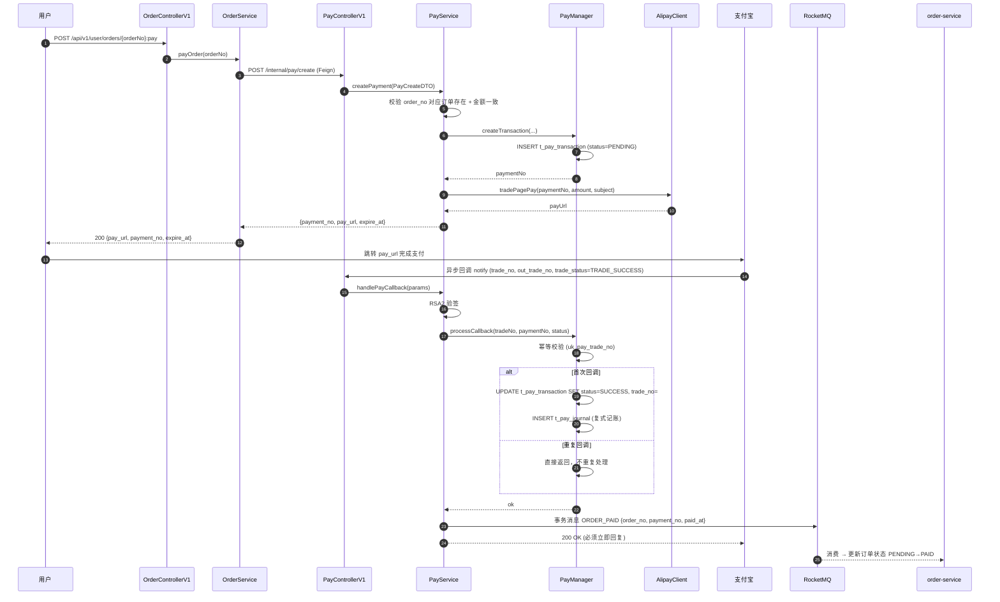
```mermaid
sequenceDiagram
    autonumber
    participant U as 用户
    participant OC as OrderControllerV1
    participant OS as OrderService
    participant PC as PayControllerV1
    participant PS as PayService
    participant PM as PayManager
    participant AC as AlipayClient
    participant Ali as 支付宝
    participant MQ as RocketMQ
    participant ORD as order-service

    U->>OC: POST /api/v1/user/orders/{orderNo}:pay
    OC->>OS: payOrder(orderNo)
    OS->>PC: POST /internal/pay/create (Feign)
    PC->>PS: createPayment(PayCreateDTO)
    PS->>PS: 校验 order_no 对应订单存在 + 金额一致
    PS->>PM: createTransaction(...)
    PM->>PM: INSERT t_pay_transaction (status=PENDING)
    PM-->>PS: paymentNo
    PS->>AC: tradePagePay(paymentNo, amount, subject)
    AC-->>PS: payUrl
    PS-->>OS: {payment_no, pay_url, expire_at}
    OS-->>U: 200 {pay_url, payment_no, expire_at}

    U->>Ali: 跳转 pay_url 完成支付

    Ali->>PC: 异步回调 notify (trade_no, out_trade_no, trade_status=TRADE_SUCCESS)
    PC->>PS: handlePayCallback(params)
    PS->>PS: RSA2 验签
    PS->>PM: processCallback(tradeNo, paymentNo, status)
    PM->>PM: 幂等校验 (uk_pay_trade_no)
    alt 首次回调
        PM->>PM: UPDATE t_pay_transaction SET status=SUCCESS, trade_no=#{tradeNo}, paid_at=NOW()
        PM->>PM: INSERT t_pay_journal (复式记账)
    else 重复回调
        PM->>PM: 直接返回，不重复处理
    end
    PM-->>PS: ok
    PS->>MQ: 事务消息 ORDER_PAID {order_no, payment_no, paid_at}
    PS-->>Ali: 200 OK (必须立即回复)

    MQ-->>ORD: 消费 → 更新订单状态 PENDING→PAID
```

**要点**：
- 支付回调必须先 200 回复支付宝，再做业务处理。
- 验签失败直接丢弃，记录安全日志。
- 幂等：`uk_pay_trade_no(trade_no)` 唯一索引，相同 trade_no 只处理一次。

#### 3.2.2 退款流程

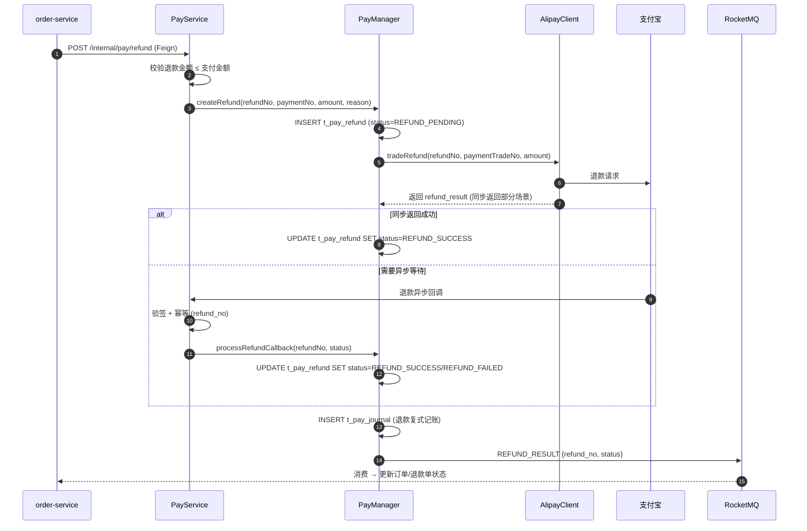
```mermaid
sequenceDiagram
    autonumber
    participant ORD as order-service
    participant PS as PayService
    participant PM as PayManager
    participant AC as AlipayClient
    participant Ali as 支付宝
    participant MQ as RocketMQ

    ORD->>PS: POST /internal/pay/refund (Feign)
    PS->>PS: 校验退款金额 ≤ 支付金额
    PS->>PM: createRefund(refundNo, paymentNo, amount, reason)
    PM->>PM: INSERT t_pay_refund (status=REFUND_PENDING)
    PM->>AC: tradeRefund(refundNo, paymentTradeNo, amount)
    AC->>Ali: 退款请求
    AC-->>PM: 返回 refund_result (同步返回部分场景)

    alt 同步返回成功
        PM->>PM: UPDATE t_pay_refund SET status=REFUND_SUCCESS
    else 需要异步等待
        Ali->>PS: 退款异步回调
        PS->>PS: 验签 + 幂等 (refund_no)
        PS->>PM: processRefundCallback(refundNo, status)
        PM->>PM: UPDATE t_pay_refund SET status=REFUND_SUCCESS/REFUND_FAILED
    end

    PM->>PM: INSERT t_pay_journal (退款复式记账)
    PM->>MQ: REFUND_RESULT {refund_no, status}
    MQ-->>ORD: 消费 → 更新订单/退款单状态
```

#### 3.2.3 对账流程

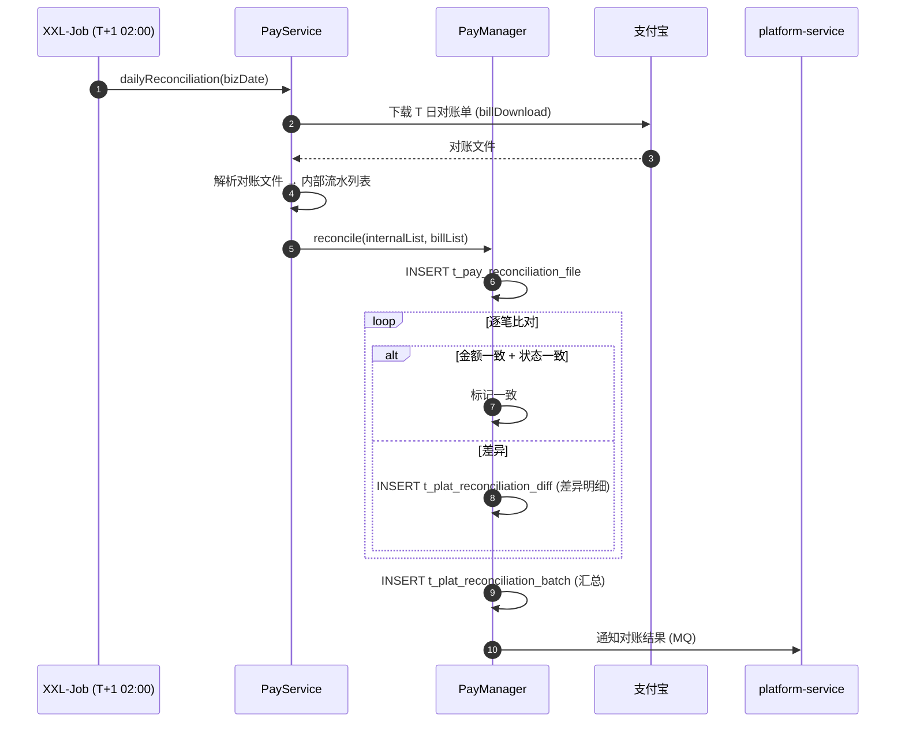
```mermaid
sequenceDiagram
    autonumber
    participant JOB as XXL-Job (T+1 02:00)
    participant PS as PayService
    participant PM as PayManager
    participant Ali as 支付宝
    participant PLAT as platform-service

    JOB->>PS: dailyReconciliation(bizDate)
    PS->>Ali: 下载 T 日对账单 (billDownload)
    Ali-->>PS: 对账文件
    PS->>PS: 解析对账文件 → 内部流水列表
    PS->>PM: reconcile(internalList, billList)
    PM->>PM: INSERT t_pay_reconciliation_file
    loop 逐笔比对
        alt 金额一致 + 状态一致
            PM->>PM: 标记一致
        else 差异
            PM->>PM: INSERT t_plat_reconciliation_diff (差异明细)
        end
    end
    PM->>PM: INSERT t_plat_reconciliation_batch (汇总)
    PM->>PLAT: 通知对账结果 (MQ)
```

### 3.3 核心类与职责

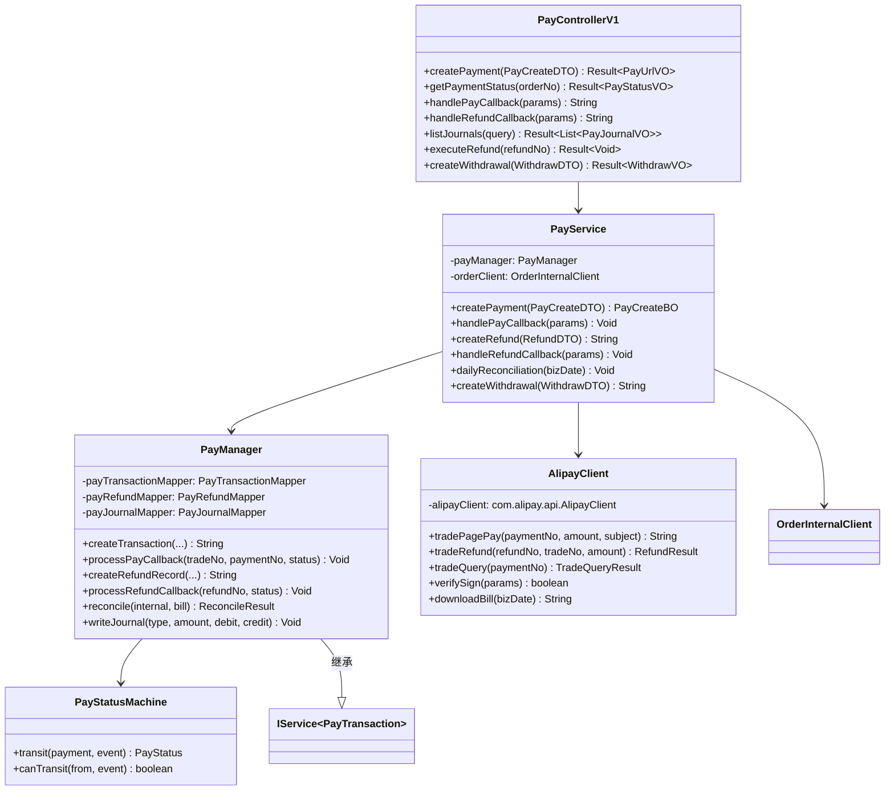
```mermaid
classDiagram
    class PayControllerV1 {
        +createPayment(PayCreateDTO) Result~PayUrlVO~
        +getPaymentStatus(orderNo) Result~PayStatusVO~
        +handlePayCallback(params) String
        +handleRefundCallback(params) String
        +listJournals(query) Result~List~PayJournalVO~~
        +executeRefund(refundNo) Result~Void~
        +createWithdrawal(WithdrawDTO) Result~WithdrawVO~
    }

    class PayService {
        -payManager: PayManager
        -orderClient: OrderInternalClient
        +createPayment(PayCreateDTO) PayCreateBO
        +handlePayCallback(params) Void
        +createRefund(RefundDTO) String
        +handleRefundCallback(params) Void
        +dailyReconciliation(bizDate) Void
        +createWithdrawal(WithdrawDTO) String
    }

    class PayManager {
        -payTransactionMapper: PayTransactionMapper
        -payRefundMapper: PayRefundMapper
        -payJournalMapper: PayJournalMapper
        +createTransaction(...) String
        +processPayCallback(tradeNo, paymentNo, status) Void
        +createRefundRecord(...) String
        +processRefundCallback(refundNo, status) Void
        +reconcile(internal, bill) ReconcileResult
        +writeJournal(type, amount, debit, credit) Void
    }

    class AlipayClient {
        -alipayClient: com.alipay.api.AlipayClient
        +tradePagePay(paymentNo, amount, subject) String
        +tradeRefund(refundNo, tradeNo, amount) RefundResult
        +tradeQuery(paymentNo) TradeQueryResult
        +verifySign(params) boolean
        +downloadBill(bizDate) String
    }

    class PayStatusMachine {
        +transit(payment, event) PayStatus
        +canTransit(from, event) boolean
    }

    PayControllerV1 --> PayService
    PayService --> PayManager
    PayService --> AlipayClient
    PayService --> OrderInternalClient
    PayManager --> PayStatusMachine
    PayManager --|> IService~PayTransaction~ : 继承
```

**分层契约**：
- `PayControllerV1`：接收 HTTP 请求 + 支付宝回调，参数校验，返回 `Result<T>`。
- `PayService`：薄业务层，**禁止**继承 `IService`。负责支付流程编排、校验、MQ 发送。
- `PayManager`：**必须**继承 `IService<PayTransaction>` + `ServiceImpl<PayTransactionMapper, PayTransaction>`。负责事务内数据操作、幂等校验、复式记账。
- `AlipayClient`：封装支付宝 SDK 调用，统一异常处理与重试。

### 3.4 状态机

#### 3.4.1 支付状态机

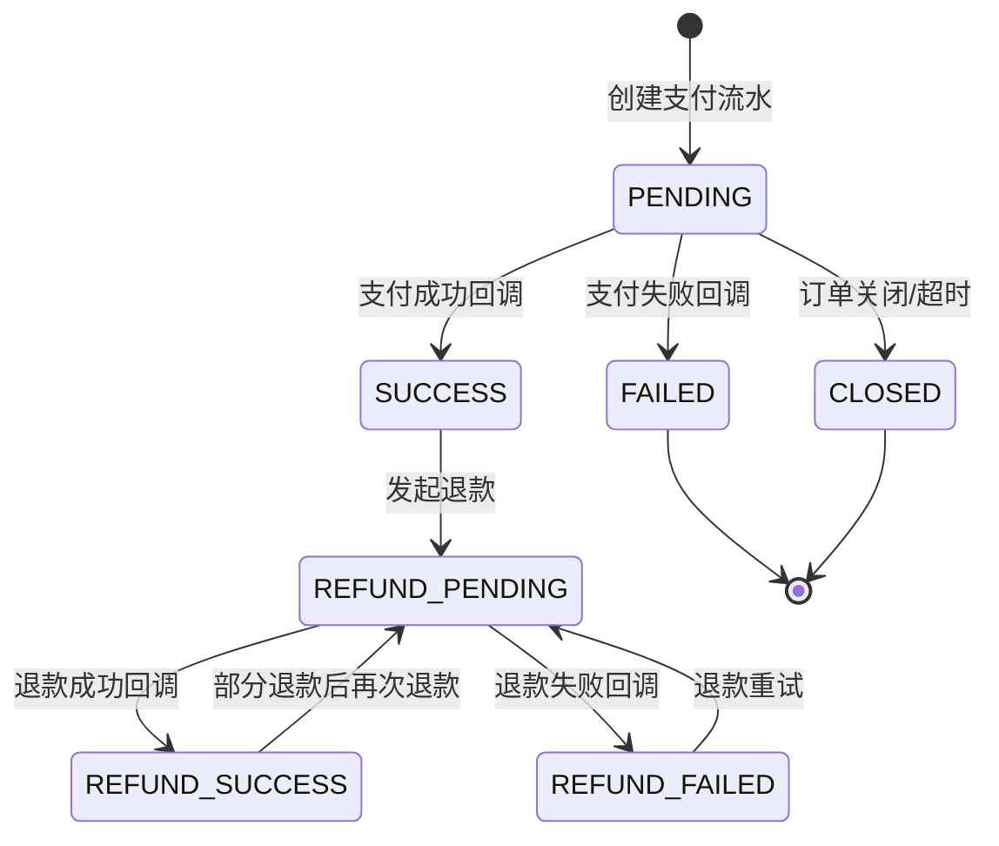
```mermaid
stateDiagram-v2
    [*] --> PENDING : 创建支付流水
    PENDING --> SUCCESS : 支付成功回调
    PENDING --> FAILED : 支付失败回调
    PENDING --> CLOSED : 订单关闭/超时
    SUCCESS --> REFUND_PENDING : 发起退款
    REFUND_PENDING --> REFUND_SUCCESS : 退款成功回调
    REFUND_PENDING --> REFUND_FAILED : 退款失败回调
    REFUND_SUCCESS --> REFUND_PENDING : 部分退款后再次退款
    FAILED --> [*]
    CLOSED --> [*]
    REFUND_FAILED --> REFUND_PENDING : 退款重试
```

#### 3.4.2 退款状态机

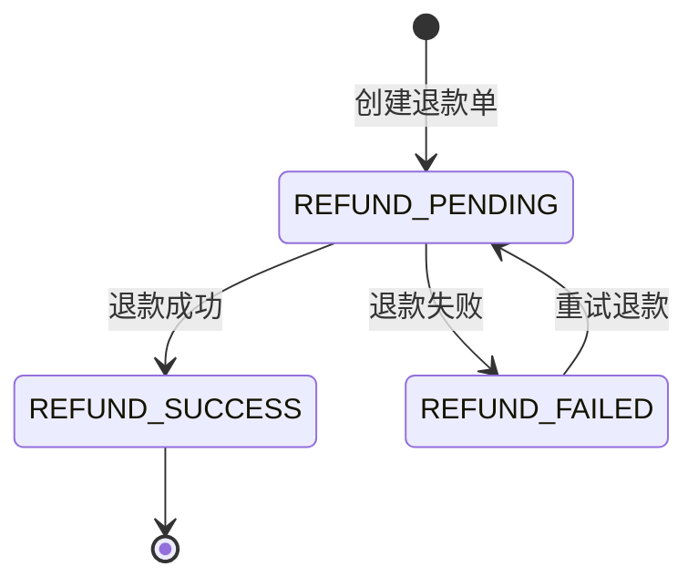
```mermaid
stateDiagram-v2
    [*] --> REFUND_PENDING : 创建退款单
    REFUND_PENDING --> REFUND_SUCCESS : 退款成功
    REFUND_PENDING --> REFUND_FAILED : 退款失败
    REFUND_FAILED --> REFUND_PENDING : 重试退款
    REFUND_SUCCESS --> [*]
```

#### 3.4.3 支付状态转换规则表

| # | 当前状态 | 事件 | 目标状态 | 守卫条件 | 动作 |
|---|----------|------|----------|----------|------|
| P1 | PENDING | PAY_CALLBACK_SUCCESS | SUCCESS | 验签通过 + trade_no 未被处理 | 更新 `trade_no`、`paid_at`、`status=SUCCESS`；写入 `channel_response`；复式记账；发 MQ `ORDER_PAID` |
| P2 | PENDING | PAY_CALLBACK_FAILED | FAILED | 验签通过 + trade_status=TRADE_CLOSED | 更新 `status=FAILED`；发 MQ `ORDER_PAY_FAILED` |
| P3 | PENDING | ORDER_CLOSED | CLOSED | 订单已取消/超时 | 更新 `status=CLOSED`；无需退款 |
| P4 | SUCCESS | REFUND_REQUEST | REFUND_PENDING | 退款金额 ≤ `amount - 已退金额` | 创建 `t_pay_refund`；调用支付宝退款 API |
| P5 | REFUND_PENDING | REFUND_CALLBACK_SUCCESS | REFUND_SUCCESS | 退款回调验签通过 | 更新退款单状态；复式记账；发 MQ `REFUND_RESULT` |
| P6 | REFUND_PENDING | REFUND_CALLBACK_FAILED | REFUND_FAILED | 退款回调返回失败 | 更新退款单状态；记录失败原因；告警 |
| P7 | REFUND_SUCCESS | REFUND_REQUEST | REFUND_PENDING | 剩余可退金额 > 0（部分退款场景） | 同 P4 |
| P8 | REFUND_FAILED | REFUND_RETRY | REFUND_PENDING | 重试次数 < 3 | 重新调用支付宝退款 API |

**退款状态转换规则表**：

| # | 当前状态 | 事件 | 目标状态 | 守卫条件 | 动作 |
|---|----------|------|----------|----------|------|
| R1 | REFUND_PENDING | ALIPAY_REFUND_SUCCESS | REFUND_SUCCESS | 验签通过 + refund_no 幂等 | 更新 `notified_at`、复式记账 |
| R2 | REFUND_PENDING | ALIPAY_REFUND_FAILED | REFUND_FAILED | 验签通过 | 记录失败原因 |
| R3 | REFUND_FAILED | MANUAL_RETRY | REFUND_PENDING | 重试次数 < 3 | 重新发起退款 |

### 3.5 关键算法/业务规则

| 规则 | 说明 | 实现位置 |
|------|------|----------|
| 验签 | 支付宝 RSA2 公钥验签，`AlipaySignature.rsaCheckV1(params, publicKey, charset, signType)` | `AlipayClient.verifySign()` |
| 幂等 | 支付回调：`uk_pay_trade_no(trade_no)`；退款回调：`refund_no` + 状态校验 | `PayManager.processPayCallback()` |
| 复式记账 | 每笔金额变动写入 `t_pay_journal`：`debit/credit/balance_after`，资金可追溯 | `PayManager.writeJournal()` |
| 退款金额校验 | `refund_amount ≤ pay_transaction.amount - SUM(已退金额)` | `PayService.createRefund()` |
| 对账 | T+1 凌晨下载支付宝对账单，逐笔比对 `trade_no + amount + status`，差异写入 `t_plat_reconciliation_diff` | `PayService.dailyReconciliation()` |
| 支付超时查询 | 支付回调延迟时主动查询 `alipay.trade.query`，30s/60s/180s 三次 | `PayService.queryPayResult()` |
| 金额校验 | 创建支付时 `pay_amount` 必须与 `t_order_payment_snapshot.pay_amount` 一致 | `PayService.createPayment()` |

### 3.6 数据结构与索引

核心表：

| 表 | 关键字段 | 说明 |
|---|---|---|
| `t_pay_transaction` | `payment_no`, `trade_no`, `order_no`, `amount`, `status`, `channel`, `channel_response`, `idempotency_key` | 支付流水 |
| `t_pay_refund` | `refund_no`, `payment_no`, `refund_trade_no`, `amount`, `status`, `idempotency_key` | 退款单 |
| `t_pay_withdraw` | `withdraw_no`, `merchant_id`, `amount`, `status` | 提现申请 |
| `t_pay_journal` | `biz_type`, `biz_no`, `debit`, `credit`, `balance_after` | 复式记账流水 |
| `t_pay_reconciliation_file` | `batch_no`, `biz_date`, `file_url`, `status` | 对账文件 |
| `t_pay_channel` | `channel_id`, `channel_name`, `config_json` | 支付渠道字典 |
| `t_pay_idempotency` | `idempotency_key`, `response_cache`, `expire_at` | 幂等键表 |

关键索引（源自数据库设计文档 §11）：

| 索引名 | 列 | 用途 |
|--------|-----|------|
| `uk_pay_trade_no` | (trade_no) | 支付宝单号唯一，回调幂等 |
| `idx_pay_order_no` | (order_no) | 按订单查支付 |
| `idx_pay_user_status` | (user_id, status, create_time) | 用户支付记录 |
| `uk_pay_idem` | (idempotency_key) | 幂等查重 |

### 3.7 异常处理与降级

| 异常场景 | 触发条件 | 处理方式 | 降级策略 |
|----------|----------|----------|----------|
| 验签失败 | 回调签名不匹配 | 丢弃请求，记录安全日志，告警 | 不降级，拒绝处理 |
| 重复回调 | 同一 trade_no 多次到达 | 幂等去重，返回首次结果 | 正常 |
| 支付宝接口超时 | 网络抖动/支付宝限流 | 重试 3 次（1s/5s/30s 指数退避） | 超时后主动查询 |
| 支付宝接口不可用 | 连续 3 次超时 | Sentinel 熔断，返回 `EXT_503_ALIPAY_DOWN` | 提示稍后重试 |
| 退款金额超限 | refund_amount > 可退余额 | 返回 `BIZ_1301_REFUND_DENIED` | 不降级 |
| 对账差异 | 内部流水与支付宝不一致 | 差异写入 `t_plat_reconciliation_diff` | 人工核查 |
| 支付状态不一致 | 支付成功但订单未推进 | 补偿任务主动查询 + RPC 兜底 | 双通道保证 |

### 3.8 性能与并发

| 场景 | 指标 | 方案 |
|------|------|------|
| 支付回调处理 P99 | ≤ 200ms | 幂等查询走唯一索引 O(1)；异步发 MQ 不阻塞 |
| 对账 | ≤ 30min/T 日 | 批量比对，差异单行写入 |
| 支付创建 | ≤ 300ms | 支付宝下单接口超时 5s；本地写入 < 50ms |
| 退款创建 | ≤ 500ms | 支付宝退款接口超时 10s |

**并发控制**：
- 支付回调幂等：`uk_pay_trade_no(trade_no)` 唯一索引，`INSERT` 冲突即去重
- 退款幂等：`refund_no` 唯一索引 + 乐观锁 `version` 字段
- 退款金额扣减：`SELECT ... FOR UPDATE` 锁定支付流水行，防止超额退款

### 3.9 测试要点

| 类别 | 测试场景 | 验证点 |
|------|----------|--------|
| 验签 | 合法签名 + 篡改签名 | 合法通过；篡改拒绝 + 安全日志 |
| 幂等 | 同一 trade_no 连续 5 次回调 | 只处理 1 次，后续直接返回 |
| 幂等 | 同一 refund_no 连续退款请求 | 只发起 1 次退款 |
| 金额 | 支付金额与订单不一致 | 拒绝创建支付 |
| 退款金额 | 部分退款累计超限 | 最后一次拒绝 |
| 对账 | 金额差异 / 状态差异 / 缺失流水 | 差异正确记录 |
| 熔断 | 支付宝连续超时 | Sentinel 熔断触发，返回 503 |
| 复式记账 | 每笔变动后 balance_after 正确 | 借贷平衡 |
| 异步回调丢失 | 支付宝回调未到 | 主动查询补偿任务推进状态 |

### 3.10 风险与遗留

| 风险 | 影响 | 缓解措施 | 遗留 |
|------|------|----------|------|
| 支付宝回调时序不可控 | 先退款后支付等异常 | 状态机守卫 + 幂等 + 人工核查 | 已设计 |
| 对账差异处理人工成本 | 运维负担 | 差异分级：小额自动调账，大额人工 | 需细化调账规则 |
| 微信支付未接入 | 功能缺失 | 预留 channel=2，本期仅支付宝 | M2 评估 |
| 退款失败重试策略 | 支付宝退款有频率限制 | 退避重试 + 人工兜底 | 需压测验证 |
| 余额支付/组合支付 | 逻辑复杂 | 本期不支持 | 远期规划 |

---

## 4. stock-service — 库存模块详细设计

### 4.1 模块概述

stock-service 负责库存的预留/释放/扣减/预警全流程管理，是防止超卖的核心屏障。核心职责包括：库存初始化、库存预留（Seata AT 分支事务）、库存释放（超时/取消）、库存扣减确认、库存调整、库存预警、出入库流水。端口 8208，独占 `stock_db`（上线即独立实例）。

**关键约束**：
- 库存扣减采用乐观更新（`WHERE available_qty >= #{qty}`），避免悲观锁热点
- Seata AT 分支事务在 `stock_db` 写入 `undo_log`，事务回滚时自动补回
- 库存预留与释放必须成对，防止库存泄漏
- 预警触发后通过 MQ 通知商家 + 平台运营

### 4.2 关键流程时序图

#### 4.2.1 库存预留（Seata AT 分支事务）

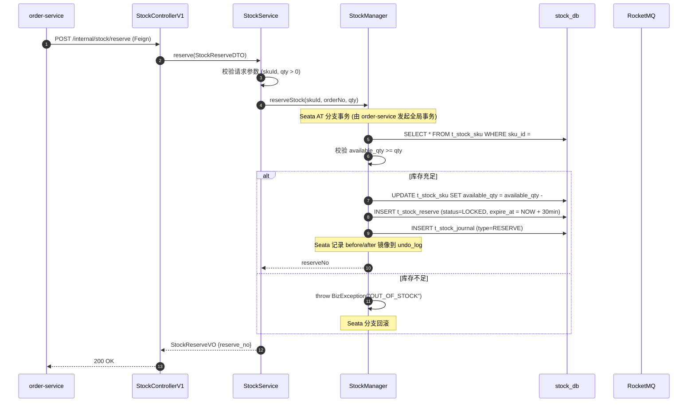
```mermaid
sequenceDiagram
    autonumber
    participant ORD as order-service
    participant SC as StockControllerV1
    participant SS as StockService
    participant SM as StockManager
    participant DB as stock_db
    participant MQ as RocketMQ

    ORD->>SC: POST /internal/stock/reserve (Feign)
    SC->>SS: reserve(StockReserveDTO)
    SS->>SS: 校验请求参数 (skuId, qty > 0)
    SS->>SM: reserveStock(skuId, orderNo, qty)

    Note over SM: Seata AT 分支事务 (由 order-service 发起全局事务)
    SM->>DB: SELECT * FROM t_stock_sku WHERE sku_id = #{skuId} FOR UPDATE
    SM->>SM: 校验 available_qty >= qty
    alt 库存充足
        SM->>DB: UPDATE t_stock_sku SET available_qty = available_qty - #{qty}, reserved_qty = reserved_qty + #{qty}, version = version + 1 WHERE sku_id = #{skuId}
        SM->>DB: INSERT t_stock_reserve (status=LOCKED, expire_at = NOW + 30min)
        SM->>DB: INSERT t_stock_journal (type=RESERVE)
        Note over SM: Seata 记录 before/after 镜像到 undo_log
        SM-->>SS: reserveNo
    else 库存不足
        SM->>SM: throw BizException("OUT_OF_STOCK")
        Note over SM: Seata 分支回滚
    end
    SS-->>SC: StockReserveVO {reserve_no}
    SC-->>ORD: 200 OK
```

**要点**：
- 库存预留使用 `SELECT ... FOR UPDATE` + 乐观更新双重保障，Seata AT 分支内执行。
- 预留记录 `t_stock_reserve.expire_at` = 创建时间 + 支付超时时间（默认 30 分钟）。

#### 4.2.2 库存释放（超时/取消）

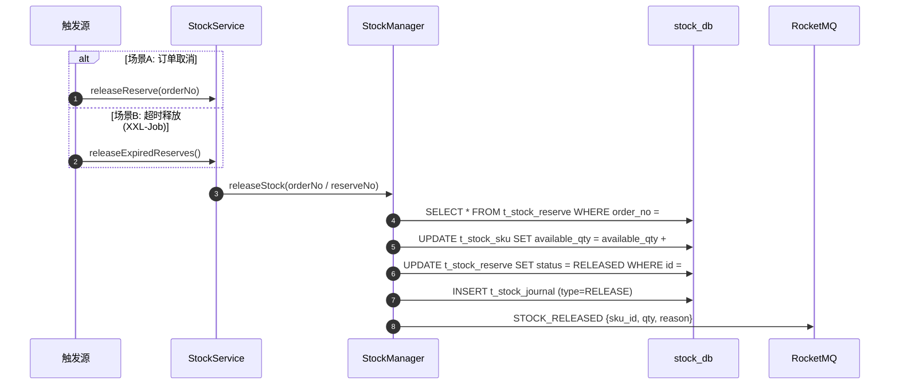
```mermaid
sequenceDiagram
    autonumber
    participant TRG as 触发源
    participant SS as StockService
    participant SM as StockManager
    participant DB as stock_db
    participant MQ as RocketMQ

    alt 场景A: 订单取消
        TRG->>SS: releaseReserve(orderNo)
    else 场景B: 超时释放 (XXL-Job)
        TRG->>SS: releaseExpiredReserves()
    end

    SS->>SM: releaseStock(orderNo / reserveNo)
    SM->>DB: SELECT * FROM t_stock_reserve WHERE order_no = #{orderNo} AND status = LOCKED
    SM->>DB: UPDATE t_stock_sku SET available_qty = available_qty + #{qty}, reserved_qty = reserved_qty - #{qty}, version = version + 1 WHERE sku_id = #{skuId}
    SM->>DB: UPDATE t_stock_reserve SET status = RELEASED WHERE id = #{id}
    SM->>DB: INSERT t_stock_journal (type=RELEASE)
    SM->>MQ: STOCK_RELEASED {sku_id, qty, reason}
```

#### 4.2.3 库存扣减确认（支付成功后）

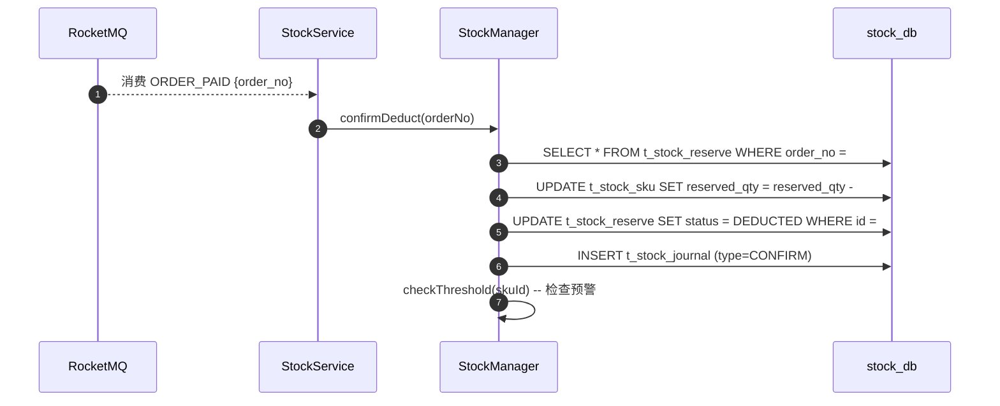
```mermaid
sequenceDiagram
    autonumber
    participant MQ as RocketMQ
    participant SS as StockService
    participant SM as StockManager
    participant DB as stock_db

    MQ-->>SS: 消费 ORDER_PAID {order_no}
    SS->>SM: confirmDeduct(orderNo)
    SM->>DB: SELECT * FROM t_stock_reserve WHERE order_no = #{orderNo} AND status = LOCKED
    SM->>DB: UPDATE t_stock_sku SET reserved_qty = reserved_qty - #{qty}, sold_qty = sold_qty + #{qty}, version = version + 1 WHERE sku_id = #{skuId}
    SM->>DB: UPDATE t_stock_reserve SET status = DEDUCTED WHERE id = #{id}
    SM->>DB: INSERT t_stock_journal (type=CONFIRM)
    SM->>SM: checkThreshold(skuId) -- 检查预警
```

#### 4.2.4 库存预警

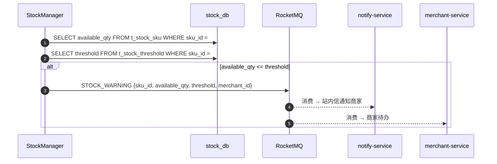
```mermaid
sequenceDiagram
    autonumber
    participant SM as StockManager
    participant DB as stock_db
    participant MQ as RocketMQ
    participant NTF as notify-service
    participant MER as merchant-service

    SM->>DB: SELECT available_qty FROM t_stock_sku WHERE sku_id = #{skuId}
    SM->>DB: SELECT threshold FROM t_stock_threshold WHERE sku_id = #{skuId}
    alt available_qty <= threshold
        SM->>MQ: STOCK_WARNING {sku_id, available_qty, threshold, merchant_id}
        MQ-->>NTF: 消费 → 站内信通知商家
        MQ-->>MER: 消费 → 商家待办
    end
```

### 4.3 核心类与职责

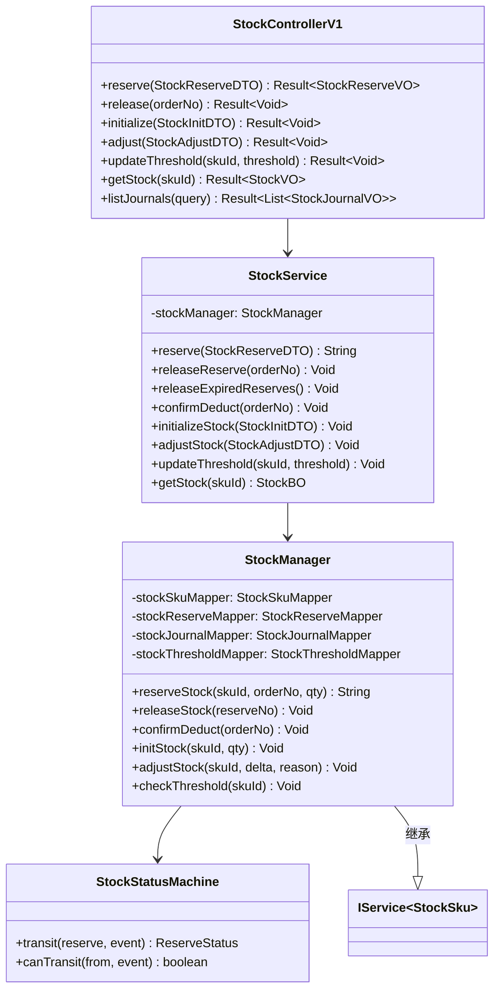
```mermaid
classDiagram
    class StockControllerV1 {
        +reserve(StockReserveDTO) Result~StockReserveVO~
        +release(orderNo) Result~Void~
        +initialize(StockInitDTO) Result~Void~
        +adjust(StockAdjustDTO) Result~Void~
        +updateThreshold(skuId, threshold) Result~Void~
        +getStock(skuId) Result~StockVO~
        +listJournals(query) Result~List~StockJournalVO~~
    }

    class StockService {
        -stockManager: StockManager
        +reserve(StockReserveDTO) String
        +releaseReserve(orderNo) Void
        +releaseExpiredReserves() Void
        +confirmDeduct(orderNo) Void
        +initializeStock(StockInitDTO) Void
        +adjustStock(StockAdjustDTO) Void
        +updateThreshold(skuId, threshold) Void
        +getStock(skuId) StockBO
    }

    class StockManager {
        -stockSkuMapper: StockSkuMapper
        -stockReserveMapper: StockReserveMapper
        -stockJournalMapper: StockJournalMapper
        -stockThresholdMapper: StockThresholdMapper
        +reserveStock(skuId, orderNo, qty) String
        +releaseStock(reserveNo) Void
        +confirmDeduct(orderNo) Void
        +initStock(skuId, qty) Void
        +adjustStock(skuId, delta, reason) Void
        +checkThreshold(skuId) Void
    }

    class StockStatusMachine {
        +transit(reserve, event) ReserveStatus
        +canTransit(from, event) boolean
    }

    StockControllerV1 --> StockService
    StockService --> StockManager
    StockManager --> StockStatusMachine
    StockManager --|> IService~StockSku~ : 继承
```

**分层契约**：
- `StockControllerV1`：接收 HTTP 请求 + 内部 Feign 调用，参数校验，返回 `Result<T>`。
- `StockService`：薄业务层，**禁止**继承 `IService`。负责预留/释放流程编排、MQ 消费处理。
- `StockManager`：**必须**继承 `IService<StockSku>` + `ServiceImpl<StockSkuMapper, StockSku>`。负责事务内库存数据操作、乐观更新、预警检测。

### 4.4 状态机

#### 4.4.1 库存预留状态机

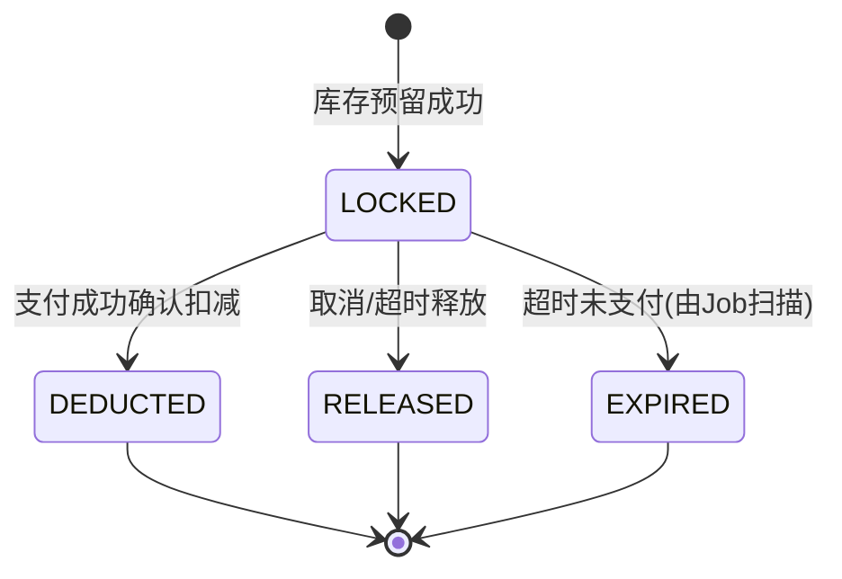
```mermaid
stateDiagram-v2
    [*] --> LOCKED : 库存预留成功
    LOCKED --> DEDUCTED : 支付成功确认扣减
    LOCKED --> RELEASED : 取消/超时释放
    LOCKED --> EXPIRED : 超时未支付(由Job扫描)
    DEDUCTED --> [*]
    RELEASED --> [*]
    EXPIRED --> [*]
```

#### 4.4.2 预留状态转换规则表

| # | 当前状态 | 事件 | 目标状态 | 守卫条件 | 动作 |
|---|----------|------|----------|----------|------|
| S1 | LOCKED | PAY_CONFIRM | DEDUCTED | 支付成功消息已消费 | `reserved_qty → sold_qty`；更新 `t_stock_reserve.status=DEDUCTED`；写入 `t_stock_journal(type=CONFIRM)` |
| S2 | LOCKED | ORDER_CANCEL | RELEASED | 订单取消消息已消费 | `reserved_qty → available_qty`；更新 `t_stock_reserve.status=RELEASED`；写入 `t_stock_journal(type=RELEASE)` |
| S3 | LOCKED | RESERVE_EXPIRE | EXPIRED | `expire_at < NOW()` 且 status=LOCKED | 同 S2 动作；`status=EXPIRED` |
| S4 | RELEASED | — | — | 终态，不可再转换 | — |
| S5 | DEDUCTED | — | — | 终态，不可再转换 | — |
| S6 | EXPIRED | — | — | 终态，不可再转换 | — |

### 4.5 关键算法/业务规则

| 规则 | 说明 | 实现位置 |
|------|------|----------|
| 乐观更新防超卖 | `UPDATE t_stock_sku SET available_qty = available_qty - #{qty} WHERE sku_id = #{skuId} AND available_qty >= #{qty} AND version = #{version}`，影响行数=0 则超卖 | `StockManager.reserveStock()` |
| 预留超时释放 | XXL-Job 每 1 分钟扫描 `t_stock_reserve WHERE status=LOCKED AND expire_at < NOW()`，批量释放 | `StockService.releaseExpiredReserves()` |
| 预警阈值检测 | 每次库存变更后检查 `available_qty <= threshold`，满足则发 MQ 告警 | `StockManager.checkThreshold()` |
| 库存一致性 | `total_qty = available_qty + reserved_qty + sold_qty`（MySQL 生成列校验），定时任务核对 | `StockService.consistencyCheck()` |
| 库存初始化 | 商家首次设置库存时 `INSERT t_stock_sku`，后续通过 `adjust` 调整 | `StockManager.initStock()` |
| 库存调整 | 增减库存走 `adjustStock(skuId, delta, reason)`，必须记录原因（INIT/ADJUST/TRANSFER/TAKE） | `StockManager.adjustStock()` |
| 预留-释放配对 | 释放时校验 `reserve_no` 或 `order_no` 存在且状态为 LOCKED | `StockManager.releaseStock()` |

### 4.6 数据结构与索引

核心表：

| 表 | 关键字段 | 说明 |
|---|---|---|
| `t_stock_sku` | `sku_id`, `merchant_id`, `available_qty`, `reserved_qty`, `sold_qty`, `total_qty`, `version` | 库存单元 |
| `t_stock_reserve` | `reserve_no`, `sku_id`, `order_no`, `qty`, `expire_at`, `status` | 锁定明细 |
| `t_stock_journal` | `sku_id`, `type`, `qty_before`, `qty_after`, `reason`, `biz_no` | 出入库流水 |
| `t_stock_threshold` | `sku_id`, `merchant_id`, `warning_qty`, `danger_qty` | 预警阈值 |
| `t_stock_transfer` | `transfer_no`, `from_merchant_id`, `to_merchant_id`, `sku_id`, `qty`, `status` | 平台调拨单 |

关键索引（源自数据库设计文档 §12）：

| 索引名 | 列 | 用途 |
|--------|-----|------|
| `uk_stock_sku_sku` | (sku_id) UNIQUE | 乐观更新 + 查询 |
| `idx_stock_sku_merchant` | (merchant_id) | 商家维度查询 |
| `idx_stock_reserve_order` | (order_no) | 按订单查预留 |
| `idx_stock_reserve_expire` | (status, expire_at) | 超时扫描 |

### 4.7 异常处理与降级

| 异常场景 | 触发条件 | 处理方式 | 降级策略 |
|----------|----------|----------|----------|
| 库存不足 | `available_qty < qty` | 返回 `BIZ_1001_OUT_OF_STOCK` (422) | 前端提示 |
| Seata 分支回滚 | order-service 全局事务回滚 | undo_log 自动补回 `available_qty` | 自动恢复 |
| 预留记录丢失 | t_stock_reserve 数据异常 | 定时一致性校验 + 人工修复 | 补偿任务 |
| 乐观锁冲突 | 并发修改同一 SKU version 不匹配 | 重试 3 次（应用层） | 超过重试次数返回 409 |
| DB 连接池耗尽 | 高并发场景 | Sentinel 限流 + 连接池监控告警 | 排队等待 |
| 预警通知失败 | MQ 发送失败 | 本地重试 + 死信队列 + 补偿任务 | 延迟通知 |

### 4.8 性能与并发

| 场景 | 指标 | 方案 |
|------|------|------|
| 库存预留 | ≤ 50ms（Seata 分支内） | `uk_stock_sku_sku` 主键查询 + 乐观更新 |
| 库存释放 | ≤ 30ms | 索引 `idx_stock_reserve_order` |
| 超时扫描 | < 5s/批次 | `idx_stock_reserve_expire` 走索引；每批 500 条 |
| 预警检测 | ≤ 10ms | 内存缓存阈值配置 |
| 并发扣减 | 单 SKU ≥ 500 QPS | 乐观更新无行锁竞争；Seata 全局锁隔离 |

**并发控制**：
- 乐观更新：`WHERE available_qty >= #{qty} AND version = #{version}`，无需悲观锁
- Seata 全局锁：全局事务期间，其他全局事务对同一行的修改被阻塞，保证一致性
- 热点 SKU 优化：热点商品可拆分虚拟 SKU 分摊并发（远期规划）

### 4.9 测试要点

| 类别 | 测试场景 | 验证点 |
|------|----------|--------|
| 超卖 | 100 并发扣减库存=10 的 SKU | 成功 10 次，失败 90 次，最终 available_qty=0 |
| 幂等 | 同一 order_no 重复预留 | 只预留 1 次 |
| 预留-释放配对 | 预留后取消 | available_qty 恢复，reserved_qty 减少 |
| 超时释放 | 预留 30 分钟未支付 | Job 自动释放 |
| 预警 | available_qty ≤ threshold | MQ 告警消息发送 |
| 一致性 | total_qty = available + reserved + sold | 定时任务校验通过 |
| Seata 回滚 | 全局事务回滚 | available_qty 自动恢复 |
| 扣减确认 | 支付成功后 | reserved→sold，available 不变 |
| 并发 | 多订单同时预留同一 SKU | 无死锁，数据正确 |

### 4.10 风险与遗留

| 风险 | 影响 | 缓解措施 | 遗留 |
|------|------|----------|------|
| 热点 SKU 扣减瓶颈 | 秒杀场景 QPS 超限 | 乐观更新 + Seata 全局锁；远期拆分虚拟 SKU | M3 评估 |
| 预留记录泄漏 | 预留未释放导致库存虚减 | 超时释放 Job + 一致性校验 | 已设计 |
| Seata undo_log 膨胀 | 写放大 | 监控 + 定期清理已提交的 undo_log | 与 order-service 共担 |
| 调拨/盘点逻辑复杂 | 跨商家库存移动 | 本期仅实现调整，调拨/盘点预留 | M2 实现 |
| 库存与商品服务数据不一致 | SKU 被删但库存仍在 | 商品下架时同步冻结库存 | 需设计事件联动 |

---

## 5. 相关文档链接

- 上游：[系统架构设计文档](01-系统架构设计文档.md)、[API 设计文档](02-API设计文档.md)、[数据库设计文档](03-数据库设计文档.md)
- 横向：[模块概要设计](06-模块概要设计.md)、[接口设计文档](05-接口设计文档.md)、[安全设计文档](04-安全设计文档.md)
- 下游：[3. 开发阶段](../3.%20开发阶段/)、[4. 测试阶段](../4.%20测试阶段/)
- 参考：[Seata AT 模式官方文档](https://seata.io/docs/user/at/)、[支付宝开放平台文档](https://opendocs.alipay.com/)、阿里规约

## 变更记录

| 日期 | 版本 | 变更人/角色 | 变更说明 |
|------|------|-------------|----------|
| 2026-07-27 | V1.0 | yirancrazy@gmail.com | 初稿创建：补全 order-service、pay-service、stock-service 三大核心模块详细设计 |
