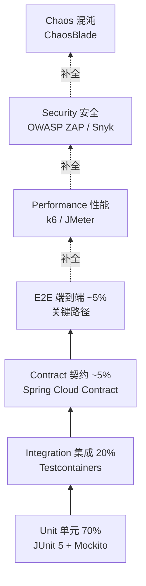
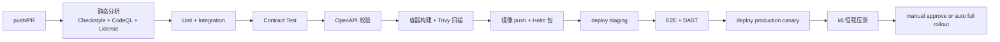

# 测试策略文档

## 文档信息

| 字段 | 内容 |
|------|------|
| 文档名称 | 测试策略与计划 |
| 文档版本 | V1.0 |$
| 所属阶段 | 测试阶段 |
| 文档状态 | 已发布 |
| 项目名称 | 薄荷商城后台系统 |
| 创建人 | yirancrazy@gmail.com |
| 审核人 | yirancrazy@gmail.com |
| 批准人 | yirancrazy@gmail.com |
| 创建日期 | 2026-07-27 |
| 最后更新 | 2026-07-28 |[\$]

## 文档目的

> 明确测试的范围、方法、分层、质量门禁与资源，作为测试活动执行、CI 门禁、发布准入的统一标准。
> 读者：研发、测试、QA 负责人、研发负责人。

## 适用范围

- **适用对象**：研发、测试、QA 负责人
- **适用场景**：测试活动规划、CI 卡点、发布准入、缺陷管理
- **适用版本**：V1.0
- **不适用范围**：单元测试细节（见 [Java 编码规范 §12](../3.%20开发阶段/01-Java编码规范.md)）、自动化脚本编写（见 [自动化测试规范](04-自动化测试规范.md)）

---

## 目录

1. [测试原则与质量定义](#1-测试原则与质量定义)
2. [测试金字塔与比例分配](#2-测试金字塔与比例分配)
3. [测试分层定义](#3-测试分层定义)
4. [单元测试规范](#4-单元测试规范)
5. [集成测试（Testcontainers）](#5-集成测试testcontainers)
6. [契约测试（Spring Cloud Contract）](#6-契约测试spring-cloud-contract)
7. [端到端测试](#7-端到端测试)
8. [性能测试](#8-性能测试)
9. [安全测试](#9-安全测试)
10. [混沌与可靠性测试](#10-混沌与可靠性测试)
11. [兼容性测试](#11-兼容性测试)
12. [覆盖率门槛与质量门禁](#12-覆盖率门槛与质量门禁)
13. [测试数据管理](#13-测试数据管理)
14. [Mock / Stub 策略](#14-mock--stub-策略)
15. [CI/CD 集成](#15-cicd-集成)
16. [缺陷分级与响应流程](#16-缺陷分级与响应流程)
17. [报告与可观测性](#17-报告与可观测性)
18. [附录：首期测试交付物清单](#18-附录首期测试交付物清单)

---

## 1. 测试原则与质量定义

### 1.1 质量定义

| 维度 | 目标 | 触发动作 |
|---|---|---|
| 资金正确性 | 100% 资金场景 0 缺陷 | P0 资金链路 case 必须 100% 通过；任何 P0 阻断上线 |
| 正确性 | 订单/支付/库存主链路 0 已知缺陷 | 每 sprint 回归主链路 |
| 安全性 | 0 高危 OWASP Top 10 漏洞 | 自动 + 季度人工 |
| 性能 | 核心交易 P99 < 500ms（待压测基线确认） | 详见 [架构设计 §11](../2.%20设计阶段/01-系统架构设计文档.md) |
| 可用性 | 99.9% 月度（待压测基线确认） | SLO 监控 |
| 可维护性 | 测试金字塔比例稳定 | 架构守护 |

### 1.2 测试原则

| 序 | 原则 | 含义 |
|---|---|---|
| T0 | 业务价值优先 | 测试用例直接映射需求 ID `USER-ORDER-0001` 等，可追溯 |
| T1 | 同一段代码只测一次 | 优先级：高金字塔层（E2E > 集成 > 单元）；重叠覆盖视为浪费 |
| T2 | 测试独立可执行 | 每个测试自建数据、不依赖外部稳定态 |
| T3 | 失败优先 | 出错立即停止后续（fail-fast），保护 CI 资源 |
| T4 | 测试也是产物 | 与实现代码同等 review 严格度，禁止降质 |
| T5 | 资金场景可重放 | 任意单据可由测试号回放整个流程，便于事后取证 |
| T6 | 自动化优先 | 手工测试只用于「探索性测试」与「验收」 |

---

## 2. 测试金字塔与比例分配



预算与执行频次：

| 层级 | 比例（用例数） | CI 时长预算 | 触发 |
|---|---|---|---|
| 单元 | 70% | ≤ 5 分钟/服务 | 每次 PR |
| 集成 | 20% | ≤ 10 分钟/服务 | 每次 PR |
| 契约 | ~5% | ≤ 3 分钟 | 每次 PR |
| E2E | ~5% (P0 用例) | ≤ 20 分钟 | 每次 merge main |
| 性能 | 关键场景 | ≤ 30 分钟 | merge main + 周一凌晨 |
| 安全 | 全量扫描 | ≤ 15 分钟 | 每日定时 + 每次发版 |
| 混沌 | 关键链路 | 手控 | 大促前 |

> 「比例」指用例数；CI 时间预算按服务平均估。整体 merge-to-deploy 工作流预算 ≤ 50 分钟。

---

## 3. 测试分层定义

### 3.1 单元测试 (Unit)

- 范围：单个类/方法；不启动 Spring Context，不连数据库与外部中间件；
- 工具：JUnit 5 + Mockito + AssertJ + Lombok `@Utility` 类；
- 边界：业务规则、边界值、空值、异常分支、并发安全（关键代码）、金额精度；
- 必须覆盖：所有 service 公共方法、所有 util、所有 Policy 类、所有状态机迁移函数。

### 3.2 集成测试 (Integration)

- 范围：单服务内全部组件协作，包含真实 DB / Cache / MQ 容器；
- 工具：Spring Boot `@SpringBootTest` + Testcontainers（MySQL 8 / Redis 7.2 / RocketMQ / Nacos）；
- 隔离：每个测试类一个独立 schema，JUnit 5 `@DirtiesContext` + 自动化 Flyway 迁移；
- 必须覆盖：Repository（CRUD + 自定义 SQL）、Service 与 Repository 协作、消息生产与本地事务、缓存读写、Seata AT 全局事务测试。

### 3.3 契约测试 (Contract)

- 范围：服务间 API 调用（OpenFeign）；由 producer 写契约，consumer 验证；
- 工具：Spring Cloud Contract + Pact provider；
- 必须覆盖：所有 OpenFeign Client 接口对应的 producer-contract.yml；每条 case 含 given/when/then；
- 双向：producer 变 schema → 更新 contract → consumer 自动校验是否破坏。

### 3.4 端到端 (E2E)

- 范围：跨服务、真实业务场景；
- 工具：JUnit 5 + RestAssured（HTTP）+ Testcontainers + WireMock 仅在外部依赖不可达时使用；
- 用例集：参见 §18；
- 数据：每个 E2E 用例入口创建全新数据，互不污染。

### 3.5 性能测试 (Performance)

- 范围：核心交易链路（登录/下单/支付/退款/搜索）；
- 工具：k6（首选） / JMeter（次选）；
- 模型：阶梯式压测 → 极限压测 → 长时间稳定性；
- 输出：P50/P95/P99、错误率、QPS、CPU/内存、DB 指标。

### 3.6 安全测试 (Security)

- 工具：OWASP ZAP（DAST）、CodeQL/Snyk（SAST）、Trivy（镜像）；
- 频率：每次 PR + 每日定时；
- 阻塞：高危漏洞 0 通过；中危 7 天内修复；低危 30 天。

### 3.7 混沌测试 (Chaos)

- 工具：ChaosBlade / Litmus；
- 故障类型：Pod 杀除、Node 故障、网络丢包、Redis 主从切换、RocketMQ Broker 抖动、MySQL 主从切换；
- 频率：生产常态压测 + 大促前；
- 配合可观测性，确保告警链路正常。

---

## 4. 单元测试规范

### 4.1 命名与组织

- 类名 `XxxServiceTest`，方法名 `methodName_givenCondition_thenExpected`；
- 包结构 `src/test/java/<mirror src/main>`，与实现一一对应；
- 内部类测试：`x_internal` 后缀方法，不暴露 public。

### 4.2 Given / When / Then 模式

```java
@Test
void createOrder_givenInsufficientStock_thenOutOfStockException() {
    // given
    when(stockClient.reserve(skuId, 5)).thenReturn(StockReserveResponse.failed(OUT_OF_STOCK));
    var req = sampleCreateOrderRequest();

    // when & then
    assertThatThrownBy(() -> orderService.createOrder(req, currentUserId))
        .isInstanceOf(OutOfStockException.class)
        .extracting("code").isEqualTo("BIZ_1001");
}
```

### 4.3 必须覆盖的场景

| 类别 | 场景 |
|---|---|
| 正常路径 | 所有 service 公共方法的 happy path |
| 边界值 | 数量 = 0 / MAX_INT、金额 = 0.00 / 99999999.99 |
| 空值 | null / 空集合 / 空字符串 |
| 异常分支 | 第三方超时、DB 唯一约束冲突、Redis 缓存 miss |
| 状态机 | 所有合法迁移 + 所有非法迁移（抛异常） |
| 资金安全 | 余额变动双向、幂等键冲突、退款超额、金额负值 |
| 并发 | 高并发场景（如 `reserve`）的乐观更新；用 `CountDownLatch` 跑 N 线程 |
| 越权 | 水平越权 / 垂直越权 各自必测 |

### 4.4 不可测试的代码

- 静态工具类纯函数必须可测；
- 不接受"这个方法太简单不需要测"作为理由；
- 任何带业务规则的代码（含注释、enum 的逻辑方法）必须测；
- 静态配置类、DTO 字段 getter/setter 不需要测试。

---

## 5. 集成测试（Testcontainers）

### 5.1 容器化中间件

```java
public class IntegrationTestBase {
    @Container static MySQLContainer<?> MYSQL = new MySQLContainer<>("mysql:8.0")
        .withCommand("--character-set-server=utf8mb4", "--collation-server=utf8mb4_0900_ai_ci")
        .withReuse(true);
    @Container static GenericContainer<?> REDIS = new GenericContainer<>("redis:7-alpine")
        .withExposedPorts(6379).withReuse(true);
    @Container static RocketMQContainer MQ = new RocketMQContainer("apache/rocketmq:5.1").withReuse(true);
    @Container static NacosContainer NACOS = new NacosContainer("nacos/nacos-server:2.3").withReuse(true);
}
```

- `withReuse(true)` 必须开启（开发阶段多次构建共享容器，提速显著）。

### 5.2 测试数据库隔离

- 每个集成测试一个独立 schema（`test_<class>_<uuid>`）；
- Flyway 一次性初始化；
- `@Sql` 或 TestDataBuilder 加载种子数据；
- 测试结束 Nacos/Redis DB 清理。

### 5.3 关键集成测试清单

| 服务 | 关键测试 |
|---|---|
| auth-service | 登录 + token 签发 + refresh 轮转 + RBAC |
| order-service | 下单 Seata AT 全局事务（order + stock） |
| order-service | 支付回调幂等 + 状态机迁移 |
| pay-service | Alipay 回调验签失败、回调成功、回调重复 |
| stock-service | 乐观锁、并发 reserve、过期 release |
| notify-service | MQ 消费 + 推送 + DB 写入 + 失败重试 |
| goods-service | SPU/SKU 创建、ES 同步、状态机 |

### 5.4 集成测试禁止事项

- 禁止打桩（mock）直接访问数据库的 service；
- 禁止把外部服务（Alipay / SMS）作为集成对象（应 mock 或用契约测试覆盖）；
- 禁止跳过清理（避免污染下一个测试）。

---

## 6. 契约测试（Spring Cloud Contract）

### 6.1 契约文件

每个 producer service 在 `src/test/resources/contracts/<endpoint>/` 下放：

```yaml
# stock-service: reserve.yml
request:
  method: POST
  url: /internal/stock/reserve
  body:
    sku_id: 30001
    qty: 2
    order_no: OD20251219-A1B2C3D4
  headers:
    X-Internal-Token: { regex: '.*' }
response:
  status: 200
  body:
    reserve_no: R20251219-X1Y2
    available_after: 50
  headers:
    Content-Type: application/json
```

### 6.2 双向流程

1. **Producer 方**：Spring Cloud Contract 生成 stub；
2. **Consumer 方**：用该 stub 跑通业务逻辑（不依赖真实 producer）；
3. 双方通过 CI 中央校验（consumer-contracts 仓）保证一致性。

### 6.3 强制覆盖

- 所有 `OpenFeign` 接口必须有契约；
- 错误响应（4xx）也必须有契约；
- 字段新增属于 MINOR 兼容，但 producer 必须保持语义稳定；删除字段属于 MAJOR，要走 ADR。

---

## 7. 端到端测试

### 7.1 P0 主链路用例

| 用例 ID | 名称 | 参与服务 |
|---|---|---|
| E2E-001 | 用户注册→登录→搜索→加车→下单→支付→发货→收货 | all |
| E2E-002 | 用户申请退款→商家同意→退款到账 | order + pay |
| E2E-003 | 用户下单，库存不足失败回滚 | order + stock |
| E2E-004 | 商家上架商品→平台审核通过→商品上架 | merchant + platform + goods |
| E2E-005 | 商家提现→平台审核→到账 | merchant + platform + pay |
| E2E-006 | 平台强制关单→库存回补→余额账调整 | platform + order + pay + stock |
| E2E-007 | 下单超时未支付→库存释放→订单关闭 | order + stock |
| E2E-008 | WebSocket 推送用户消息通知 | order + notify + ws |

### 7.2 E2E 工具与隔离

- RestAssured + JUnit 5；
- 全链路真实服务（除 Alipay 走 mock provider）；
- 每个用例随机账号、随机商品，独立 schema 串行执行；
- 失败时截图 + trace id 自动归档至测试报告。

### 7.3 阻塞/豁免

- E2E 主链路任一失败 → 阻塞发版；
- E2E 边缘用例（探索性）可豁免 24h 修复。

---

## 8. 性能测试

### 8.1 测试场景

| 场景 | 工具 | 关键指标 |
|---|---|---|
| 登录混合读写 | k6 | 登录 P99 ≤ 300ms，200 QPS 无错误 |
| 商品搜索 | k6 | P99 ≤ 200ms，500 QPS |
| 下单 | k6 | P99 ≤ 500ms，200 QPS；超卖率 = 0 |
| 支付回调 | k6（恒定速率） | 处理 P99 ≤ 200ms，1500 TPS |
| 退款 | k6 | P99 ≤ 1s，100 QPS |
| 大促混合场景 | k6 / JMeter | 整体 QPS ≥ 5000，P99 ≤ 1s，错误率 ≤ 0.1% |

### 8.2 压测环境

- 与生产 1:1 配置，至少 1 个完整 K8s 命名空间；
- 数据集：种子脚本生成 ≥ 100w 用户、1000w SKU、500w 历史订单；
- 监控：Prometheus + Grafana 看板 SkyWalking trace 与 JVM。

### 8.3 报告模板

每次压测产出：

```
场景: 登录混合读写
工具: k6 0.46
时长: 30 分钟 (爬坡 5min + 恒载 20min + 降载 5min)
并发: 200 VU

P50      P95      P99      Error Rate   Throughput
45ms     150ms    287ms    0.03%        4800 rps

DB CPU: 35%  Redis CPU: 8%  
App Pod Avg CPU: 28%  JVM GC: 12 次/min
```

### 8.4 性能基线与变更门禁

- 上一次基线到本次提交 P99 退化 > 20% → 阻塞合并；
- 错误率上升 > 0.1% → 阻塞合并；
- P99 绝对值超过架构文档 §11 给定阈值 → 必须修复。

---

## 9. 安全测试

### 9.1 SAST

- 工具：CodeQL / Snyk Code；
- 触发：每次 PR 自动扫描；
- 高危漏洞：blocking；
- 中危：单次 sprint 必须修复；
- 低危：30 天窗口。

### 9.2 DAST

- 工具：OWASP ZAP；
- 范围：预发环境；
- 用例包：SQL 注入、XSS、CSRF（API 模式 SSRF + Header 注入）、IDOR、暴力破解、未授权访问、敏感字段泄露；
- 频率：每日 1 次 + 大促前 1 周连续扫描。

### 9.3 依赖扫描

- Snyk / OWASP Dependency-Check；
- 高危漏洞必须升级；
- 0-day 漏洞：值班 4 小时内评估修复方案。

### 9.4 镜像扫描

- Trivy，CI 阶段；
- 高危 CVE 阻塞。

### 9.5 渗透测试

- 第三方专业团队；
- 上线前 + 每年 1 次；
- 范围：黑盒 + 灰盒；
- 输出整改清单 + 时限。

### 9.6 红蓝对抗

- 内部红队；
- 频率：每半年；
- 模拟钓鱼、内部越权、密钥泄露扩散、供应链劫持；
- 重点检验应急响应链路。

---

## 10. 混沌与可靠性测试

### 10.1 故障矩阵

| 故障 | 工具 | 验证项 |
|---|---|---|
| Pod 杀除 | ChaosBlade | HPA / 自愈 / Sentinel 流控 |
| Node 故障 | ChaosBlade | Pod 漂移、服务可用性 |
| 网络丢包 / 延迟 | ChaosBlade | Feign 超时、Sentinel 熔断、降级 |
| Redis 主从切换 | ChaosBlade | 库存计数一致性 |
| MySQL 主从切换 | ChaosBlade | Seata 回滚不丢事务 |
| RocketMQ Broker 重启 | ChaosBlade | 消费重试 + 死信 |
| Alipay 回调延迟 | wiremock 模拟 | 主动 Query 兜底 |

### 10.2 演练规则

- 任何故障持续时间 ≤ 5 分钟，先快闪；
- 演练期间开启值班 + 全员克制部署；
- 演练结果记录到 ADR，反向驱动可观测性完善。

---

## 11. 兼容性测试

### 11.1 浏览器矩阵

| 浏览器 | 桌面 | 移动 |
|---|---|---|
| Chrome | 近 2 年稳定版 + 主版本 | Android |
| Edge | Windows | — |
| Safari | macOS | iOS |

### 11.2 接口兼容

- OpenAPI 3.0 自动化校验：consumer 端契约测试；
- 每版本发布前比对 OpenAPI diff；
- 任何 breaking change 走 ADR + deprecate 流程。

### 11.3 移动端

- iOS / Android WebView H5；
- 通过 BrowserStack 做云端真机矩阵回归。

---

## 12. 覆盖率门槛与质量门禁

### 12.1 覆盖率阈值

| 项 | 门槛 | 阻断 |
|---|---|---|
| 行覆盖（line） | ≥ 80% | < 80% 阻断 merge |
| 增量行覆盖（line） | ≥ 85% | < 85% 阻断 merge |
| 分支覆盖（branch） | ≥ 60% | < 60% 阻断 merge |
| service / domain 类 | ≥ 90% | < 90% 阻断 merge |
| util / policy 类 | ≥ 95% | < 95% 阻断 merge |
| 资金相关 service / controller | 100% | < 100% 阻断 merge |

工具：JaCoCo（Java）/ `report-aggregate`（合并多服务报表）。

### 12.2 质量门禁（CI 校验）

| 项 | 必过 |
|---|---|
| 单元 / 集成测试全部通过 | ✅ |
| 覆盖率达标 | ✅ |
| Spring Cloud Contract 校验通过 | ✅ |
| Lint（Checkstyle + Sonar） | ✅ |
| CodeQL SAST 无 high | ✅ |
| Cyclomatic complexity 平均 ≤ 10 | ✅ |
| 无新增 hardcoded secrets | ✅ |
| 公共 API 变更已有 ADR 或变更日志 | ✅ |

### 12.3 豁免流程

- 任何「临时豁免」必须由 owner 在 PR 中显式注释 `// coverage:ignore-justification=<reason>`，reviewer 通过；
- 豁免清单在月底回顾，按"补测/移出"决策。

---

## 13. 测试数据管理

### 13.1 数据来源

| 类型 | 工具 | 来源 |
|---|---|---|
| 随机数据 | datafaker (Java Faker) | 运行时生成 |
| 种子数据 | SQL + Flyway | 仓库中约定位置 |
| 边界数据 | 手写 | 仓库中约定位置 |
| 真实脱敏数据 | 单独脚本（不在 CI 仓库） | 由 ops 提供 |

### 13.2 PII 脱敏

- 测试用任何账号的姓名、手机号、身份证、银行卡必须使用 datafaker 或自合成数据；
- 严禁直接复制生产数据未经脱敏脚本处理。

### 13.3 数据隔离

- 单元测试：用内存构建，不持久化；
- 集成测试：Testcontainers 容器 + 独立 schema + 测试结束清理；
- E2E 测试：独立 K8s namespace 上的 mock 全链路；
- 性能测试：专用 namespace，结束保留 1 小时便于定位。

---

## 14. Mock / Stub 策略

| 场景 | 策略 |
|---|---|
| 第三方支付 (Alipay) | OpenFeign + Spring Cloud Contract stub（prevent 真实调用）|
| 短信网关 | WireMock Server |
| OSS 上传 | WireMock 或 OSS mock provider |
| 跨服务 OpenFeign | Spring Cloud Contract producer stub |
| 时间（now()） | Clock 抽象 + `Clock.fixed(...)` 注入 |
| ID 生成 | Snowflake 抽象 + 测试专用 ID 生成器 |

Mock 规则：
- 不通过 Spring `@MockBean` 拦截 Service-to-Service（应走契约测试）；
- 仅在「真实外部依赖无法触达」时使用 WireMock；
- Mock 范围必须明确，不允许"通配" mock。

---

## 15. CI/CD 集成

### 15.1 流水线



### 15.2 流水线策略

| 阶段 | 触发 | 时长预算 |
|---|---|---|
| 静态分析 | PR | ≤ 3 min |
| 单元 + 集成 | PR | ≤ 15 min |
| 契约 | PR | ≤ 5 min |
| 构建 + 扫描 | PR | ≤ 5 min |
| E2E | merge main | ≤ 20 min |
| 性能 | 每周一 + 大促前 | ≤ 30 min |
| DAST | 每日定时 | ≤ 60 min |

### 15.3 分支与回滚

- main 是稳定分支，PR 通过所有门槛后合并；
- feature/<ID> 工作分支 ≤ 7 天；过期强制重开；
- 生产发版必须可 `kubectl rollout undo` 5 分钟内回滚。

---

## 16. 缺陷分级与响应流程

### 16.1 缺陷级别

| 级别 | 描述 | 响应 |
|---|---|---|
| P0 | 全站不可用 / 大规模资金异常 / 数据大规模泄露 | 立即响应 |
| P1 | 重大功能不可用 / 核心资金链路缺陷 | 30 分钟内响应 |
| P2 | 中等影响，绕过得不到严重影响 | 4 小时响应 |
| P3 | 边界 / UI / 体验 | 当迭代修复 |
| P4 | 文档/文案 | 下次文档迭代 |

### 16.2 缺陷生命周期

1. 报告：Jira / 内部 ITSM 新建工单；
2. 分类：级别定级 + 关联需求 ID；
3. 修复：基于 main hotfix 分支；
4. 回归：P0/P1 必须补 E2E 测试用例；
5. 关闭：reviewer 审 + 工单关联 trace id；
6. 复盘：P0 必须有复盘文档入 `docs/postmortem/`。

### 16.3 SLA

| 级别 | 修复 SLA | 长期 SLA |
|---|---|---|
| P0 | ≤ 4h | 关闭率 100% |
| P1 | 72h | 99% / 月 |
| P2 | 1 sprint | 90% / 月 |
| P3 | 1 quarter | 60% / 月 |

---

## 17. 报告与可观测性

### 17.1 测试报告

- Allure Reports（JUnit + RestAssured + k6 三合一）；
- 集成进 CI，PR 自动评论报告链接；
- 含截图、trace id、错误堆栈、日志 tail。

### 17.2 失败信息标准化

```
[失败的 E2E 用例]
E2E-001 用户下单主链路
Step: POST /api/v1/user/orders → 201
Expected: 201 Created with valid orderNo
Actual:   500 Internal Server Error
Trace:    TID=5f3a1b2c4d5e
Log:      https://grafana/.../trace/5f3a1b2c4d5e
```

所有阶段输出格式一致，便于聚合看板上墙。

### 17.3 看板

- 实测覆盖率（按服务 × 模块）；
- 测试通过率趋势（最近 30 天）；
- 性能基线偏差；
- 缺陷密度；
- 自动化占比。

---

## 18. 附录：首期测试交付物清单

### 18.1 必须在 M1 (首版) 完成

- [ ] 每个服务单测覆盖率 ≥ 70%；
- [ ] 关键链路（auth/order/pay/stock）E2E 用例可用；
- [ ] Spring Cloud Contract 在所有 OpenFeign 接口上启用；
- [ ] Testcontainers 在 4 个服务（auth/order/pay/stock）落地；
- [ ] K6 性能脚本：登录 + 搜索 + 下单 + 支付 + 退款 5 个场景；
- [ ] OWASP ZAP 自动化扫描脚本（每日）；
- [ ] CI 流水线集成静态分析 + 测试 + 镜像扫描 + 部署；
- [ ] Allure 报告在 CI 集成 + PR 评论；
- [ ] 缺陷分级与追踪流程在 ITSM 中建好。

### 18.2 必须在 M2 (加固) 完成

- [ ] ZAP DAST 100% 全路径覆盖；
- [ ] 性能基线建立；
- [ ] 混沌演练场景清单 + 演练记录；
- [ ] 红队演练至少 1 次。

### 18.3 必须在 M3 完成

- [ ] 分库分表 + 压测验证；
- [ ] 兼容性矩阵定期回归；
- [ ] 安全渗透测试整改闭环。

---

> 末尾说明：本测试策略与架构/数据库/安全/API 等设计文档相互引用；任何测试架构变更须先在 ADR 评审再改本文档。

---

## 相关文档链接

- 上游：[需求规格说明书（SRS）](../1.%20需求阶段/02-需求规格说明书（SRS）.md)、[Java 编码规范](../3.%20开发阶段/01-Java编码规范.md)
- 横向：[测试用例文档](02-测试用例文档.md)、[缺陷管理流程](03-缺陷管理流程.md)、[自动化测试规范](04-自动化测试规范.md)
- 下游：[构建与部署文档（CI/CD）](../5.%20部署阶段/01-构建与部署文档（CI-CD）.md)
- 参考：阿里规约（黄山版）、SonarQube、JaCoCo

## 变更记录

| 日期 | 版本 | 变更人/角色 | 变更说明 |
|------|------|-------------|----------|
| 2026-07-27 | V1.0 | yirancrazy@gmail.com | 初稿创建 |
